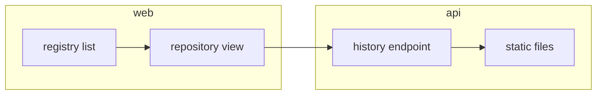

# FORMAT — the spec file contract

This file is the written contract between the files a spec-driven repository carries and the one parser that reads
them, `core/`. It documents what the parser accepts **as implemented**, not as wished; where the implementation is
still a stub, the section says so and names the task that fills it.

- **The files are the truth.** Stage, progress, drift and every number on the dashboard are derived from the files on
  every read. The app's own database never holds a copy of a spec.
- **One parser.** Only `core/` reads this format; the server, the web app and the later plugin import it
  (`bun run check:single-core`). A parser change updates this file in the same task (`core/CLAUDE.md`).
- **What the app never writes.** Nothing in a registered repository: no spec text, no master, no git object, no
  index, no lock file, not `.git/`. Spec 002's light writes are the only exceptions: the reviewed mark with its one
  `events.jsonl` line (ISC-24) and a single task checkbox (ISC-25), each guarded by a sha256 compare-and-swap and the
  lock sources below.
- **Checked.** `bun run check:format-doc` asserts one section per file kind of `core/src/files.ts` (`FILE_KINDS`), in
  that order, each naming its path and holding an example. Every example introduced by a line `From \`path\`:` is
  compared with that file and must occur in it verbatim.

## Where the files live

A repository root holds the master `ISA.md` (untracked in a public repository) and a `specs/` folder:
`specs/constitution.md`, optionally `specs/tldr.md`, one folder per spec `specs/NNN-slug/`, and closed specs under
`specs/archive/NNN-slug/`. A spec folder name is three digits, a hyphen and a slug (`^\d{3}-.+$`); other names are
ignored, and symbolic links are not followed. A folder without `spec.md` is not a spec: it gets a diagnostic, no row.

A ref names exactly one folder or nothing (`resolve.ts`): `002`, `002-web-console` or `web-console`, active and
archived folders alike; no match or more than one match is `not_found`, never another spec.

## The thirteen file kinds

Paths are relative to the spec folder, as `FILE_KINDS` holds them. Legend: **R** required (no spec without it),
**S** the stage table stops at this file until it exists, **S3** the same from three claims on, **G** a gate the stage
table waits on until it is fresh, **O** optional, read when present. A spec with an unknown or missing `spec_type`
needs neither plan nor tasks.

| Kind | Path | Read as | feature | project | infra | refactor | bug | spike |
|------|------|---------|---------|---------|-------|----------|-----|-------|
| `spec` | `spec.md` | frontmatter, claims, sections | R | R | R | R | R | R |
| `plan` | `plan.md` | existence, mermaid fence, hash | S | S | S | O | O | O |
| `tasks` | `tasks.md` | task lines, hash | S3 | S3 | O | S3 | O | O |
| `context` | `context.md` | goal lock, rounds, questions | O | O | O | O | O | O |
| `design` | `design.md` | Markdown, rendered | O | O | O | O | O | O |
| `constitution` | `../constitution.md` | frontmatter, lanes | O | O | O | O | O | O |
| `rounds` | `rounds.jsonl` | one JSON line per round | O | O | O | O | O | O |
| `events` | `events.jsonl` | one JSON line per transition | O | O | O | O | O | O |
| `gateReviewed` | `.gates/reviewed.json` | JSON mark | G | G | G | G | G | G |
| `gateCodeReviewed` | `.gates/code-reviewed.json` | JSON mark | G | G | G | G | G | G |
| `artifacts` | `artifacts/` | directory listing | O | O | O | O | O | O |
| `evidence` | `.evidence/` | directory listing | O | O | O | O | O | O |
| `master` | `../../ISA.md` | frontmatter, claims, fog | O | O | O | O | O | O |

Diagrams: a `feature`, `infra` or `project` spec needs a fence whose info string is exactly `mermaid` in both
`spec.md` and `plan.md` (dashboard warning `diagrams`); a `refactor` only warns without one in `spec.md`; a complete
spec is never held to it (`diagrams.ts`).

## `spec` — `spec.md`

The what: frontmatter, goal, Test Strategy, claims with stable IDs and `(after: …)` edges, decisions.

**Frontmatter** (`frontmatter.ts`). The file starts with a `---` line (a BOM is skipped) and a later `---` line
closes the block; an unclosed block is an error and the file reads as having none. Inside, one flat `key: value` per
line, key `[\w-]+`. A value in single or double quotes runs to the closing quote (`\"` unescapes in double quotes); an
unquoted value drops a trailing ` # comment`. Blank lines and `#` lines are skipped; an indented line is ignored with
a warning (nested YAML is not part of the format); a repeated key warns and the last value wins. Typed keys:

| Key | Value | Used for |
|-----|-------|----------|
| `task` | text | the row title (else the folder slug without its number) |
| `slug`, `isa_master`, `isa_feature`, `constitution`, `context_log`, `migrated_from` | text | `isa_feature`'s first word names the master block for `missing_in_spec` |
| `spec_type` | `feature`, `bug`, `refactor`, `spike`, `infra`, `project` | the type router; anything else warns and reads as none |
| `phase` | text | `complete` decides stage `done`; otherwise a tooltip only |
| `progress` | `M/N`, M ≤ N | compared with the recount (`progress_mismatch`) |
| `started`, `updated` | ISO 8601 as written | `updated` against the TL;DR's `generated` |
| `principal_stated_goal`, `…_source`, `…_locked` | text | a goal makes `anchors_missing_at_complete` apply |
| `principal_stated_goal_signal` | number | — |
| `context_sufficient`, `interview_invoked` | `true` or `false` | — |
| `archived_reason`, `archived` | text, `YYYY-MM-DD` | the archive listing |

Every other key is kept as written (`rest`) and read by nobody.

**Body.** The goal is the first prose paragraph under `## Goal` (or `## Ziel`); fences, comments and tables are
skipped. The claim section is the first of `## Features`, `## Claims`, `## Criteria`, `## ISC Criteria`,
`## IDEAL STATE CRITERIA` or `### Criteria`; it ends at the next level-two heading **or at a `---` line**. Lines
inside a fenced block are neither claims nor headings.

- A feature block opens with `### F<n>[.<m>] · <name>` (`·`, `:`, `—`, `–` or `-`, or no separator) and may carry one
  `Why:` line before its first claim. Another heading of level three or less ends the block; level four does not.
- A claim line is `- [ ] <ID>: <text>`, checked as `[x]` or `[X]`, indented for a nested leaf. The ID is
  `ISC-<n>[.<m>…]`, a domain form (`H-AVAIL`) or a short form (`C4`, `EQ-12`); the separator after it may be `:`,
  `—`, `–`, `-` or nothing. Trailing marks `⟨?: …⟩` / `⟨resolved: …⟩` are lifted off first, then one trailing
  `(after: A, B)` (comma or space separated, a final `.` allowed); code spans never count. A leading
  `[DROPPED …]` is a tombstone whose words are its note, and `[DROPPED` anywhere marks the claim dropped. After the
  tombstone, `Anti:` or `Antecedent:` sets the claim's kind. A checkbox without an ID warns and is invisible.
- `## Not yet specified` holds `- fog: <text>` lines, trailing marks lifted.
- `## Test Strategy` rows are positional: `isc | type | check | threshold | tool | anchors_to | severity`. A row whose
  first cell is `isc` or a dash rule is skipped, `\|` is a literal pipe, missing cells read as empty.
- `## Verification` holds `- <ID>: <evidence>` lines (the ID may be followed by `(…)`).
- `## Decisions` is prose: rendered, not parsed.

Progress is recounted from the boxes: closed over live claims, a tombstone leaves both. Edge checks warn on a
duplicate ID, a self edge, an unknown ID and the first cycle.

From `core/fixtures/harbor/specs/002-web-console/spec.md`:

```markdown
---
task: "Show every sync run and its failures in a small web console"
slug: 002-web-console
spec_type: feature
isa_master: ../../ISA.md
isa_feature: F2
constitution: ../constitution.md
phase: building
progress: 25/30
started: 2026-03-03T10:00:00Z
updated: 2026-03-08T16:45:00Z
context_sufficient: true
interview_invoked: false
context_log: context.md
---
```

From `core/fixtures/harbor/specs/002-web-console/spec.md`:

```markdown
## Features

### F2 · Web console
Why: a teammate who never touches the CLI can see what was mirrored, when, and what failed.

- [x] ISC-51: The registry list renders from the API with no console error.
```

From `core/fixtures/harbor/specs/002-web-console/spec.md`:

```markdown
| isc | type | check | threshold | tool | anchors_to | severity |
|-----|------|-------|-----------|------|------------|----------|
| ISC-51 | e2e | registry-list: renders | 0 console errors | `bun run e2e -- registry-list -g render` | derived: console-usable | high |
```

From `core/fixtures/harbor/specs/005-config-format-choice/spec.md`, fog lines and an antecedent claim:

```markdown
## Not yet specified

- fog: whether includes are resolved relative to the including file or to the working directory — needs one real multi-repository config
- fog: whether a comment-preserving writer is required at all — depends on whether the console ever edits the config

## Claims

- [ ] ISC-94: Antecedent: the config format for version 2 is chosen and recorded as a decision.
```

**Derived:** the row's title, type, stage and next command, the progress fraction, the takeable claims, the fog count,
the goal line, the drift and diagram gates, and the warnings `review`, `diagrams`, `closed` (every claim closed,
phase not complete) and `fog`.

## `plan` — `plan.md`

The how: approach, affected files, interfaces, risks, open points. `core/` reads only whether it exists (the stage
table), whether it carries a `mermaid` fence (the diagram rule) and its normalised hash (the reviewed mark). Its
frontmatter is not read. The Docs tab renders it as Markdown (spec 002).

From `core/fixtures/harbor/specs/002-web-console/plan.md`:

````markdown
## Approach

Serve a static Angular build from the API and read everything through one history endpoint. A separate console server would be one more process to run and secure.


````

## `tasks` — `tasks.md`

Atomic task lines, each anchored to one claim, plus the probe mapping. **Implemented today:** a line
`- [ ] T<n>` or `- [x] T<n>` (indent allowed) counts as a task, checked as landed; this is the task fraction on the
dashboard and in the archive listing. **The full grammar is spec 002's T23** (`tasks.ts`, a stub until then); the
fixtures write it as:

`- [ ] T<n> · <claim ID> · [flags · ] <lane> — <text> [(after: T<a>, T<b>)] · <paths>`

- flags `[P]` (may share a round) and `[seam]` (the contract between two lanes; runs alone, its fan-out waits);
- the lane is derived from the paths through the constitution's `## Lanes`; `operator` is the principal's own step
  and is never dispatched;
- `(after: …)` names tasks, not claims; `<paths>` are code spans, comma separated, after the last ` · `;
- a struck task is a plain bullet, `- ~~T<n> · …~~ — struck <date>: <reason>`; it is no checkbox and counts nowhere;
- `## Probe Mapping` is a table `Task | Claim | Probe`, the first cell listing one or more task IDs.

The frontmatter is not read; the reviewed hash ignores checkbox states and `~~`.

From `core/fixtures/harbor/specs/002-web-console/tasks.md`:

```markdown
- [x] T1 · ISC-51 · [seam] · api — history endpoint contract: run, repository, digest, failure · `api/src/history.contract.ts`
- [x] T2 · ISC-51 · web — registry-list: renders (ISC-51) (after: T1) · `web/src/app/registry-list/`
```

From `core/fixtures/harbor/specs/002-web-console/tasks.md`:

```markdown
- [x] T30 · ISC-77 · [P] · operator — set up the screen-reader profile on the test device · `tests/manual/screen-reader-setup.md`
- [ ] T31 · ISC-77 · operator — screen-reader pass over the sync history (ISC-77) (after: T1, T30) · `tests/manual/screen-reader.md`
```

**Derived:** the task fraction, the lanes on the spec page, the takeable set of the next round (`takeable.ts`: claim
takeable, task edges done, no file shared within the round, width 1 for bug, spike and infra, else 4) and the cards of
the live frame.

## `context` — `context.md`

The context log: the goal lock, question rounds and dated decisions. A record, not an authority; nothing gates on it.
The timeline (`timeline.ts`) reads it in `##`/`###` blocks, headings inside a fence ignored:

- `## Goal — confirmed <ts>` is one decision entry with the goal lock, its body the goal.
- `## Round <n> — <title>, <ts>` opens a round; `<ts>` is the last comma-separated token and must start with a date
  (`2026-09-24` or a full ISO time). A round header without a time yields no entries.
- Each `### Q<n> · <question>` (or `### Q · …`, numbered by position) under a timed round is one decision entry,
  ref `R<round>.Q<n>`, timed by its round. A `- From: <who>` line in it is the entry's actor; `Offered:`, `Chosen:`
  and `Landed in:` lines stay in the body as written.
- Any other `##` heading (`## Still open`, `## Code review — …`) ends the round: its `###` blocks are not events.
  Prose rounds without Q blocks yield nothing. The frontmatter is not read.

From `core/fixtures/leadgen/specs/022-chat-turn-status-and-bulk-delete/context.md`:

```markdown
## Round 3 — during build, 2026-09-27T23:33:05Z

- Solo run: the parent builds the tasks itself in the main tree, serially, no dispatch and no worktrees; the lock protocol does not apply to a solo run.
- second look: off (default)

### Q1 · When should the cited row scroll into view, given that the shortlist is one column beside the docked chat below about 2300px?

- From: T1 (ISC-479), lane `web`
- Offered: as soon as the list is on screen beside the detail — at once on a wide screen, else when the chat closes (recommended) | only while it is on screen at the click | fold the chat's rail on a citation click instead (a new claim)
- Chosen: as soon as the list is on screen
- Landed in: ISC-479's Test Strategy row (refined master-first), master and spec `## Decisions` 2026-09-28
```

**Derived:** the decision entries of the timeline and the Decisions tab of the Docs area.

## `design` — `design.md`

The design pass per viewport for a UI spec: `## Mobile (390)`, `## Tablet (820)`, `## Desktop (1440)` with `### Ist`
and `### Soll`, then the cross-viewport rules. It holds no acceptance criterion. `core/` does not parse it; the Docs
tab renders it as Markdown with a table of contents (spec 002, `markdown-docs.ts`). Its frontmatter is not read.

From `core/fixtures/spectant-001/specs/001-app-skeleton/design.md`:

```markdown
---
spec: 001-app-skeleton
type: feature
design_track: app
viewports: [390, 820, 1440]
updated: 2026-09-28T12:40:00Z
---
```

## `constitution` — `../constitution.md`

The repository constitution shared by every spec: binding rules, gates, lanes, conformance baseline. The dashboard
reads `specs/constitution.md` at a fixed place (the frontmatter key `constitution:` is not used to find it). Its
frontmatter parses like a spec's; `dev_services: <port>=<label>, …` names the local services on the live indicator.
The `## Lanes` table maps path prefixes to lanes for the task grammar (spec 002, T23). The Docs tab renders the rest.

From `core/fixtures/harbor/specs/constitution.md`:

```markdown
---
repo: harbor
derived: 2026-03-02T08:00:00Z
standards_version: 1.0.0
design_track: app
viewports: [390, 820, 1440]
dev_services: 4200=Web dev, 8080=API
stack: [bun, typescript, angular]
---
```

From `core/fixtures/harbor/specs/constitution.md`:

```markdown
| Lane | Path prefixes | Context a worker loads | Lane probe |
|------|---------------|------------------------|------------|
| cli | `cli/` | `cli/CLAUDE.md` | `bun test cli/` |
| api | `api/`, `tests/` | `api/CLAUDE.md` | `bun test api/` |
| web | `web/` | `web/CLAUDE.md` | `bun run --cwd web test` |
```

## `rounds` — `rounds.jsonl`

One JSON object per line, one line per implementation round: the whole board after that round. Blank lines are
skipped; a line that is not JSON, or has no parseable `ts`, is skipped with a diagnostic.

| Field | Shape | Read by |
|-------|-------|---------|
| `v` | `1` | nobody yet (not checked) |
| `round` | number | timeline (ref, title); a line without it is no timeline entry |
| `ts` | ISO 8601 | timeline; the newest is the row's `lastRound` and makes a TL;DR stale |
| `mode`, `width` | `"agent"`, number | frames (spec 002) |
| `dispatched` | task IDs | timeline count; a task's `builder` counts as actor only when dispatched |
| `tasks[]` | `{id, claim, lane, seam, parallel, text, paths, state, reason, note?, builder?, reader?, verdict?}` | timeline counts `state: "held"`; frames read the rest |
| `claims` | `{closed, open, closed_this_round}` | timeline counts `closed_this_round` |
| `progress` | `"M/N"` | frames |
| `stop` | text, only when the round stopped early | timeline title and body |

Task states in the fixtures: `held`, `dispatched`, `question`, `concerns`, `fail`, `done`, `closed`. Lines are several
kilobytes; the examples quote one task object and one line's end.

From `core/fixtures/harbor/specs/002-web-console/rounds.jsonl`, a task of round 3:

```json
{"id":"T29","claim":"ISC-76","lane":"web","seam":false,"parallel":false,"text":"empty-state: keyboard reach and focus ring (ISC-76)","paths":["web/src/app/empty-state/"],"state":"question","reason":"claim takeable, edges closed","note":"question: should the empty state link to the sync docs or to the settings page?","builder":"Engineer"}
```

From `core/fixtures/harbor/specs/002-web-console/rounds.jsonl`, the end of round 3:

```json
"progress":"25/30","stop":"a decision only the principal can make"}
```

**Derived:** the round entries of the timeline, the row's last-round time, and the scrubber frames of the round board.

## `events` — `events.jsonl`

One JSON object per line, one line per recorded stage transition: `{ts, from, to, command, actor}`, every field a
string, `ts` ISO 8601. When the file exists its transitions win in the timeline; without it the timeline shows the
stage derived from the files, marked as derived (ISC-36). The validator is spec 002's T16 (`events.ts`, a stub).

**No fixture yet.** No fixture tree carries an `events.jsonl`; the line below shows the schema only, with stage names
from the stage table.

```json
{"ts":"2026-03-07T15:30:00Z","from":"review","to":"build","command":"/spec-review 002","actor":"principal"}
```

## `gateReviewed` — `.gates/reviewed.json`

The reviewed mark: `{gate: "reviewed", at, files: {"spec.md", "plan.md", "tasks.md"}}`, each file a sha256 hex of its
normalised text or `null` for a file that did not exist (an absent key reads as `null`). A missing `gate` warns and is
read from the file name; another gate name is an error. A missing `at` warns.

Normalisation (`normalizeForGate`, byte for byte the old skill's): line endings to LF, a leading frontmatter block
removed, every `- [x]` box reset to `- [ ]`, in `tasks.md` every `~~` removed, in `spec.md` the first `## Not yet
specified`, `## Decisions` and `## Verification` sections removed, trailing spaces trimmed per line, the whole trimmed.
The mark is **fresh** when all three hashes match, **stale** when any differs (the changed files are named),
**missing** without a mark.

From `core/fixtures/harbor/specs/006-partial-push/.gates/reviewed.json`:

```json
{
  "gate": "reviewed",
  "at": "2026-03-08T12:00:00Z",
  "files": {
    "spec.md": "08a83a1bc735b8b7a913eee076ba5eae301e66dadb19037eb07b5beb148439ec",
    "plan.md": null,
    "tasks.md": null
  }
}
```

## `gateCodeReviewed` — `.gates/code-reviewed.json`

The code-reviewed mark: `{gate: "code-reviewed", at, tree, head?, branch?, note?, root?}` plus the accepted findings,
either top-level `code` and `security` counts or nested `findings: {code, security}`. `tree` must be a git object id
(40 or 64 hex) or the mark is unreadable. It is **fresh** only when `tree` equals the tree id of the current working
tree, computed in memory as `git add -A && git write-tree` would print it without writing anything (SHA-1 object
format only); an uncomputable tree reads as stale. `root` is informational and a public fixture never carries a
machine path there.

From `core/fixtures/harbor/specs/004-retention-policies/.gates/code-reviewed.json`:

```json
{
  "gate": "code-reviewed",
  "at": "2026-03-08T11:00:00Z",
  "tree": "0f0b75edd68fe6549744de66e4500c4f95b538bf",
  "head": "da3b7bf10406c1facaabffd3c7acd7853204a65d",
  "branch": "feature/004-retention-policies",
  "code": 0,
  "security": 0,
  "note": "one finding fixed; tree changed since"
}
```

From `core/fixtures/leadgen/specs/022-chat-turn-status-and-bulk-delete/.gates/code-reviewed.json`, the nested shape:

```json
  "findings": {
    "code": 4,
    "security": 0
  },
```

**Derived for both marks:** the gate views on the row and the spec page, the stage (`review`, `code-review`, `close`),
the `review` warning, and one gate entry per mark on the timeline (with files, head, branch and note).

## `artifacts` — `artifacts/`

Files the tasks produced, grouped by claim. Listed, never parsed: each file with its path relative to the spec folder,
its media type and size, and the claim ID its path names (else no group). The listing is confined to the spec folder;
a file outside it is never served (ISC-83). The lister is spec 002's T24 (`evidence.ts`, a stub).

**No fixture yet.** No fixture tree carries an `artifacts/` folder; the layout below is illustrative.

```text
specs/002-web-console/artifacts/
└── ISC-61/
    └── tag-table-390.png
```

## `evidence` — `.evidence/`

Probe output that closed a claim, grouped by claim; listed like `artifacts/`, with image and Markdown previews on the
Evidence tab. A Test Strategy row may point at it as its tool (`transcript in \`.evidence/\``).

**No fixture yet.** No fixture tree carries an `.evidence/` folder; the layout below is illustrative.

```text
specs/002-web-console/.evidence/
└── ISC-77/
    └── screen-reader-transcript.md
```

## `master` — `../../ISA.md`

The master ISA every spec derives from, at the repository root; untracked in a public repository. It parses with the
same two readers as a spec (frontmatter and claims): its feature blocks, claims, fog lines and `progress:`. The
dashboard reads `ISA.md` at the root (the frontmatter key `isa_master:` is not used to find it). A declared
`progress:` that disagrees with the recount is one diagnostic per repository.

From `core/fixtures/harbor/ISA.md`:

```markdown
---
task: "Mirror container manifests between registries with Harbor"
slug: 20260302-harbor
project: harbor
phase: climbing
progress: 101/124
started: 2026-03-02T08:00:00Z
updated: 2026-03-09T17:30:00Z
---
```

From `core/fixtures/harbor/ISA.md`:

```markdown
### F0 · Cross-cutting
Why: what would sink Harbor whichever feature slipped — a half-written manifest, a silent failure or a leaked credential.

- [ ] ISC-1: Anti: a failed push leaves a partial manifest visible in the target registry.
```

From `core/fixtures/leadgen/ISA.md`, a tombstone with an edge:

```markdown
- [ ] ISC-342: [DROPPED — see Decisions 2026-09-24] The jar carries the Gradle version through Spring Boot's build info, `leadgen.version` defaults to it and `LEADGEN_VERSION` from the image tag still wins when set, the HTTP user agent names the running version, and no file under `backend/src` spells the version as a literal. (after: ISC-348)
```

**Derived:** the master fraction (the hero number), the reference for every spec's drift, and its fog lines in the
attention count.

## The stage table

Stage and next command per spec (`stage.ts`, `STAGE_RULES`), derived from the files on every read. The rows are
tried in order and the first match wins; `phase:` decides `done` and nothing else. "Closed" counts checked claims;
the three-claim threshold counts every claim line, tombstones included; "every claim closed" means none is open.

| # | Stage | Condition | Next command |
|---|-------|-----------|--------------|
| 1 | `done` | `phase: complete` | — |
| 2 | `plan` | the type needs `plan.md` and it is missing | `/spec-plan NNN` |
| 3 | `tasks` | the type needs `tasks.md`, the spec has three or more claims, and `tasks.md` is missing | `/spec-tasks NNN` |
| 4 | `review` | the reviewed mark is not fresh | `/spec-review NNN` |
| 5 | `build` | at least one claim is takeable | `/spec-implement NNN` |
| 6 | `code-review` | every claim is closed and the code-reviewed mark is not fresh | `/spec-code-review NNN` |
| 7 | `close` | every claim is closed and the code-reviewed mark is fresh | `/spec-complete NNN` |
| 8 | `blocked` | anything else: open claims none of which is takeable, or no claims yet | `/spec-status NNN` |

A claim is **takeable** when it is open, every claim in its `(after: …)` is closed or dropped, and no lock holds it; an
open claim is **blocked** while an edge is unresolved (an edge to an unknown ID counts as unresolved) and **taken**
while a lock holds it. The dashboard lists specs in action order: `close`, `code-review`, `review`, `build`,
`blocked`, `tasks`, `plan`, `done`.

## The drift classes

The audit of one spec against its master (`status.ts`, `driftReport`). A class is clean when empty, null or 0; any
unclean class raises the `drift` warning with `/spec-sync NNN`. Without a master the drift gate reads "not
applicable".

| Class | Unclean when |
|-------|--------------|
| `unknown_to_master` | the spec holds a claim ID the master does not |
| `state_mismatch` | a claim is open, closed or dropped in the spec and differently in the master |
| `progress_mismatch` | the spec's `progress:` is missing or disagrees with the recount |
| `closed_without_evidence` | a claim is `[x]`, not dropped, with no line under `## Verification` |
| `evidence_without_close` | a `## Verification` line names a claim that is still open |
| `missing_in_spec` | a claim of the master's `isa_feature` block is held by no spec folder, active or archived (dropped ones excepted) |
| `anchors_missing_at_complete` | at `phase: complete` with a `principal_stated_goal`: Test Strategy rows with an empty or missing `anchors_to` |

## Activity and lock lines

Read when present, never written by the app (spec 002, T20, `locks.ts` a stub). Two sources can hold a claim:

- **LifeOS frontier locks**, lock files under the LifeOS state directory, read only when LifeOS is present; without
  LifeOS no LifeOS path is read (ISC-37).
- **`.spectant/activity.jsonl`** at the repository root, written by the plugin's hooks: one JSON object per line,
  `{ts, event: "claim" | "release", claim, session, task?, worktree?}`. A claim without a later release is open.

The page names the source it read (`frontier` before `activity`, else `none`); with no source it says so and a write
proceeds under the hash check alone.

From `core/fixtures/harbor/.spectant/activity.jsonl`:

```json
{"ts":"2026-03-08T14:06:00Z","event":"claim","claim":"ISC-74","task":"T27","session":"spec-002-ISC-74","worktree":"wt-7"}
{"ts":"2026-03-08T15:52:00Z","event":"release","claim":"ISC-72","session":"spec-002-ISC-72"}
```

## The archive rule

A closed spec moves to `specs/archive/NNN-slug/` and carries `archived: YYYY-MM-DD`. Its folder location is the fact:
an archived spec is listed and counted, with no stage, next command or warning; its number stays taken; its claims
still count as held for other specs' `missing_in_spec`.

From `core/fixtures/harbor/specs/archive/001-manifest-sync/spec.md`:

```markdown
phase: complete
progress: 46/46
started: 2026-03-02T09:00:00Z
updated: 2026-03-05T15:00:00Z
archived: 2026-03-05
```

## The TL;DR

`specs/tldr.md` (`tldr.ts`): frontmatter `generated:` (ISO 8601), then sections opened by `<!-- section: <key> -->`
markers; the keys are `overview`, `try`, `per-spec`, `risks`, `next`, a repeated key appends. It is **stale** when
`generated` is missing or invalid, or any active spec's `updated:` or newest round is later; **incomplete** when a key
is missing or an open spec's number is not named.

From `core/fixtures/harbor/specs/tldr.md`:

```markdown
<!-- section: next -->
Answer the empty-state question in 002, then run the code review for 004.
```

## Not part of the contract

Derived pages (`review.html`, `report.html`, the old dashboard), `.i18n/`, `.vendor/` and `.design/` folders inside a
spec, and any other file not named above are not read by `core/`. Changing them never changes a stage, a count or a
warning.

## Open questions

Behaviour the parser has that the old format never stated, and points spec 002 must decide. Nothing here changed the
parser.

- ⟨?: The claim section also ends at a `---` line, so a horizontal rule inside `## Features` silently hides every
  claim after it.⟩
- ⟨?: `[DROPPED` anywhere in a claim's text drops it, not only a leading tombstone.⟩
- ⟨?: Claim IDs are wider than `ISC-N` (`H-AVAIL`, `C4`, `EQ-12`), and the separator after the ID is optional.⟩
- ⟨?: The goal heading `## Ziel` is accepted beside `## Goal`, a German alias in an English format.⟩
- ⟨?: The reviewed hash strips only the first `## Decisions`, `## Not yet specified` and `## Verification` section of
  `spec.md`; a second one of the same name is hashed.⟩
- ⟨?: `isa_master:` and `constitution:` are never used to locate a file. For an archived folder, `specFilePath` resolves
  the `constitution` and `master` kinds one level too shallow (`specs/archive/constitution.md`, `specs/ISA.md`), and the
  harbor fixture keeps `isa_master: ../../ISA.md` in its archived spec while leadgen's says `../../../ISA.md`.⟩
- ⟨?: The task grammar above is the fixtures' convention; `tasks.ts` (T23) is still a stub, today only the boxes are
  counted. No fixture carries a struck task line, and a task text may itself contain ` · ` or code spans, so "paths
  after the last ` · `" needs a rule outside code spans.⟩
- ⟨?: `events.jsonl` `from`/`to` vocabulary: ISC-24 names a `tasked → reviewed` event, but the stage table's names are
  `tasks`, `review`, `build`, …; spec 002 must pick one vocabulary before T16.⟩
- ⟨?: How a path in `artifacts/` or `.evidence/` names its claim (a folder per ID, or the ID anywhere in the path) is
  not fixed yet (T24).⟩
- ⟨?: The frontier lock file's shape and location are not written down in this repository (T20).⟩
- ⟨?: ISC-68.1's threshold says 11 kinds; `files.ts` has 13 (the gate marks are two kinds, and `events` joined).
  Three of them (`events`, `artifacts`, `evidence`) have no fixture yet, so "one real example each" holds for ten.⟩
- ⟨?: `rounds.jsonl` `v` is not checked, and the timeline accepts a `ts` that does not parse while the dashboard
  skips it with a diagnostic.⟩
