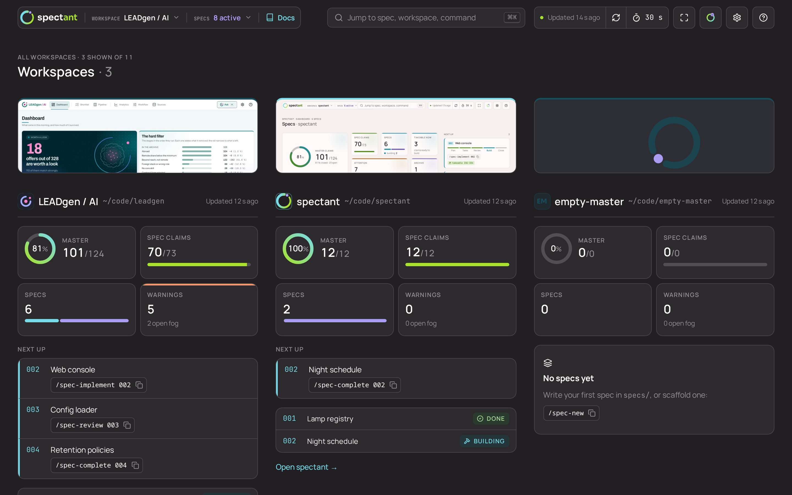
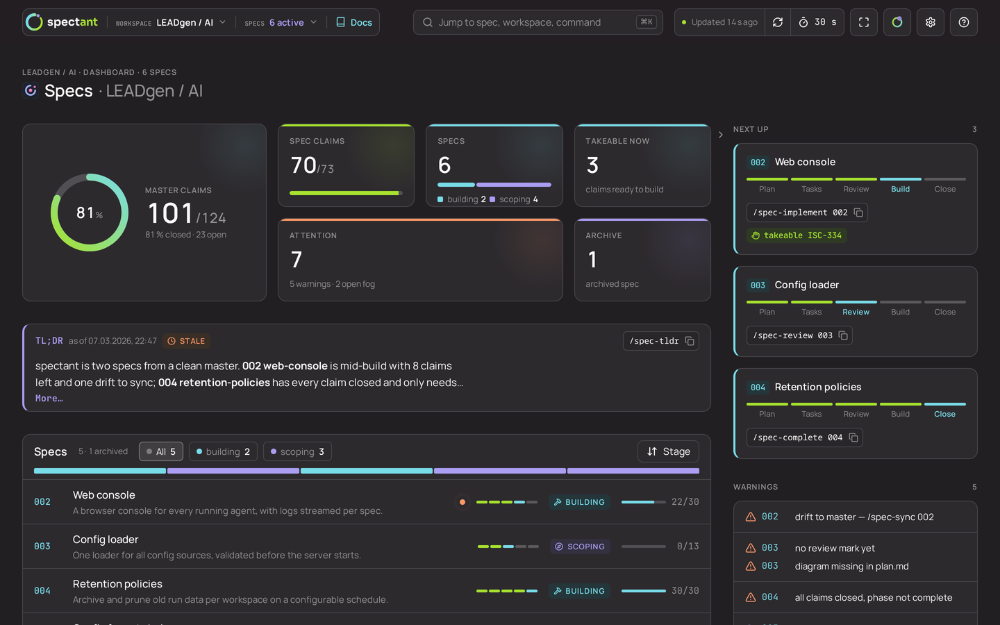
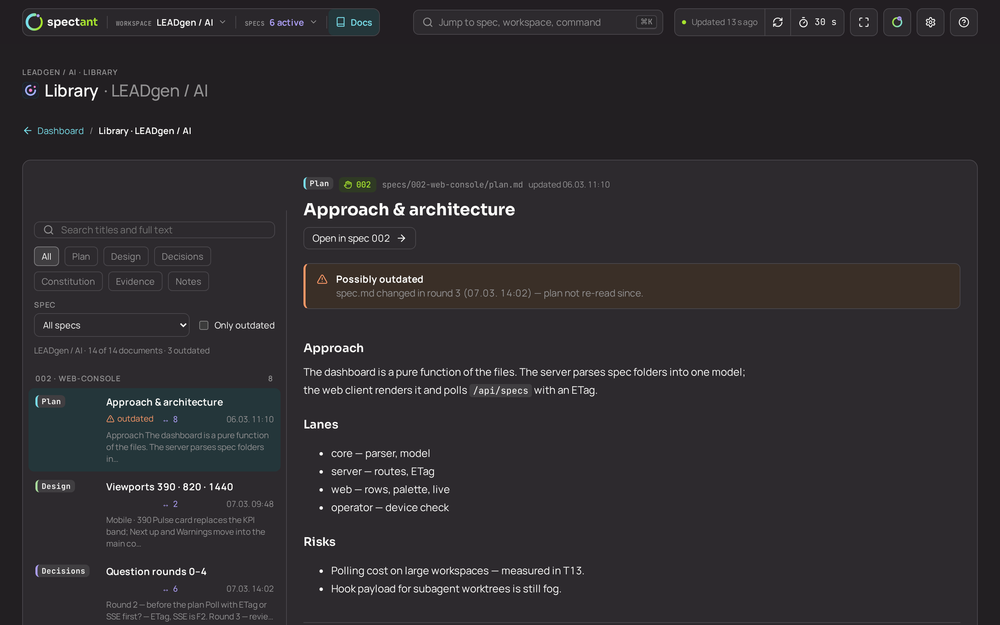
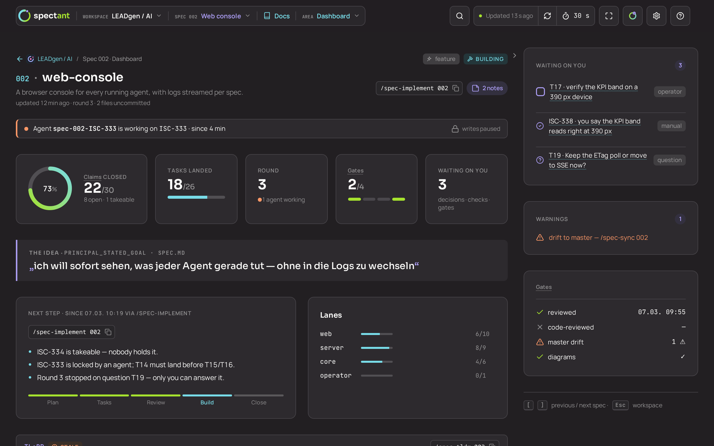
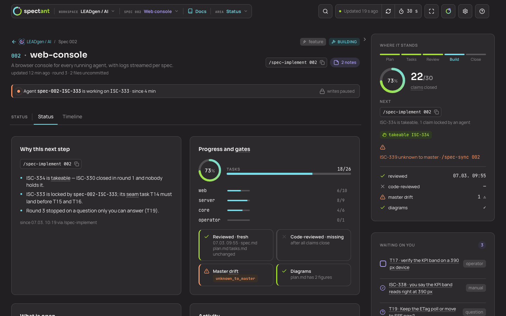
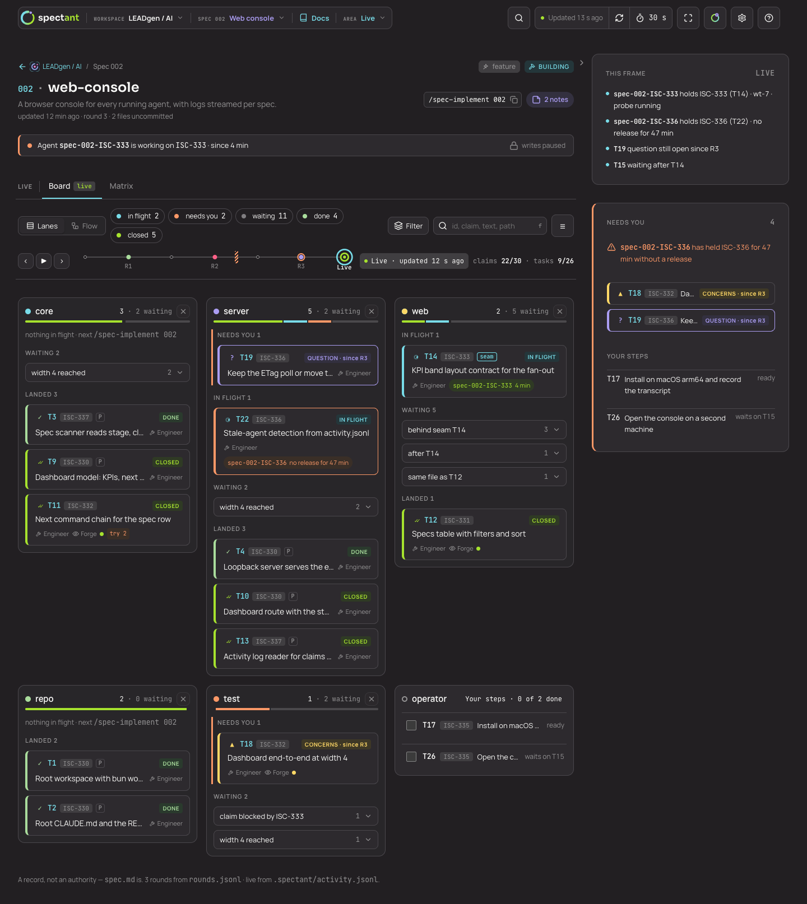
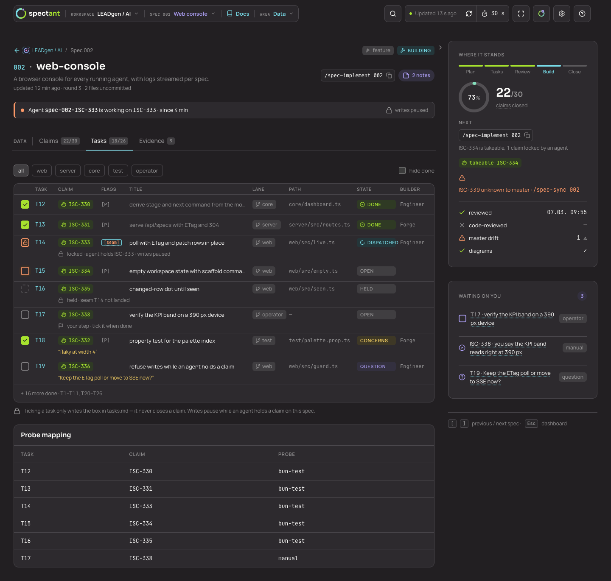
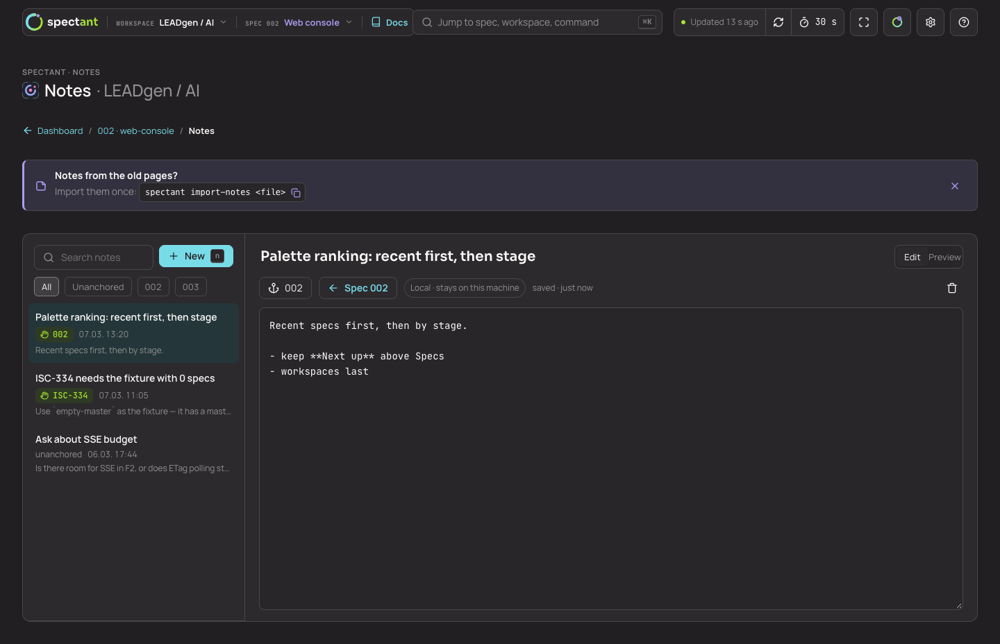

# spectant

**The local spec companion for developers.** spectant is a single binary for macOS and Linux that reads the Markdown
specs in the repositories you register and shows them side by side on one dashboard in your browser, or in a
terminal's web panel. It shows where every spec stands, what comes next and what needs attention, updates in place
when a file changes, and works from the keyboard. It writes only what you set in the app, such as a stage, a review
mark or a task checkbox, and every change lands in versioned files, so git shows what changed and when. Nothing
leaves your machine.

**Work in the chat, keep the overview in the app.** spectant ships with a Spec skill for Claude Code: you shape, plan
and build specs right from the AI chat, and the skill writes plain Markdown into your repository. The app runs beside
it and shows, live, where every spec stands, what waits on you and which agent works on what.

> **Status:** pre-release, spec 001 in progress. Nothing below is released yet.

## Preview

Desktop screens of the design prototype the app is being built against (spec 002, dark theme, fixture data). The
running app does not render these pages yet.



| Workspace dashboard | Library |
|---|---|
|  |  |
| **Spec dashboard** | **Status area** |
|  |  |
| **Live board** | **Tasks** |
|  |  |
| **Notes** | |
|  | |

## Install

```sh
curl -fsSL https://github.com/<org>/spectant/releases/latest/download/install.sh | sh
```

The script picks the binary for your OS and architecture. Set `INSTALL_DIR` to choose where it goes; it never edits
your shell configuration.

## Usage

```sh
spectant add <repo>      # register a repository
spectant list            # show registered repositories
spectant remove <repo>   # unregister one
spectant                 # start the dashboard and open it in the browser
```

`spectant` listens on `127.0.0.1:7717` (or the next free port) and prints the URL. Pass `--no-browser` to skip
opening a browser, `--port N` to choose the port.

## How it works

- spectant reads the Markdown specs (`specs/`) of each registered repository. The files are the only source of truth.
- It keeps only a workspace registry and your settings in SQLite, in `$XDG_DATA_HOME/spectant` or `~/.spectant/`.
  Deleting that directory loses nothing a repository says.
- The server listens on loopback only; the web UI, fonts and icons are embedded in the binary.
- spectant ships with its Spec skill, a Claude Code plugin that shares the same spec parser. You start spec work
  from the AI chat with the skill; the app runs alongside as the place to see, steer and administer it. The skill is
  written for Claude Code first and is meant to work with other agents that understand skills. The plugin lands with
  its own spec.

## Development

Requires [Bun](https://bun.sh).

```sh
bun install
bun run verify
```

Contributor and agent working notes live in `CLAUDE.md`; the rules specs are held to live in `specs/constitution.md`.

## License

Apache-2.0. See `LICENSE`; third-party notices are in `THIRD_PARTY_NOTICES.md`.

## Acknowledgements

The ISA spec format descends from [danielmiessler/LifeOS](https://github.com/danielmiessler/LifeOS) (MIT).
