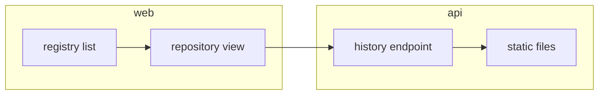

# Plan 002 — Web console

**Purpose:** how the claims in `spec.md` get built. The what lives there; this file holds no acceptance criterion.

## Approach

Serve a static Angular build from the API and read everything through one history endpoint. A separate console server would be one more process to run and secure.

## Affected Files and Modules

| Path | Change | Claim |
|------|--------|-------|
| `api/src/history.ts` | new: history endpoint | ISC-55 |
| `web/src/app/` | new: the console | ISC-51 |

## Risks

| Risk | Blast radius | Early warning | Mitigation |
|------|--------------|---------------|------------|
| history file grows large | console load time | p95 over 300 ms | paginate the endpoint |
