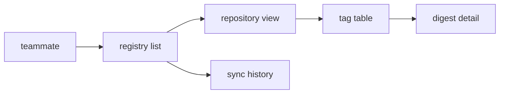

<!-- SPEC — a derived view of ../../ISA.md (feature F2). Claim IDs belong to the master.
     Sync: Skill("Spec", "sync 002-web-console"). Never edit the master from this file. -->

# 002 — Web console

## Problem

The sync log is a text file on one machine. A teammate who does not run the CLI cannot see what was mirrored or
why a run failed.

## Vision

## Out of Scope

- Triggering a sync from the console.
- Editing retention policies in the browser.

## Constraints

- The console is served by the API on loopback, as the cross-cutting claims require.
- It works at 390 px and with the keyboard alone.

## Goal

A teammate opens the console, finds any mirrored repository in two steps, and sees each sync run with its failures,
on a phone-sized screen and with the keyboard alone.

## Test Strategy

| isc | type | check | threshold | tool | anchors_to | severity |
|-----|------|-------|-----------|------|------------|----------|
| ISC-51 | e2e | registry-list: renders | 0 console errors | `bun run e2e -- registry-list -g render` | derived: console-usable | high |
| ISC-52 | e2e | repository-view: renders | 0 console errors | `bun run e2e -- repository-view -g render` | derived: console-usable |  |
| ISC-53 | e2e | tag-table: renders | 0 console errors | `bun run e2e -- tag-table -g render` | derived: console-usable |  |
| ISC-54 | e2e | digest-detail-panel: renders | 0 console errors | `bun run e2e -- digest-detail-panel -g render` | derived: console-usable |  |
| ISC-55 | e2e | sync-history: renders | 0 console errors | `bun run e2e -- sync-history -g render` | derived: console-usable |  |
| ISC-56 | e2e | settings-page: renders | 0 console errors | `bun run e2e -- settings-page -g render` | derived: console-usable |  |
| ISC-57 | e2e | search-box: renders | 0 console errors | `bun run e2e -- search-box -g render` | derived: console-usable |  |
| ISC-58 | e2e | empty-state: renders | 0 console errors | `bun run e2e -- empty-state -g render` | derived: console-usable |  |
| ISC-59 | e2e | error-banner: renders | 0 console errors | `bun run e2e -- error-banner -g render` | derived: console-usable |  |
| ISC-60 | e2e | theme-switch: renders | 0 console errors | `bun run e2e -- theme-switch -g render` | derived: console-usable |  |
| ISC-60.1 | e2e | theme-switch: follows the system scheme | 2 cases | `bun run e2e -- theme-switch -g system` | literal |  |
| ISC-60.2 | e2e | theme-switch: mode survives reload | 2 cases | `bun run e2e -- theme-switch -g persist` | literal |  |
| ISC-61 | e2e | tag-table: no overflow at 390 px | scrollWidth == clientWidth | `bun run e2e -- tag-table -g narrow` | derived: small-screens |  |
| ISC-62 | e2e | digest-detail-panel: no overflow at 390 px | scrollWidth == clientWidth | `bun run e2e -- digest-detail-panel -g narrow` | derived: small-screens |  |
| ISC-63 | e2e | sync-history: no overflow at 390 px | scrollWidth == clientWidth | `bun run e2e -- sync-history -g narrow` | derived: small-screens |  |
| ISC-64 | e2e | settings-page: no overflow at 390 px | scrollWidth == clientWidth | `bun run e2e -- settings-page -g narrow` | derived: small-screens |  |
| ISC-65 | e2e | search-box: no overflow at 390 px | scrollWidth == clientWidth | `bun run e2e -- search-box -g narrow` | derived: small-screens |  |
| ISC-66 | e2e | empty-state: no overflow at 390 px | scrollWidth == clientWidth | `bun run e2e -- empty-state -g narrow` | derived: small-screens |  |
| ISC-67 | e2e | error-banner: no overflow at 390 px | scrollWidth == clientWidth | `bun run e2e -- error-banner -g narrow` | derived: small-screens |  |
| ISC-68 | e2e | theme-switch: no overflow at 390 px | scrollWidth == clientWidth | `bun run e2e -- theme-switch -g narrow` | derived: small-screens |  |
| ISC-69 | browser | registry-list: keyboard reach and focus ring | all reachable | `bun run test:browser -- registry-list` | derived: console-usable |  |
| ISC-70 | browser | repository-view: keyboard reach and focus ring | all reachable | `bun run test:browser -- repository-view` | derived: console-usable |  |
| ISC-71 | browser | tag-table: keyboard reach and focus ring | all reachable | `bun run test:browser -- tag-table` | derived: console-usable |  |
| ISC-72 | browser | digest-detail-panel: keyboard reach and focus ring | all reachable | `bun run test:browser -- digest-detail-panel` | derived: console-usable |  |
| ISC-73 | browser | sync-history: keyboard reach and focus ring | all reachable | `bun run test:browser -- sync-history` | derived: console-usable |  |
| ISC-74 | browser | settings-page: keyboard reach and focus ring | all reachable | `bun run test:browser -- settings-page` | derived: console-usable |  |
| ISC-75 | browser | search-box: keyboard reach and focus ring | all reachable | `bun run test:browser -- search-box` | derived: console-usable |  |
| ISC-76 | browser | empty-state: keyboard reach and focus ring | all reachable | `bun run test:browser -- empty-state` | derived: console-usable |  |
| ISC-77 | manual | screen-reader pass over the sync history | no blocker | transcript in `.evidence/` | derived: console-usable |  |
| ISC-78 | browser | theme-switch: keyboard reach and focus ring | all reachable | `bun run test:browser -- theme-switch` | derived: console-usable |  |

## Features

### F2 · Web console
Why: a teammate who never touches the CLI can see what was mirrored, when, and what failed.

- [x] ISC-51: The registry list renders from the API with no console error.
- [x] ISC-52: The repository view renders from the API with no console error.
- [x] ISC-53: The tag table renders from the API with no console error.
- [x] ISC-54: The digest detail panel renders from the API with no console error.
- [x] ISC-55: The sync history renders from the API with no console error.
- [x] ISC-56: The settings page renders from the API with no console error.
- [x] ISC-57: The search box renders from the API with no console error.
- [x] ISC-58: The empty state renders from the API with no console error.
- [x] ISC-59: The error banner renders from the API with no console error.
- [x] ISC-60: The theme switch renders from the API with no console error.
- [x] ISC-60.1: The theme switch follows the system colour scheme until a mode is chosen. (after: ISC-60)
- [x] ISC-60.2: A chosen colour mode survives a reload of the console. (after: ISC-60)
- [x] ISC-61: The tag table stays usable at 390 px without horizontal scrolling.
- [x] ISC-62: The digest detail panel stays usable at 390 px without horizontal scrolling.
- [x] ISC-63: The sync history stays usable at 390 px without horizontal scrolling.
- [x] ISC-64: The settings page stays usable at 390 px without horizontal scrolling.
- [x] ISC-65: The search box stays usable at 390 px without horizontal scrolling.
- [x] ISC-66: The empty state stays usable at 390 px without horizontal scrolling. (after: ISC-65)
- [x] ISC-67: The error banner stays usable at 390 px without horizontal scrolling.
- [x] ISC-68: The theme switch stays usable at 390 px without horizontal scrolling.
- [x] ISC-69: Every interactive element in the registry list is reachable by keyboard and shows a focus ring.
- [x] ISC-70: Every interactive element in the repository view is reachable by keyboard and shows a focus ring.
- [x] ISC-71: Every interactive element in the tag table is reachable by keyboard and shows a focus ring.
- [x] ISC-72: Every interactive element in the digest detail panel is reachable by keyboard and shows a focus ring.
- [x] ISC-73: Every interactive element in the sync history is reachable by keyboard and shows a focus ring.
- [ ] ISC-74: Every interactive element in the settings page is reachable by keyboard and shows a focus ring.
- [ ] ISC-75: Every interactive element in the search box is reachable by keyboard and shows a focus ring.
- [ ] ISC-76: Every interactive element in the empty state is reachable by keyboard and shows a focus ring.
- [ ] ISC-77: Every interactive element in the error banner is reachable by keyboard and shows a focus ring.
- [ ] ISC-78: Every interactive element in the theme switch is reachable by keyboard and shows a focus ring. (after: ISC-77)

## Decisions

- 2026-03-03: the console reads the API only; it never opens the history file itself.
- 2026-03-07: refined: the colour mode is a stored setting (ISC-60.1, ISC-60.2).

## Verification

- ISC-51: `bun run e2e -- registry-list -g render` passed, 2026-03-08
- ISC-52: `bun run e2e -- repository-view -g render` passed, 2026-03-08
- ISC-53: `bun run e2e -- tag-table -g render` passed, 2026-03-08
- ISC-54: `bun run e2e -- digest-detail-panel -g render` passed, 2026-03-08
- ISC-55: `bun run e2e -- sync-history -g render` passed, 2026-03-08
- ISC-56: `bun run e2e -- settings-page -g render` passed, 2026-03-08
- ISC-57: `bun run e2e -- search-box -g render` passed, 2026-03-08
- ISC-58: `bun run e2e -- empty-state -g render` passed, 2026-03-08
- ISC-59: `bun run e2e -- error-banner -g render` passed, 2026-03-08
- ISC-60: `bun run e2e -- theme-switch -g render` passed, 2026-03-08
- ISC-60.1: `bun run e2e -- theme-switch -g system` passed, 2026-03-08
- ISC-60.2: `bun run e2e -- theme-switch -g persist` passed, 2026-03-08
- ISC-61: `bun run e2e -- tag-table -g narrow` passed, 2026-03-08
- ISC-62: `bun run e2e -- digest-detail-panel -g narrow` passed, 2026-03-08
- ISC-63: `bun run e2e -- sync-history -g narrow` passed, 2026-03-08
- ISC-64: `bun run e2e -- settings-page -g narrow` passed, 2026-03-08
- ISC-65: `bun run e2e -- search-box -g narrow` passed, 2026-03-08
- ISC-66: `bun run e2e -- empty-state -g narrow` passed, 2026-03-08
- ISC-67: `bun run e2e -- error-banner -g narrow` passed, 2026-03-08
- ISC-68: `bun run e2e -- theme-switch -g narrow` passed, 2026-03-08
- ISC-69: `bun run test:browser -- registry-list` passed, 2026-03-08
- ISC-70: `bun run test:browser -- repository-view` passed, 2026-03-08
- ISC-71: `bun run test:browser -- tag-table` passed, 2026-03-08
- ISC-72: `bun run test:browser -- digest-detail-panel` passed, 2026-03-08
- ISC-73: `bun run test:browser -- sync-history` passed, 2026-03-08
