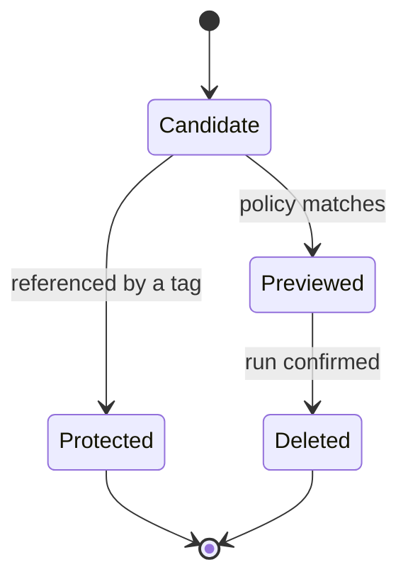

<!-- SPEC — a derived view of ../../ISA.md (feature F4). Claim IDs belong to the master.
     Sync: Skill("Spec", "sync 004-retention-policies"). Never edit the master from this file. -->

# 004 — Retention policies

## Problem

The mirror only grows. Old manifests pile up until the registry's quota stops the next sync.

## Vision

## Out of Scope

- Deleting blobs; the registry's own garbage collection does that.

## Constraints

- Every deletion is previewed in the console first.

## Goal

A team writes its retention policy once, sees its effect before anything goes, and no manifest that a tag still
references is ever deleted.

## Test Strategy

| isc | type | check | threshold | tool | anchors_to | severity |
|-----|------|-------|-----------|------|------------|----------|
| ISC-95 | bun-test | verdict log for keep-last-N | one line per manifest | `bun test tests/retention.test.ts -t "keep-last-N"` | literal |  |
| ISC-96 | bun-test | verdict log for keep-newer-than | one line per manifest | `bun test tests/retention.test.ts -t "keep-newer-than"` | literal |  |
| ISC-97 | bun-test | verdict log for keep-by-tag-pattern | one line per manifest | `bun test tests/retention.test.ts -t "keep-by-tag-pattern"` | literal |  |
| ISC-98 | bun-test | verdict log for a protected tag | one line per manifest | `bun test tests/retention.test.ts -t "a protected tag"` | literal |  |
| ISC-99 | bun-test | verdict log for an untagged manifest | one line per manifest | `bun test tests/retention.test.ts -t "an untagged manifest"` | literal |  |
| ISC-100 | bun-test | verdict log for a policy preview | one line per manifest | `bun test tests/retention.test.ts -t "a policy preview"` | literal |  |
| ISC-101 | bun-test | verdict log for a policy conflict | one line per manifest | `bun test tests/retention.test.ts -t "a policy conflict"` | literal |  |
| ISC-102 | bun-test | verdict log for a scheduled run | one line per manifest | `bun test tests/retention.test.ts -t "a scheduled run"` | literal |  |
| ISC-103 | bun-test | verdict log for a manual run | one line per manifest | `bun test tests/retention.test.ts -t "a manual run"` | literal |  |
| ISC-104 | bun-test | verdict log for a policy file with comments | one line per manifest | `bun test tests/retention.test.ts -t "a policy file with comments"` | literal |  |
| ISC-105 | bun-test | referenced manifests deleted for keep-last-N | 0 | `bun test tests/retention.test.ts -t "keep-last-N"` | derived: never-lose-a-referenced-manifest | high |
| ISC-106 | bun-test | referenced manifests deleted for keep-newer-than | 0 | `bun test tests/retention.test.ts -t "keep-newer-than"` | derived: never-lose-a-referenced-manifest | high |
| ISC-107 | bun-test | referenced manifests deleted for keep-by-tag-pattern | 0 | `bun test tests/retention.test.ts -t "keep-by-tag-pattern"` | derived: never-lose-a-referenced-manifest | high |
| ISC-108 | bun-test | referenced manifests deleted for a protected tag | 0 | `bun test tests/retention.test.ts -t "a protected tag"` | derived: never-lose-a-referenced-manifest | high |
| ISC-109 | bun-test | referenced manifests deleted for an untagged manifest | 0 | `bun test tests/retention.test.ts -t "an untagged manifest"` | derived: never-lose-a-referenced-manifest | high |
| ISC-110 | bun-test | referenced manifests deleted for a policy preview | 0 | `bun test tests/retention.test.ts -t "a policy preview"` | derived: never-lose-a-referenced-manifest | high |
| ISC-111 | bun-test | referenced manifests deleted for a policy conflict | 0 | `bun test tests/retention.test.ts -t "a policy conflict"` | derived: never-lose-a-referenced-manifest | high |
| ISC-112 | bun-test | referenced manifests deleted for a scheduled run | 0 | `bun test tests/retention.test.ts -t "a scheduled run"` | derived: never-lose-a-referenced-manifest | high |
| ISC-113 | bun-test | referenced manifests deleted for a manual run | 0 | `bun test tests/retention.test.ts -t "a manual run"` | derived: never-lose-a-referenced-manifest | high |
| ISC-114 | bun-test | referenced manifests deleted for a policy file with comments | 0 | `bun test tests/retention.test.ts -t "a policy file with comments"` | derived: never-lose-a-referenced-manifest | high |
| ISC-115 | e2e | preview shown for keep-last-N | before delete | `bun run e2e -- retention -g "preview 1"` | literal |  |
| ISC-116 | e2e | preview shown for keep-newer-than | before delete | `bun run e2e -- retention -g "preview 2"` | literal |  |
| ISC-117 | e2e | preview shown for keep-by-tag-pattern | before delete | `bun run e2e -- retention -g "preview 3"` | literal |  |
| ISC-118 | e2e | preview shown for a protected tag | before delete | `bun run e2e -- retention -g "preview 4"` | literal |  |
| ISC-119 | e2e | preview shown for an untagged manifest | before delete | `bun run e2e -- retention -g "preview 5"` | literal |  |
| ISC-120 | e2e | preview shown for a policy preview | before delete | `bun run e2e -- retention -g "preview 6"` | literal |  |
| ISC-121 | e2e | preview shown for a policy conflict | before delete | `bun run e2e -- retention -g "preview 7"` | literal |  |
| ISC-122 | e2e | preview shown for a scheduled run | before delete | `bun run e2e -- retention -g "preview 8"` | literal |  |
| ISC-123 | e2e | preview shown for a manual run | before delete | `bun run e2e -- retention -g "preview 9"` | literal |  |
| ISC-124 | e2e | preview shown for a policy file with comments | before delete | `bun run e2e -- retention -g "preview 10"` | literal |  |

## Features

### F4 · Retention policies
Why: old manifests go away on a schedule the team wrote down, and nothing still in use ever does.

- [x] ISC-95: For keep-last-N, the retention engine evaluates every repository and logs one verdict per manifest.
- [x] ISC-96: For keep-newer-than, the retention engine evaluates every repository and logs one verdict per manifest.
- [x] ISC-97: For keep-by-tag-pattern, the retention engine evaluates every repository and logs one verdict per manifest.
- [x] ISC-98: For a protected tag, the retention engine evaluates every repository and logs one verdict per manifest.
- [x] ISC-99: For an untagged manifest, the retention engine evaluates every repository and logs one verdict per manifest.
- [x] ISC-100: For a policy preview, the retention engine evaluates every repository and logs one verdict per manifest.
- [x] ISC-101: For a policy conflict, the retention engine evaluates every repository and logs one verdict per manifest.
- [x] ISC-102: For a scheduled run, the retention engine evaluates every repository and logs one verdict per manifest.
- [x] ISC-103: For a manual run, the retention engine evaluates every repository and logs one verdict per manifest.
- [x] ISC-104: For a policy file with comments, the retention engine evaluates every repository and logs one verdict per manifest.
- [x] ISC-105: Anti: keep-last-N deletes a manifest that another tag still references.
- [x] ISC-106: Anti: keep-newer-than deletes a manifest that another tag still references.
- [x] ISC-107: Anti: keep-by-tag-pattern deletes a manifest that another tag still references.
- [x] ISC-108: Anti: a protected tag deletes a manifest that another tag still references.
- [x] ISC-109: Anti: an untagged manifest deletes a manifest that another tag still references.
- [x] ISC-110: Anti: a policy preview deletes a manifest that another tag still references.
- [x] ISC-111: Anti: a policy conflict deletes a manifest that another tag still references.
- [x] ISC-112: Anti: a scheduled run deletes a manifest that another tag still references.
- [x] ISC-113: Anti: a manual run deletes a manifest that another tag still references.
- [x] ISC-114: Anti: a policy file with comments deletes a manifest that another tag still references.
- [x] ISC-115: The console shows the effect of keep-last-N before anything is deleted. (after: ISC-95)
- [x] ISC-116: The console shows the effect of keep-newer-than before anything is deleted. (after: ISC-96)
- [x] ISC-117: The console shows the effect of keep-by-tag-pattern before anything is deleted. (after: ISC-97)
- [x] ISC-118: The console shows the effect of a protected tag before anything is deleted. (after: ISC-98)
- [x] ISC-119: The console shows the effect of an untagged manifest before anything is deleted. (after: ISC-99)
- [x] ISC-120: The console shows the effect of a policy preview before anything is deleted. (after: ISC-100)
- [x] ISC-121: The console shows the effect of a policy conflict before anything is deleted. (after: ISC-101)
- [x] ISC-122: The console shows the effect of a scheduled run before anything is deleted. (after: ISC-102)
- [x] ISC-123: The console shows the effect of a manual run before anything is deleted. (after: ISC-103)
- [x] ISC-124: The console shows the effect of a policy file with comments before anything is deleted. (after: ISC-104)

## Decisions

- 2026-03-04: a manifest referenced by any tag is never a deletion candidate, whatever the policy says.

## Verification

- ISC-95: `bun test tests/retention.test.ts -t "keep-last-N"` passed, 2026-03-08
- ISC-96: `bun test tests/retention.test.ts -t "keep-newer-than"` passed, 2026-03-08
- ISC-97: `bun test tests/retention.test.ts -t "keep-by-tag-pattern"` passed, 2026-03-08
- ISC-98: `bun test tests/retention.test.ts -t "a protected tag"` passed, 2026-03-08
- ISC-99: `bun test tests/retention.test.ts -t "an untagged manifest"` passed, 2026-03-08
- ISC-100: `bun test tests/retention.test.ts -t "a policy preview"` passed, 2026-03-08
- ISC-101: `bun test tests/retention.test.ts -t "a policy conflict"` passed, 2026-03-08
- ISC-102: `bun test tests/retention.test.ts -t "a scheduled run"` passed, 2026-03-08
- ISC-103: `bun test tests/retention.test.ts -t "a manual run"` passed, 2026-03-08
- ISC-104: `bun test tests/retention.test.ts -t "a policy file with comments"` passed, 2026-03-08
- ISC-105: `bun test tests/retention.test.ts -t "keep-last-N"` passed, 2026-03-08
- ISC-106: `bun test tests/retention.test.ts -t "keep-newer-than"` passed, 2026-03-08
- ISC-107: `bun test tests/retention.test.ts -t "keep-by-tag-pattern"` passed, 2026-03-08
- ISC-108: `bun test tests/retention.test.ts -t "a protected tag"` passed, 2026-03-08
- ISC-109: `bun test tests/retention.test.ts -t "an untagged manifest"` passed, 2026-03-08
- ISC-110: `bun test tests/retention.test.ts -t "a policy preview"` passed, 2026-03-08
- ISC-111: `bun test tests/retention.test.ts -t "a policy conflict"` passed, 2026-03-08
- ISC-112: `bun test tests/retention.test.ts -t "a scheduled run"` passed, 2026-03-08
- ISC-113: `bun test tests/retention.test.ts -t "a manual run"` passed, 2026-03-08
- ISC-114: `bun test tests/retention.test.ts -t "a policy file with comments"` passed, 2026-03-08
- ISC-115: `bun run e2e -- retention -g "preview 1"` passed, 2026-03-08
- ISC-116: `bun run e2e -- retention -g "preview 2"` passed, 2026-03-08
- ISC-117: `bun run e2e -- retention -g "preview 3"` passed, 2026-03-08
- ISC-118: `bun run e2e -- retention -g "preview 4"` passed, 2026-03-08
- ISC-119: `bun run e2e -- retention -g "preview 5"` passed, 2026-03-08
- ISC-120: `bun run e2e -- retention -g "preview 6"` passed, 2026-03-08
- ISC-121: `bun run e2e -- retention -g "preview 7"` passed, 2026-03-08
- ISC-122: `bun run e2e -- retention -g "preview 8"` passed, 2026-03-08
- ISC-123: `bun run e2e -- retention -g "preview 9"` passed, 2026-03-08
- ISC-124: `bun run e2e -- retention -g "preview 10"` passed, 2026-03-08
