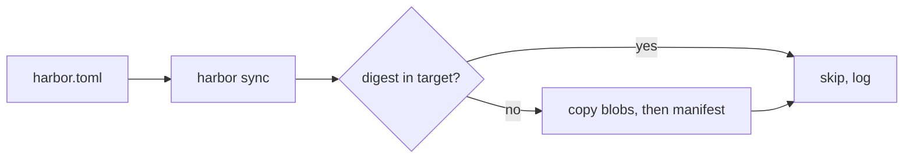

<!-- SPEC — a derived view of ../../ISA.md (feature F1). Claim IDs belong to the master.
     Sync: Skill("Spec", "sync 001-manifest-sync"). Never edit the master from this file. -->

# 001 — Manifest sync

## Problem

Copying images between registries by hand loses digests, repeats uploads and leaves no log.

## Vision

## Out of Scope

- Retention; spec 004 owns it.

## Constraints

- A manifest is pushed only after every blob it references is present.

## Goal

`harbor sync` mirrors every listed manifest with an identical digest, and a second run uploads nothing.

## Test Strategy

| isc | type | check | threshold | tool | anchors_to | severity |
|-----|------|-------|-----------|------|------------|----------|
| ISC-5 | bun-test | digest equality for case 1 | equal | `bun test tests/sync.test.ts -t "case 5"` | literal | high |
| ISC-6 | bun-test | digest equality for case 2 | equal | `bun test tests/sync.test.ts -t "case 6"` | literal |  |
| ISC-7 | bun-test | digest equality for case 3 | equal | `bun test tests/sync.test.ts -t "case 7"` | literal |  |
| ISC-8 | bun-test | digest equality for case 4 | equal | `bun test tests/sync.test.ts -t "case 8"` | literal |  |
| ISC-9 | bun-test | digest equality for case 5 | equal | `bun test tests/sync.test.ts -t "case 9"` | literal |  |
| ISC-10 | bun-test | digest equality for case 6 | equal | `bun test tests/sync.test.ts -t "case 10"` | literal |  |
| ISC-11 | bun-test | digest equality for case 7 | equal | `bun test tests/sync.test.ts -t "case 11"` | literal |  |
| ISC-12 | bun-test | digest equality for case 8 | equal | `bun test tests/sync.test.ts -t "case 12"` | literal |  |
| ISC-13 | bun-test | digest equality for case 9 | equal | `bun test tests/sync.test.ts -t "case 13"` | literal |  |
| ISC-14 | bun-test | digest equality for case 10 | equal | `bun test tests/sync.test.ts -t "case 14"` | literal | high |
| ISC-15 | bun-test | digest equality for case 11 | equal | `bun test tests/sync.test.ts -t "case 15"` | literal |  |
| ISC-16 | bun-test | digest equality for case 12 | equal | `bun test tests/sync.test.ts -t "case 16"` | literal |  |
| ISC-17 | bash | dry-run writes for case 1 | 0 writes | `bun run cli -- sync --dry-run --case 1 \| rg -c PUSH` | literal |  |
| ISC-18 | bash | dry-run writes for case 2 | 0 writes | `bun run cli -- sync --dry-run --case 2 \| rg -c PUSH` | literal |  |
| ISC-19 | bash | dry-run writes for case 3 | 0 writes | `bun run cli -- sync --dry-run --case 3 \| rg -c PUSH` | literal |  |
| ISC-20 | bash | dry-run writes for case 4 | 0 writes | `bun run cli -- sync --dry-run --case 4 \| rg -c PUSH` | literal |  |
| ISC-21 | bash | dry-run writes for case 5 | 0 writes | `bun run cli -- sync --dry-run --case 5 \| rg -c PUSH` | literal |  |
| ISC-22 | bash | dry-run writes for case 6 | 0 writes | `bun run cli -- sync --dry-run --case 6 \| rg -c PUSH` | literal |  |
| ISC-23 | bash | dry-run writes for case 7 | 0 writes | `bun run cli -- sync --dry-run --case 7 \| rg -c PUSH` | literal | high |
| ISC-24 | bash | dry-run writes for case 8 | 0 writes | `bun run cli -- sync --dry-run --case 8 \| rg -c PUSH` | literal |  |
| ISC-25 | bash | dry-run writes for case 9 | 0 writes | `bun run cli -- sync --dry-run --case 9 \| rg -c PUSH` | literal |  |
| ISC-26 | bash | dry-run writes for case 10 | 0 writes | `bun run cli -- sync --dry-run --case 10 \| rg -c PUSH` | literal |  |
| ISC-27 | bash | dry-run writes for case 11 | 0 writes | `bun run cli -- sync --dry-run --case 11 \| rg -c PUSH` | literal |  |
| ISC-28 | bash | dry-run writes for case 12 | 0 writes | `bun run cli -- sync --dry-run --case 12 \| rg -c PUSH` | literal |  |
| ISC-29 | bun-test | bytes uploaded on re-run for case 1 | 0 bytes | `bun test tests/sync.test.ts -t "case 29"` | derived: idempotent-sync |  |
| ISC-30 | bun-test | bytes uploaded on re-run for case 2 | 0 bytes | `bun test tests/sync.test.ts -t "case 30"` | derived: idempotent-sync |  |
| ISC-31 | bun-test | bytes uploaded on re-run for case 3 | 0 bytes | `bun test tests/sync.test.ts -t "case 31"` | derived: idempotent-sync |  |
| ISC-32 | bun-test | bytes uploaded on re-run for case 4 | 0 bytes | `bun test tests/sync.test.ts -t "case 32"` | derived: idempotent-sync | high |
| ISC-33 | bun-test | bytes uploaded on re-run for case 5 | 0 bytes | `bun test tests/sync.test.ts -t "case 33"` | derived: idempotent-sync |  |
| ISC-34 | bun-test | bytes uploaded on re-run for case 6 | 0 bytes | `bun test tests/sync.test.ts -t "case 34"` | derived: idempotent-sync |  |
| ISC-35 | bun-test | bytes uploaded on re-run for case 7 | 0 bytes | `bun test tests/sync.test.ts -t "case 35"` | derived: idempotent-sync |  |
| ISC-36 | bun-test | bytes uploaded on re-run for case 8 | 0 bytes | `bun test tests/sync.test.ts -t "case 36"` | derived: idempotent-sync |  |
| ISC-37 | bun-test | bytes uploaded on re-run for case 9 | 0 bytes | `bun test tests/sync.test.ts -t "case 37"` | derived: idempotent-sync |  |
| ISC-38 | bun-test | bytes uploaded on re-run for case 10 | 0 bytes | `bun test tests/sync.test.ts -t "case 38"` | derived: idempotent-sync |  |
| ISC-39 | bun-test | bytes uploaded on re-run for case 11 | 0 bytes | `bun test tests/sync.test.ts -t "case 39"` | derived: idempotent-sync |  |
| ISC-40 | bun-test | bytes uploaded on re-run for case 12 | 0 bytes | `bun test tests/sync.test.ts -t "case 40"` | derived: idempotent-sync |  |
| ISC-41 | bun-test | log line fields for case 1 | source and target named | `bun test tests/sync.test.ts -t "case 41"` | literal | high |
| ISC-42 | bun-test | log line fields for case 2 | source and target named | `bun test tests/sync.test.ts -t "case 42"` | literal |  |
| ISC-43 | bun-test | log line fields for case 3 | source and target named | `bun test tests/sync.test.ts -t "case 43"` | literal |  |
| ISC-44 | bun-test | log line fields for case 4 | source and target named | `bun test tests/sync.test.ts -t "case 44"` | literal |  |
| ISC-45 | bun-test | log line fields for case 5 | source and target named | `bun test tests/sync.test.ts -t "case 45"` | literal |  |
| ISC-46 | bun-test | log line fields for case 6 | source and target named | `bun test tests/sync.test.ts -t "case 46"` | literal |  |
| ISC-47 | bun-test | log line fields for case 7 | source and target named | `bun test tests/sync.test.ts -t "case 47"` | literal |  |
| ISC-48 | bun-test | log line fields for case 8 | source and target named | `bun test tests/sync.test.ts -t "case 48"` | literal |  |
| ISC-49 | bun-test | log line fields for case 9 | source and target named | `bun test tests/sync.test.ts -t "case 49"` | literal |  |
| ISC-50 | bun-test | log line fields for case 10 | source and target named | `bun test tests/sync.test.ts -t "case 50"` | literal | high |

## Features

### F1 · Manifest sync
Why: one command mirrors every manifest a team depends on into its own registry, and running it again changes nothing.

- [x] ISC-5: `harbor sync` copies a single-platform manifest to the target registry with an identical digest.
- [x] ISC-6: `harbor sync` copies a multi-platform index to the target registry with an identical digest. (after: ISC-5)
- [x] ISC-7: `harbor sync` copies a manifest pinned by digest to the target registry with an identical digest.
- [x] ISC-8: `harbor sync` copies a manifest referenced by tag to the target registry with an identical digest.
- [x] ISC-9: `harbor sync` copies an attestation attached to a manifest to the target registry with an identical digest.
- [x] ISC-10: `harbor sync` copies a signature artifact to the target registry with an identical digest.
- [x] ISC-11: `harbor sync` copies a manifest larger than 4 MB to the target registry with an identical digest. (after: ISC-10)
- [x] ISC-12: `harbor sync` copies a blob already present in the target to the target registry with an identical digest.
- [x] ISC-13: `harbor sync` copies a layer shared by two manifests to the target registry with an identical digest.
- [x] ISC-14: `harbor sync` copies a manifest whose source answers 404 to the target registry with an identical digest.
- [x] ISC-15: `harbor sync` copies a registry that answers 429 to the target registry with an identical digest.
- [x] ISC-16: `harbor sync` copies an empty repository to the target registry with an identical digest. (after: ISC-15)
- [x] ISC-17: A dry run over a single-platform manifest prints the planned push and writes nothing.
- [x] ISC-18: A dry run over a multi-platform index prints the planned push and writes nothing.
- [x] ISC-19: A dry run over a manifest pinned by digest prints the planned push and writes nothing.
- [x] ISC-20: A dry run over a manifest referenced by tag prints the planned push and writes nothing.
- [x] ISC-21: A dry run over an attestation attached to a manifest prints the planned push and writes nothing. (after: ISC-20)
- [x] ISC-22: A dry run over a signature artifact prints the planned push and writes nothing.
- [x] ISC-23: A dry run over a manifest larger than 4 MB prints the planned push and writes nothing.
- [x] ISC-24: A dry run over a blob already present in the target prints the planned push and writes nothing.
- [x] ISC-25: A dry run over a layer shared by two manifests prints the planned push and writes nothing.
- [x] ISC-26: A dry run over a manifest whose source answers 404 prints the planned push and writes nothing. (after: ISC-25)
- [x] ISC-27: A dry run over a registry that answers 429 prints the planned push and writes nothing.
- [x] ISC-28: A dry run over an empty repository prints the planned push and writes nothing.
- [x] ISC-29: Anti: syncing a single-platform manifest twice uploads a byte the second time.
- [x] ISC-30: Anti: syncing a multi-platform index twice uploads a byte the second time.
- [x] ISC-31: Anti: syncing a manifest pinned by digest twice uploads a byte the second time. (after: ISC-30)
- [x] ISC-32: Anti: syncing a manifest referenced by tag twice uploads a byte the second time.
- [x] ISC-33: Anti: syncing an attestation attached to a manifest twice uploads a byte the second time.
- [x] ISC-34: Anti: syncing a signature artifact twice uploads a byte the second time.
- [x] ISC-35: Anti: syncing a manifest larger than 4 MB twice uploads a byte the second time.
- [x] ISC-36: Anti: syncing a blob already present in the target twice uploads a byte the second time. (after: ISC-35)
- [x] ISC-37: Anti: syncing a layer shared by two manifests twice uploads a byte the second time.
- [x] ISC-38: Anti: syncing a manifest whose source answers 404 twice uploads a byte the second time.
- [x] ISC-39: Anti: syncing a registry that answers 429 twice uploads a byte the second time.
- [x] ISC-40: Anti: syncing an empty repository twice uploads a byte the second time.
- [x] ISC-41: The sync log names a single-platform manifest with its source and target reference. (after: ISC-40)
- [x] ISC-42: The sync log names a multi-platform index with its source and target reference.
- [x] ISC-43: The sync log names a manifest pinned by digest with its source and target reference.
- [x] ISC-44: The sync log names a manifest referenced by tag with its source and target reference.
- [x] ISC-45: The sync log names an attestation attached to a manifest with its source and target reference.
- [x] ISC-46: The sync log names a signature artifact with its source and target reference. (after: ISC-45)
- [x] ISC-47: The sync log names a manifest larger than 4 MB with its source and target reference.
- [x] ISC-48: The sync log names a blob already present in the target with its source and target reference.
- [x] ISC-49: The sync log names a layer shared by two manifests with its source and target reference.
- [x] ISC-50: The sync log names a manifest whose source answers 404 with its source and target reference.

## Decisions

- 2026-03-02: sync compares digests, never tags, so a moved upstream tag is copied again.
- 2026-03-05: closed; every claim green on its probe.

## Verification

- ISC-5: `bun test tests/sync.test.ts -t "case 5"` passed, 2026-03-05
- ISC-6: `bun test tests/sync.test.ts -t "case 6"` passed, 2026-03-05
- ISC-7: `bun test tests/sync.test.ts -t "case 7"` passed, 2026-03-05
- ISC-8: `bun test tests/sync.test.ts -t "case 8"` passed, 2026-03-05
- ISC-9: `bun test tests/sync.test.ts -t "case 9"` passed, 2026-03-05
- ISC-10: `bun test tests/sync.test.ts -t "case 10"` passed, 2026-03-05
- ISC-11: `bun test tests/sync.test.ts -t "case 11"` passed, 2026-03-05
- ISC-12: `bun test tests/sync.test.ts -t "case 12"` passed, 2026-03-05
- ISC-13: `bun test tests/sync.test.ts -t "case 13"` passed, 2026-03-05
- ISC-14: `bun test tests/sync.test.ts -t "case 14"` passed, 2026-03-05
- ISC-15: `bun test tests/sync.test.ts -t "case 15"` passed, 2026-03-05
- ISC-16: `bun test tests/sync.test.ts -t "case 16"` passed, 2026-03-05
- ISC-17: `bun run cli -- sync --dry-run --case 1 | rg -c PUSH` passed, 2026-03-05
- ISC-18: `bun run cli -- sync --dry-run --case 2 | rg -c PUSH` passed, 2026-03-05
- ISC-19: `bun run cli -- sync --dry-run --case 3 | rg -c PUSH` passed, 2026-03-05
- ISC-20: `bun run cli -- sync --dry-run --case 4 | rg -c PUSH` passed, 2026-03-05
- ISC-21: `bun run cli -- sync --dry-run --case 5 | rg -c PUSH` passed, 2026-03-05
- ISC-22: `bun run cli -- sync --dry-run --case 6 | rg -c PUSH` passed, 2026-03-05
- ISC-23: `bun run cli -- sync --dry-run --case 7 | rg -c PUSH` passed, 2026-03-05
- ISC-24: `bun run cli -- sync --dry-run --case 8 | rg -c PUSH` passed, 2026-03-05
- ISC-25: `bun run cli -- sync --dry-run --case 9 | rg -c PUSH` passed, 2026-03-05
- ISC-26: `bun run cli -- sync --dry-run --case 10 | rg -c PUSH` passed, 2026-03-05
- ISC-27: `bun run cli -- sync --dry-run --case 11 | rg -c PUSH` passed, 2026-03-05
- ISC-28: `bun run cli -- sync --dry-run --case 12 | rg -c PUSH` passed, 2026-03-05
- ISC-29: `bun test tests/sync.test.ts -t "case 29"` passed, 2026-03-05
- ISC-30: `bun test tests/sync.test.ts -t "case 30"` passed, 2026-03-05
- ISC-31: `bun test tests/sync.test.ts -t "case 31"` passed, 2026-03-05
- ISC-32: `bun test tests/sync.test.ts -t "case 32"` passed, 2026-03-05
- ISC-33: `bun test tests/sync.test.ts -t "case 33"` passed, 2026-03-05
- ISC-34: `bun test tests/sync.test.ts -t "case 34"` passed, 2026-03-05
- ISC-35: `bun test tests/sync.test.ts -t "case 35"` passed, 2026-03-05
- ISC-36: `bun test tests/sync.test.ts -t "case 36"` passed, 2026-03-05
- ISC-37: `bun test tests/sync.test.ts -t "case 37"` passed, 2026-03-05
- ISC-38: `bun test tests/sync.test.ts -t "case 38"` passed, 2026-03-05
- ISC-39: `bun test tests/sync.test.ts -t "case 39"` passed, 2026-03-05
- ISC-40: `bun test tests/sync.test.ts -t "case 40"` passed, 2026-03-05
- ISC-41: `bun test tests/sync.test.ts -t "case 41"` passed, 2026-03-05
- ISC-42: `bun test tests/sync.test.ts -t "case 42"` passed, 2026-03-05
- ISC-43: `bun test tests/sync.test.ts -t "case 43"` passed, 2026-03-05
- ISC-44: `bun test tests/sync.test.ts -t "case 44"` passed, 2026-03-05
- ISC-45: `bun test tests/sync.test.ts -t "case 45"` passed, 2026-03-05
- ISC-46: `bun test tests/sync.test.ts -t "case 46"` passed, 2026-03-05
- ISC-47: `bun test tests/sync.test.ts -t "case 47"` passed, 2026-03-05
- ISC-48: `bun test tests/sync.test.ts -t "case 48"` passed, 2026-03-05
- ISC-49: `bun test tests/sync.test.ts -t "case 49"` passed, 2026-03-05
- ISC-50: `bun test tests/sync.test.ts -t "case 50"` passed, 2026-03-05
