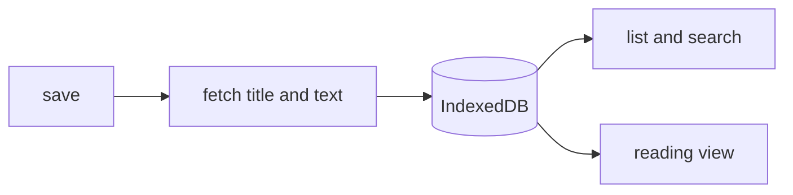

# Plan 001 — Reading list

**Purpose:** how the claims in `spec.md` get built. The what lives there; this file holds no acceptance criterion.

## Approach

Store each saved link with its fetched text in IndexedDB at save time, so reading offline is a read from the same
store the list uses. Fetching the text only when the reader opens an article would fail exactly when there is no
connection.

## Affected Files and Modules

| Path | Change | Claim |
|------|--------|-------|
| `src/app/save/` | new: the save action | ISC-3 |
| `src/app/store.ts` | new: the IndexedDB store | ISC-4 |
| `src/app/search/` | new: title and tag search | ISC-7 |
| `src/app/reader/` | new: the reading view | ISC-9 |

## Risks

| Risk | Blast radius | Early warning | Mitigation |
|------|--------------|---------------|------------|
| a page blocks text extraction | one article | empty text at save | keep the link, mark the entry "online only" |
