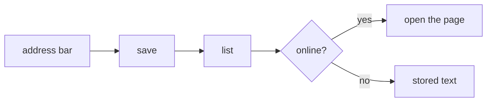

<!-- SPEC — a derived view of ../../ISA.md (feature F1). Claim IDs belong to the master.
     Sync: Skill("Spec", "sync 001-reading-list"). Never edit the master from this file. -->

# 001 — Reading list

## Problem

Saved articles live in browser tabs and chat threads and are gone when the tab closes.

## Vision

## Out of Scope

- Sharing lists with other readers.

## Constraints

- Everything is stored on the device; no sync in this spec.

## Goal

A reader saves a link in one step, finds it again by title or tag, and reads it offline.

## Test Strategy

| isc | type | check | threshold | tool | anchors_to | severity |
|-----|------|-------|-----------|------|------------|----------|
| ISC-3 | e2e | save a link from the address bar | 1 step | `bun run e2e -- save -g "one step"` | literal | |
| ISC-4 | e2e | saved link listed after reload | listed | `bun run e2e -- save -g reload` | literal | |
| ISC-5 | bun-test | title fetched for a saved link | title set | `bun test tests/title.test.ts` | literal | |
| ISC-6 | bun-test | tags stored with a link | round-trip | `bun test tests/tags.test.ts` | literal | |
| ISC-7 | e2e | search by title narrows the list | only matches | `bun run e2e -- search -g title` | derived: find-again | |
| ISC-8 | e2e | search by tag narrows the list | only matches | `bun run e2e -- search -g tag` | derived: find-again | |
| ISC-9 | e2e | saved article readable offline | text shown | `bun run e2e -- offline -g read` | derived: read-offline | |
| ISC-10 | browser | reading view at 390 px | no horizontal overflow | `bun run test:browser -- reading` | derived: read-offline | |

## Features

### F1 · Reading list
Why: a link saved once is found again later and can be read without a connection.

- [x] ISC-3: A link is saved from the address bar in one step.
- [x] ISC-4: A saved link is still listed after a reload. (after: ISC-3)
- [x] ISC-5: A saved link gets the page title fetched at save time. (after: ISC-3)
- [x] ISC-6: Tags are stored with a link and restored with it.
- [ ] ISC-7: Typing in the search box narrows the list to titles that match.
- [ ] ISC-8: Typing a tag narrows the list to links carrying it. (after: ISC-7)
- [ ] ISC-9: A saved article's text is readable with the network switched off.
- [ ] ISC-10: The reading view has no horizontal overflow at 390 px. (after: ISC-9)

## Decisions

- 2026-03-03: the list is stored in IndexedDB; a server comes with a later sync spec.

## Verification

- ISC-3: `bun run e2e -- save -g "one step"` passed, 2026-03-05
- ISC-4: `bun run e2e -- save -g reload` passed, 2026-03-05
- ISC-5: `bun test tests/title.test.ts` passed, 2026-03-05
- ISC-6: `bun test tests/tags.test.ts` passed, 2026-03-06
