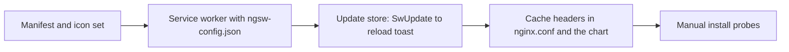

# Plan 012 — Installable as a PWA

**Purpose:** how the claims in `spec.md` get built. The what lives there; this file
holds no acceptance criterion.

## Approach

Angular's own service worker (`@angular/service-worker`, `ngsw`) over a hand-written one, in
four steps: the manifest and the icon set first, because they are what makes the app installable
and they touch nothing that runs; then the worker with its `ngsw-config.json`, an `update` store
that listens to `SwUpdate.versionUpdates` and raises the reload toast; then the cache headers in
the repository's `nginx.conf` and, by the operator's hand, in the chart's own copy of that file;
last the two manual probes on a real install. The obvious path in this house is a hand-written
`src/sw.js` stamped at postbuild (FE-PWA-01), and it is not taken: that rule is written for a
product used offline in the field, where a chunk never fetched must still exist and the precache
therefore needs two halves. This app is used online; the worker exists so an installed window
opens on its shell instead of the browser's offline page and so a deploy reaches an open window.
`ngsw` expresses that in a JSON file a spec can read, ships the update channel the toast needs,
and needs no build step of its own. The departure is recorded below with its probe.

## Stack Decisions

| Rule | Chosen | Alternatives | Why, and what stays green | Recorded in |
|------|--------|--------------|---------------------------|-------------|
| FE-PWA-01 hand-written `src/sw.js` stamped at postbuild | `@angular/service-worker` with `ngsw-config.json` | a hand-written worker plus a bun postbuild stamper | The failure the rule prevents is a precache list that drifts from the real hashed chunk names, so a chunk is missing offline. `ngsw.json` is generated from the build output by the same build, so the list cannot drift; drift is not possible rather than avoided. The probe that stays green is the ISC-329 row of `spec.md` § Test Strategy. | this row; `docs/decisions/frontend-design-system.md` via ISC-336 |
| FE-PWA-02 two precache halves, bundles individually with `catch` | one `app` asset group in `prefetch` mode for the shell, `lazy` groups for i18n and help | the two halves | The failure is one missing bundle aborting the whole install. `ngsw` treats a failed prefetch of one file as a failed *version*, keeps the previous one for windows already open and retries on the next check; a window opened fresh in that state goes to the network and, offline, gets no shell. That behaviour is the library's, not this repo's; it is read in `ngsw` and not probed here. `unenforced` from here, and this is the price: a broken deploy shows as "no update" rather than as a red probe, which ISC-331's toast makes visible on the next good deploy. | this row |
| FE-PWA-04 the worker unregistered on localhost | registration keyed on build mode: `enabled: !isDevMode()`, never on hostname | hostname check | The failure is a stale cached build during development that nothing can clear. The dev server on `:4200` is a development build and registers nothing. The compose stack on localhost is the production artifact, and the two manual probes (ISC-330, ISC-334) install from it, so a hostname rule would make them impossible. A stale compose image is cleared by the update toast (ISC-331) or by a rebuild. Probe: the `enabled` clause of the ISC-329 row. | this row |

`FE-PWA-03` and `FE-PWA-05`…`08` are about offline exports and replication; nothing here
replicates or exports, so they do not apply and no row is written for them.

## Affected Files and Modules

| Path | Change | Claim |
|------|--------|-------|
| `frontend/public/manifest.webmanifest` | new: name, `start_url`, `scope`, `display`, colours, the icon list | ISC-327, ISC-335 |
| `frontend/src/index.html` | `<link rel="manifest">`, a `theme-color` meta the inline script sets from the same default as `data-theme`, the touch icon repointed to the 180 square | ISC-327, ISC-333 |
| `frontend/tools/build-favicon.sh` | renders 192 and 512 on the round plate, a 512 maskable on a rounded square plate at 80 % mark width, a 180 square opaque touch icon; the existing favicon and 256 stay | ISC-328 |
| `frontend/public/icon-192.png`, `icon-512.png`, `icon-512-maskable.png`, `apple-touch-icon.png` | new, generated, committed | ISC-328 |
| `frontend/src/app/core/pwa/manifest.spec.ts` | new: reads the manifest, the link in `index.html`, each icon's PNG header | ISC-327, ISC-328 |
| `frontend/package.json`, `frontend/bun.lock` | `@angular/service-worker` pinned like its siblings | ISC-329 |
| `frontend/ngsw-config.json` | new: `app` group prefetch (index, bundles, styles, fonts, icons), `assets` groups lazy with prefetch updates (i18n, help); no data groups | ISC-329, ISC-335 |
| `frontend/angular.json` | `serviceWorker: "ngsw-config.json"` on the production build configuration only | ISC-329 |
| `frontend/src/app/app.config.ts` | `provideServiceWorker('ngsw-worker.js', {enabled: !isDevMode(), registrationStrategy: 'registerWhenStable:30000'})` | ISC-329 |
| `frontend/src/app/core/pwa/ngsw-config.spec.ts` | new: the config's groups and patterns, the provider's `enabled` clause | ISC-329, ISC-335 |
| `frontend/src/app/core/pwa/update.events.ts`, `update.store.ts`, `update.store.spec.ts` | new: subscribes `SwUpdate.versionUpdates`, raises one `versionReady` event per version hash, an `activate` handler that calls `activateUpdate` then reloads, an hourly `checkForUpdate` while the document is visible | ISC-331 |
| `frontend/src/app/core/toast/toast.model.ts`, `toast.store.ts`, `toast.events.ts` | an optional `action` on a toast (catalog key plus the event it dispatches); the update toast is raised from `versionReady`, tone `info`, once per hash, and does not expire on the timer | ISC-331 |
| `frontend/src/app/layout/toast-stack/toast-stack.html`, `.ts`, `.css`, `.spec.ts` | renders the action as a button when present | ISC-331 |
| `frontend/public/i18n/en.json`, `de.json` | `toast.update.ready`, `toast.update.reload` in both catalogs | ISC-331 |
| `frontend/src/app/core/theme/theme.store.ts`, `theme.store.spec.ts` | the effect also writes `meta[name=theme-color]` from the resolved theme's surface | ISC-333 |
| `frontend/src/app/core/theme/theme.model.ts` | the two surface hex twins as constants, held to the stylesheet by `theme-colors.spec.ts` | ISC-327, ISC-333 |
| `frontend/nginx.conf` | `Cache-Control: no-cache` on `/index.html`, `/ngsw.json`, `/manifest.webmanifest`; `immutable, max-age=31536000` on hashed `.js` and `.css`; `webmanifest` mime type if the image's `mime.types` lacks it | ISC-332 |
| `~/Development/codeministry/devops/projects/office/leadgen/templates/web/configmap-nginx.yaml` | the same header blocks, by the operator: the chart replaces `default.conf` wholesale, so the repository file never reaches the cluster | ISC-332 (operator lane) |
| `docs/decisions/frontend-design-system.md` | a section "Installable (spec 012)": the manifest, the icon set, the caching policy, the update flow, the FE-PWA departure | ISC-336 |
| `CHANGELOG.md` | § Unreleased, Added: installable, offline shell, update toast | ISC-336 |
| `README.md` | one paragraph under "Try it in one command" or "The screens": install from the browser | ISC-336 |
| `frontend/CLAUDE.md` | one trap line: the dev server registers no worker, a stale shell on the compose stack is the update toast's job | ISC-336 |

## Data Model

Nothing persisted changes. The worker's caches live in the browser and are named by `ngsw`;
`localStorage` gains no key.

## Interfaces

| Contract | Before | After | Who calls it |
|----------|--------|-------|--------------|
| `Toast` | `id`, `tone`, `key`, `params?`, `link?` | plus `action?: {key: string; event: EventInstance}` (the instance, so the stack dispatches what it was handed and never learns a payload); a toast with an action does not expire on the timer | `toast.store.ts` raises it, `toast-stack` renders it, `update.store.ts` is the first producer |
| `theme.store.ts` effect | writes `data-theme` and `localStorage` | also writes `meta[name=theme-color]` | nothing new; the DOM |
| nginx | no cache headers | three `no-cache` paths, one `immutable` rule | the browser, the worker |

## Risks

| Risk | Blast radius | Early warning | Mitigation |
|------|--------------|---------------|------------|
| A stale shell after a deploy because a proxy or the chart's nginx caches `ngsw.json` | every installed window keeps the old bundle until its cache is cleared by hand | `curl -sI` on the deployed host shows no `no-cache` on `/ngsw.json` (ISC-332's check, run against the cluster) | the chart change goes out in the same rollout as the image; the operator runs the curl before calling it deployed |
| The worker serves an old `index.html` whose bundle names no longer exist after a rollout with two web pods | a white page until the worker's next check | `ngsw` logs a version mismatch in the console | single replica today; if replicas grow, the image tag pins both pods to one build |
| `@angular/service-worker` 22.1 and `@angular/build` disagree on a peer | `bun install --frozen-lockfile` red | the install step | pin to the same minor as `@angular/core`; `bun add @angular/service-worker@~22.1.0` |
| The `initial` bundle budget (500 kB warn, 1 MB error) | a red production build | `bun run build` | the worker script is a separate file and the update store is small; if the budget warns, the budget is the thing to read, not to raise |
| A toast that does not expire stays forever if the reload never comes | one line at the corner of the screen | the toast stack shows it | the close button dismisses it; `TOAST_CAP` still drops it when three newer arrive |
| `frontend/CLAUDE.md` is 627 characters under its budget | `WorkingNotesStaySmallTest` red | the test | the trap is one line; the reasoning goes to `docs/decisions/` |
| iOS keeps the sign-in redirect in the installed window only from 16.4 on, and older builds hand it to Safari | ISC-334 red on an old phone | the manual probe | the fog line; if red, the claim narrows to desktop and Android and iOS becomes remaining work |
| The maskable icon's safe zone is misjudged and Android crops the ring | a clipped icon on one launcher | the manual install on a phone (ISC-330's setup) | the mark sits at 80 % of the width, the documented safe zone; the PNG header check in ISC-328 does not see this, only the eye does |

## Open Points

- fog (spec): whether an installed window on iOS keeps the sign-in redirect in scope. Resolves on the device in ISC-334; step 4 of the approach.
- The chart-side nginx copy was fog when the spec was written and is resolved: the chart replaces `default.conf` wholesale, so the header change is made twice, and the second time by the operator. It is an operator-lane task in `tasks.md`, not fog.

## Conformance Impact

| Baseline entry | Effect |
|----------------|--------|
| FE-TST-05 coverage as a ratchet | leaves it: the new specs raise the report, no threshold is added |
| G-FE-02 i18n parity | leaves it, and does not worsen it: the two new `toast.update.*` keys land in both catalogs and `i18n-parity.spec.ts` sees them |
