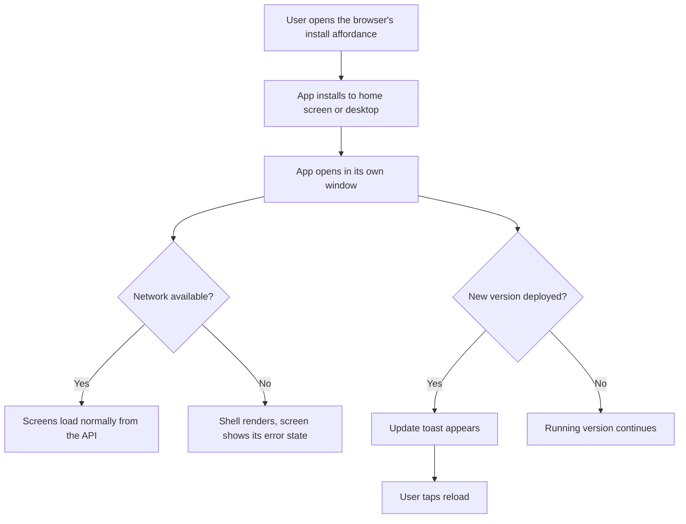

<!-- SPEC — a derived view of ../../ISA.md (feature F40). Claim IDs belong to the master.
     Sync: Skill("Spec", "sync 012-pwa-install"). Never edit the master from this file.
     principal_stated_goal is the one German string in this folder: the format keeps the principal's
     words byte for byte, and they carry no value the constitution keeps out of specs/. -->

# 012 — Installable as a PWA

## Problem

The app lives in a browser tab. On a phone or a tablet it is a bookmark among bookmarks, opens
with the browser's chrome around it, and paints the browser's white before its own dark surface.
There is no manifest, so no browser offers to install it; the only icons are a favicon and one
touch icon. Without a network the tab shows the browser's offline page, and after a deploy a tab
that was left open keeps running the old bundle until somebody reloads by hand.

## Vision

He installs the app from the browser's own install affordance, on the desktop or from the share
sheet of a phone. It lands on the home screen with the lead ring on its round plate and opens in
its own window, title bar in the surface colour of the theme he uses, no address bar. On a train
with no signal the window still opens on the shell and says a screen could not load, instead of
going blank. The morning after a deploy a toast says a new version is ready; he taps reload when
he is between two actions, not in the middle of one.

## Out of Scope

- **An in-app install prompt or iOS instructions.** The browser's own UI is the way in (operator's call, context Q3).
- **Offline reading of offers, applications or packages.** The shell is cached; data always comes from the API. The shortlist offline was offered and declined.
- **Push notifications, background sync, a badge.**
- **New layouts for narrow screens.** The screens already hold at 320 and 375 (spec 003, spec 007); this spec adds no breakpoint.
- **Store listings, TWA wrappers, native shells.**

## Constraints

- **Rules before model is untouched**: nothing here calls a model or changes the pipeline.
- **The icons come from `brand/mark.svg` through `build-favicon.sh`** and from nowhere else; the script stays deterministic (spec 003, ISC-239). No hand-drawn bitmap enters `public/`.
- **The manifest names no configured value** (constitution § What a spec may contain applies to shipped assets too, since they are public).
- **The worker never caches `/api/`.** A cached data response would show yesterday's shortlist as today's, which is the "quiet market" failure the principles name.
- **Design system**: the update toast is one more toast of spec 002, in an existing tone, no new colour; `DS-APP-04` holds, so the manifest's colours are the hex twins `theme-colors.spec.ts` already pins to the `oklch()` values.
- **Production builds only.** The dev server registers no worker, so a developer never fights a stale cache on `:4200`.
- **bun, one lockfile**: `@angular/service-worker` enters through `bun add`, pinned like its siblings.

## Goal

The app can be installed on a desktop, a tablet or a phone and opens in its own window with the
lead-ring icon and the app's own colours; a service worker keeps the app shell available without a
network, a toast offers to reload when a deploy has landed, and data still comes from the API only.

## Features

### F40 · Installable as a PWA

**Why:** The app runs only in a browser tab. The operator wants it installed on a desktop, a tablet or a phone like a native app: its own window, the lead-ring icon and the app's colours on the home screen, the shell available without a network, and a deploy picked up without a stale shell.

- [x] ISC-327: A web app manifest linked from `index.html` names the app, sets `start_url` and `scope` to `/` and `display` to `standalone`, and takes `theme_color` and `background_color` from the dark theme's surface, so an installed window opens on the app's own colour before the first paint.
- [x] ISC-328: Every icon the manifest names is rendered from `brand/mark.svg` by `build-favicon.sh` and nothing else: 192 and 512 any-purpose icons on the round plate, a 512 maskable icon whose mark stays inside the safe zone of a square plate, and a 180 square opaque `apple-touch-icon`; a second run leaves `git diff` empty, and a test holds every named icon to an existing file of the stated size. (after: ISC-327)
- [x] ISC-329: A service worker, registered in production builds only, caches the app shell — the index, the bundles, the styles, the fonts, the icons, the i18n catalogs and the help assets — and nothing under `/api/`, so no data response is ever served from cache. (after: ISC-327)
- [x] ISC-330: With the shell cached and no network, the installed app opens on its shell and the screens show their existing error state instead of a blank page or the browser's offline page. (after: ISC-329)
- [x] ISC-331: When the worker has a new version ready, a toast from the feedback system offers to reload; activating it activates the update and reloads, dismissing it leaves the running version, and the toast appears once per version. (after: ISC-329)
- [x] ISC-332: nginx serves `index.html`, `ngsw.json` and the manifest with `Cache-Control: no-cache` and the hashed bundles as immutable, so a deploy is picked up on the worker's next check and never held by a stale shell. (after: ISC-329)
- [x] ISC-333: The browser's `theme-color` follows the active app theme: the inline theme script writes it before the first paint and the theme store updates it when the preference changes, so an installed window's title bar matches the surface in both themes. (after: ISC-327)
- [ ] ISC-334: Under `security.auth: oidc` the sign-in redirect completes inside the installed window and returns to the app; the window is never left on the identity provider's page. (after: ISC-329)
- [x] ISC-335: Anti: the worker caches a response from `/api/`, or the manifest, an icon or the worker configuration names a configured value such as a portal, a sender or a model.
- [x] ISC-336: `docs/decisions/frontend-design-system.md` records the manifest, the icon set, the caching policy and the update flow, `CHANGELOG.md` § Unreleased names the installable app, `README.md` says how to install it, and `WorkingNotesStaySmallTest` stays green. (after: ISC-331)

## Not yet specified

- fog: whether an installed window on iOS keeps the sign-in redirect in scope or hands it to the browser. Resolves on the device in ISC-334; if it does not, the claim narrows to desktop and Android and the iOS case becomes remaining work.

## Test Strategy

| isc | type | check | threshold | tool | anchors_to |
|---|---|---|---|---|---|
| ISC-327 | bun-test | a spec parses `public/manifest.webmanifest` and reads the `<link rel="manifest">` and `theme-color` in `index.html` | `start_url` and `scope` `/`, `display` `standalone`, colours equal to the dark theme's `--color-base-100` hex twin; the link present | Vitest | `manifest.spec.ts`, `theme-colors.spec.ts` |
| ISC-328 | bun-test | run `build-favicon.sh` twice; a spec reads each icon the manifest names and its PNG header | `git diff --exit-code public/` empty; every icon exists at the stated size; the maskable one has an opaque square plate | Vitest, bash | `manifest.spec.ts`, `build-favicon.sh` |
| ISC-329 | bun-test | a spec over `ngsw-config.json` and the worker provider | asset groups cover index, bundles, styles, fonts, icons, i18n and help; no data group; no `/api/` pattern; `enabled` is `!isDevMode()` | Vitest, rg | `ngsw-config.spec.ts`, `app.config.ts` |
| ISC-330 | manual | build, serve the compose stack, install, set the network offline in devtools, reopen the installed window | the shell renders; a screen shows its error state; no browser offline page | Interceptor | `ngsw-config.json` |
| ISC-331 | bun-test | feed a faked `versionUpdates` stream a `VERSION_READY`; activate the action; dismiss on a second run | one toast with the reload action; `activateUpdate` then reload called once; nothing on dismiss; one toast per version | Vitest | `update.store.spec.ts`, `toast.store.spec.ts` |
| ISC-332 | bash | `rg -n 'Cache-Control' frontend/nginx.conf`; `curl -sI` against the compose web port for `/`, `/ngsw.json`, `/manifest.webmanifest` and one hashed bundle | `no-cache` on the three; `immutable` on the bundle | rg, curl | `nginx.conf` |
| ISC-333 | bun-test | render with `lg-dark`, switch to light, read `meta[name=theme-color]`; `rg -n 'theme-color' src/index.html` | the meta follows each switch; the inline script writes it before first paint | Vitest, rg | `theme.store.spec.ts`, `index.html` |
| ISC-334 | manual | install from the compose stack under `security.auth: oidc` on desktop Chrome and one phone OS; sign out and open the installed window | the redirect and the return both stay inside the installed window | Interceptor, a device | `auth.service.ts` |
| ISC-335 | bash | `rg -n '"/api' frontend/ngsw-config.json` (a pattern that would cache or serve `/api/`; the negated navigation entry `!/api/**` is the fix, not a hit); `rg -n -i` over the manifest and the worker configuration for the values `.env` and `config/` hold | 0 hits each | rg | `ngsw-config.json`, `manifest.webmanifest` |
| ISC-336 | bun-test | `WorkingNotesStaySmallTest`; `rg -n -i 'manifest\|service worker\|install' docs/decisions/frontend-design-system.md CHANGELOG.md README.md` | green; ≥ 1 hit in each file | JUnit, rg | `frontend-design-system.md`, `CHANGELOG.md`, `README.md` |

## Decisions

- **2026-09-24: The shell offline, the data never.** Of the three readings offered — installable only, shell offline, shortlist offline — the operator chose the middle one. A cached shell costs a config file and a worker; cached data would need an offline story per store and a way to say how old a list is, and it would break the principle that a quiet screen means a quiet market.
- **2026-09-24: A toast, not a silent swap and not a forced reload.** The feedback system of spec 002 already owns "something happened, here is the line"; an update is one more line, with the one action the system did not have yet. A silent swap leaves the operator on the old bundle for a day; a forced reload can land in the middle of a status move.
- **2026-09-24: No in-app install button.** Offered with an iOS hint and declined; the browser's own affordance is enough for a single operator who installs once.
- **2026-09-24: `theme-color` follows the app theme, not the OS.** The app's default is dark whatever the OS prefers (spec 003), and a `media`-qualified pair of meta tags would follow the OS. The store writes the one meta tag the same way it writes `data-theme`.
- **2026-09-24: The chart serves its own nginx file, so the cache headers are set twice.** The fog line on the deployment is resolved by reading it: the chart's web ConfigMap replaces `default.conf` wholesale, because nginx resolves the `proxy_pass` upstream at parse time and the image's `api` host does not exist in the cluster. ISC-332's headers therefore go into the repository's `nginx.conf` and, by the operator, into that ConfigMap in the same rollout; the plan carries it as an operator-lane task.
- **2026-09-24: `ngsw` over the house's hand-written worker.** The operator's call at the approach lock. FE-PWA-01 and FE-PWA-02 are written for a product used offline in the field; here only the shell is offline, and a generated `ngsw.json` cannot drift from the build that made it. The departure and its probe stand in `plan.md` § Stack Decisions.
- **2026-09-24 — refined: the ISC-335 probe reads `"/api`, not `/api`.** The second look on ISC-329 found that ngsw answers every extension-less navigation with the cached index, and the package download is a navigation to `/api/v1/offers/<id>/package`; the fix is the negated entry `!/api/**` in `navigationUrls`, which the old probe would have counted as a hit. The claim text is unchanged; only its check moved with the fix. Master first, mirrored here.
- **2026-09-24: Marks, with their reasoned defaults.** ⟨?: the manifest's `name` is "Lead Generation" and `short_name` "Leadgen", the same words as the page title and the repository; the F37 wordmark is a leftover and is not used⟩ ⟨?: `@angular/service-worker`'s `ngsw` over a hand-written worker or Workbox — it is the one the build already knows, needs no extra bundler step, and its config is a JSON file a spec can read⟩ ⟨?: registration strategy `registerWhenStable:30000`, the Angular default, so the worker never competes with the first paint⟩ ⟨resolved: the toast model grows an optional action — a catalog key and an event instance the stack dispatches — used by the update toast and by nothing else yet⟩ ⟨?: the maskable icon's plate is a rounded square in the dark surface and the mark sits at 80 % of the width, the safe zone Chrome and Android mask against⟩ ⟨?: the i18n catalogs and the help assets are `lazy` groups with `prefetch` updates, so the first install does not download both languages and every diagram before the app paints⟩ ⟨?: the version check runs on every start and every hour while the window is open, so a deploy at noon reaches an open window the same afternoon⟩

## Verification

- ISC-336 · 2026-09-24 · `WorkingNotesStaySmallTest` 3/3 (budgets 17,261/18,000 and 11,769/12,000); `rg` hits in the decision record, CHANGELOG and README went from 0/unrelated/0 to 15/10/3; `check:static` clean · second look Max: pass, four text findings adopted (ngsw failure mode, unmeasured mime claim, Safari/Firefox, block count)
- ISC-330 · 2026-09-24 · manual: prod image served locally, worker `activated` and controlling, server stopped (curl 000), reload renders the shell with header and nav and each screen its error state, no browser offline page (`~/Downloads/interceptor-capture-20260924-174836-12644.png`); operator, verbatim: "Ja, schließen"
- ISC-331 · 2026-09-24 · `update.store.spec.ts`, `toast.store.spec.ts`, `toast-stack.spec.ts`, i18n parity 79/79 (red first): one update toast per version, a newer one replaces it, the action activates then reloads (bounded at 10 s), dismissing does nothing, `unrecoverable` reloads at once, a disabled worker subscribes to nothing · second look Max: pass, two findings adopted
- ISC-332 · 2026-09-24 · curl against the built web image: `/`, SPA routes, `/index.html`, `/ngsw.json`, `/manifest.webmanifest` (application/manifest+json) and both worker scripts `no-cache` with 304 on revalidation; hashed bundles and fonts `immutable`; icons, i18n, help without a policy (red first: no header anywhere); the chart ConfigMap mirrors the blocks, `helm template` + `nginx -t` green, rollout pending · second look Max: pass, two findings adopted
- ISC-335 · 2026-09-24 · `rg` for `"/api` in `ngsw-config.json`: 0 hits; manifest and worker config against 18 `.env` values, the `config/` hosts and the model names: 0 hits beyond the public product name and the `html` extension; no URL, no address · probe only, no second look
- ISC-329 · 2026-09-24 · `ngsw-config.spec.ts` 15/15 (red first on the missing file, then on the /api navigation rule): app group prefetch, i18n prefetch, help and fonts lazy, no data group, `/api` only as `!/api/**` in navigationUrls, `enabled: !isDevMode()`; production build emits ngsw.json with the negative /api regex; @angular/service-worker 22.1.4 like core · second look Max: concerns, five findings adopted
- ISC-328 · 2026-09-24 · `manifest.spec.ts` 21/21: every named icon at its size, 8-bit, plate by colour type and corner, mark inside the safe zone (red at 228.9 px, green at 197.6 of 204.8 at 512; 68.8 of 72 at 180), two script runs byte-identical, favicon set unchanged · second look Max: fail on the safe zone, fixed and remeasured independently
- ISC-333 · 2026-09-24 · `theme.store.spec.ts` + `manifest.spec.ts` 27/27; the inline script executed for dark, light, system × OS, unset and garbage (4 red with the meta write removed, green after); the store follows each switch · second look Max: pass, one finding adopted (a comment-satisfiable assertion replaced by the executing test)
- ISC-327 · 2026-09-24 · `manifest.spec.ts` + `theme-colors.spec.ts` 23/23 (red first: missing export); manifest standalone, scope `/`, both colours the dark surface held to its oklch; link and theme-color in `index.html` · second look Max: pass (icons arrive with ISC-328)
