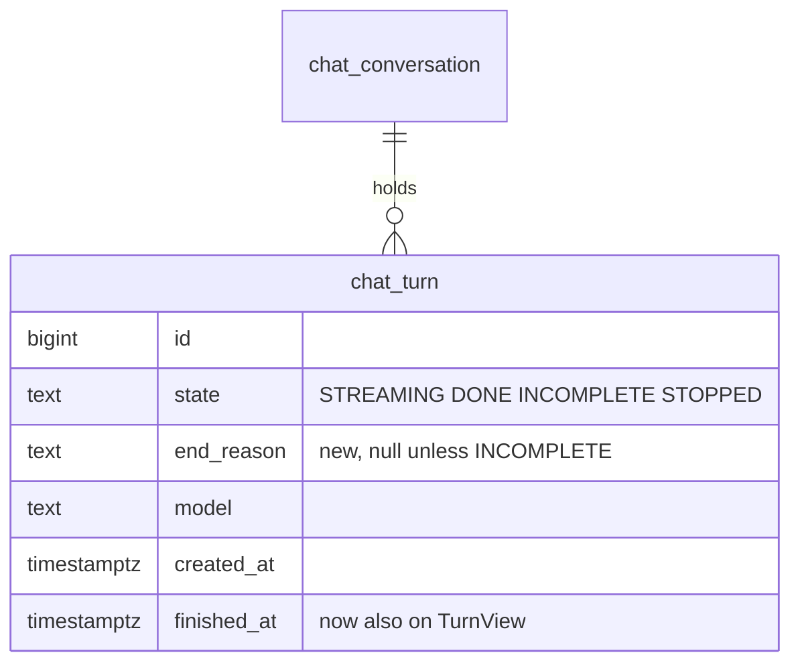

# Plan 022 — Chat turn status, bulk delete, and the cited row in view

**Purpose:** how the claims in `spec.md` get built. The what lives there; this file
holds no acceptance criterion.

## Approach

Three vertical slices, each carried from the database to the screen before it counts, so
each one can ship on its own: **(A) the cited row in view** (ISC-479, frontend only, the
smallest), **(B) the status popovers** (ISC-473 to ISC-476: `V36`, the turn's end reason and
finish time on `TurnView`, `GET /api/v1/chat/status`, one popover component for the answer
glyph and the plate), and **(C) bulk delete** (ISC-477, ISC-478: the endpoint, a store event,
the list's select mode). ISC-480 closes last, over all three. The slices touch disjoint files
except the two i18n catalogs and `docs/decisions/chat.md`, so they can be built side by side
as long as the catalog and doc edits land one after the other. The obvious alternative,
backend first and then the frontend layer by layer, was not taken: nothing would be visible
until everything stood, and the three parts share no code worth sequencing for.

Slice A reuses what the shortlist already has rather than adding a scroll path. Today the
pane lands a card only when the selection came from a key press (`focusWanted` →
`landCard`); a selection that arrives by URL, which is what a chat citation does through
`navigateByUrl(['/shortlist', id])`, marks the row and moves nothing. The change is a second
trigger for the same `landCard` call — a selection the list did not make itself — without
taking focus, because focus belongs to the chat that was clicked.

Slice B stores the reason where the turn already ends: every `INCOMPLETE` goes through
`ChatTurnService.Turn.end(reason, …)` or the two cut-off paths in `ConversationRepository`
(stale-turn sweep, cancelled stream), so `finish(...)` gains the reason as a parameter rather
than a second update. The popover is one `features/chat` component, `chat-status-popover`,
hosted twice (glyph, plate), positioned with `shared/popover/anchor-for.ts` like the list's
⋯ menu, opened on `pointerenter` and `focus` and closed on `pointerleave`, `blur` and Escape;
the turn animation is the host setting `--lg-living-mark-turn`, which `dcc8369` introduced.

Slice C names every id it deletes (`spec.md` § Constraints), so the endpoint takes a list and
the store sends exactly the ids the list shows as selected; the server loops the single
delete's stop-then-delete per id inside one transaction for the rows.

```mermaid
flowchart TB
    subgraph A["Slice A · ISC-479"]
        a1["chat-answer: citation navigateByUrl /shortlist/:id"] --> a2["shortlist-page: selection not from a key press"]
        a2 --> a3["landCard(pane, card) without focus"]
    end
    subgraph B["Slice B · ISC-473…476"]
        b1["V36 chat_turn.end_reason"] --> b2["ConversationRepository.finish(reason)"]
        b2 --> b3["TurnView endReason, finishedAt"]
        b4["GET /chat/status"] --> b6
        b3 --> b5["ChatStore turns"] --> b6["chat-status-popover"]
        b6 --> b7["glyph host · plate host · --lg-living-mark-turn"]
    end
    subgraph C["Slice C · ISC-477, 478"]
        c1["POST /chat/conversations/bulk-delete"] --> c2["ChatApi.deleteMany"]
        c2 --> c3["chatEvents.bulkDeleteRequested / bulkDeleted"]
        c3 --> c4["chat-history select mode + one dialog"]
    end
    A --> D["ISC-480 · docs, CHANGELOG, hints, parity"]
    B --> D
    C --> D
```

## Affected Files and Modules

| Path | Change | Claim |
|---|---|---|
| `frontend/src/app/features/shortlist/shortlist-page.ts` | land the selected card in the pane when the selection arrives from outside the list, focus untouched | ISC-479 |
| `frontend/src/app/features/shortlist/shortlist.browser.spec.ts` | the row-below-the-fold and the row-not-loaded cases | ISC-479 |
| `backend/src/main/resources/db/migration/V36__chat_turn_end_reason.sql` | new: nullable `end_reason` with a check on the three reasons | ISC-473 |
| `backend/src/main/java/de/codeministry/leadgen/chat/ConversationRepository.java` | `finish(…, reason)`; the two sweep updates write `MODEL`; read `end_reason` and `finished_at` into `TurnView` | ISC-473 |
| `backend/src/main/java/de/codeministry/leadgen/chat/ChatTurnService.java` | pass the reason from `end(...)` and the cut-off paths to `finish` | ISC-473 |
| `backend/src/main/java/de/codeministry/leadgen/chat/TurnView.java` | `endReason`, `finishedAt` | ISC-473, ISC-474 |
| `backend/src/main/java/de/codeministry/leadgen/chat/ChatStatusView.java` | new record: model, calls used, calls limit, tool rounds | ISC-476 |
| `backend/src/main/java/de/codeministry/leadgen/chat/ChatBudget.java` | expose the resolved limit and round bound for the status read | ISC-476 |
| `backend/src/main/java/de/codeministry/leadgen/web/ChatController.java` | `GET /status`; `POST /conversations/bulk-delete` | ISC-476, ISC-477 |
| `backend/src/main/java/de/codeministry/leadgen/chat/BulkDelete.java`, `BulkDeleted.java` | new request and answer records | ISC-477 |
| `backend/src/main/java/de/codeministry/leadgen/LeadGenRuntimeHints.java` | hints for the new request and view records | ISC-480 |
| `backend/src/test/java/de/codeministry/leadgen/chat/ChatConversationTest.java` | stored reason per ending, old turns null | ISC-473 |
| `backend/src/test/java/de/codeministry/leadgen/web/ChatControllerTest.java` | status 200/404; bulk delete, streaming stop, unknown id, 400s | ISC-476, ISC-477 |
| `frontend/src/app/core/model/chat.ts` | `TurnView.endReason`, `finishedAt`; `ChatStatus`; bulk types | ISC-473, ISC-476, ISC-477 |
| `frontend/src/app/core/api/chat.api.ts` (+ `chat-stub.ts`) | `status()`, `deleteMany(ids)` | ISC-476, ISC-477 |
| `frontend/src/app/core/store/chat.events.ts`, `chat.store.ts` | the live turn keeps its end reason; `bulkDeleteRequested` / `bulkDeleted` / `bulkDeleteFailed`, an open conversation among them leaves for a new one | ISC-474, ISC-478 |
| `frontend/src/app/features/chat/chat-status-popover/` | new component: state line, reason, steps, duration, model; or the chat's status | ISC-474, ISC-475, ISC-476 |
| `frontend/src/app/features/chat/chat-panel/chat-panel.html`, `.ts`, `.css` | the glyph and the plate become focusable hosts of the popover and set the turn | ISC-474, ISC-475, ISC-476 |
| `frontend/src/app/features/chat/chat-history/chat-history.html`, `.ts`, `.css` | select mode, checkboxes, select all shown, `Delete N` | ISC-478 |
| `frontend/src/app/features/chat/chat-history/chat-delete-dialog.html`, `.ts` | a count variant of the one dialog, Cancel still first | ISC-478 |
| `frontend/src/app/features/chat/chat-panel/chat-panel.browser.spec.ts`, `chat-history/chat-history.browser.spec.ts` | the popover and select-mode cases | ISC-474 to ISC-478 |
| `frontend/public/i18n/en.json`, `de.json` | `chat.status.*`, `chat.select.*`, `chat.delete.many*` | ISC-475, ISC-478 |
| `docs/DATA-MODEL.md`, `docs/decisions/chat.md`, `CHANGELOG.md` | `end_reason`; the popovers, the status endpoint, bulk delete; § Unreleased | ISC-480 |

## Data Model

`chat_turn` before: `state`, `model`, `created_at`, `finished_at`, no reason.
After: `+ end_reason TEXT NULL CHECK (end_reason IN ('MODEL', 'BUDGET', 'ROUNDS'))`, written
only together with `state = 'INCOMPLETE'`.

`TurnView` (server and client) gains `endReason: MODEL | BUDGET | ROUNDS | null` and
`finishedAt: Instant | null`.

## Interfaces

| Contract | Before | After | Called by |
|---|---|---|---|
| `GET /api/v1/chat/conversations/{id}` | turns without reason or finish | each turn also `endReason`, `finishedAt` | the chat store; additive, the MCP server ignores unknown fields |
| `GET /api/v1/chat/status` | — | `{ model, callsUsed, callsLimit, toolRounds }`; 404 without a chat model | the plate's popover, on open |
| `POST /api/v1/chat/conversations/bulk-delete` | — | body `{ ids: long[] }` (1..500); answer `{ deleted: long[] }`; 400 on an empty or missing list | the list's select mode |
| `DELETE /api/v1/chat/conversations/{id}` | unchanged | unchanged | the ⋯ menu, the head's ⋯ |

## Migration and Rollback

Expand only. `V36` adds one nullable column and a check; no existing row changes, no read
of the previous image breaks (it selects its columns by name). It is written once in slice B's
first task and never edited afterwards — the Flyway checksum trap in the root `CLAUDE.md`.

Rollback to the previous image needs nothing: it ignores the column. Removing the column is
`ALTER TABLE chat_turn DROP COLUMN end_reason;` plus
`DELETE FROM flyway_schema_history WHERE version = '36';`, run by hand against the instance;
it loses every stored reason, never a turn or a conversation.

## Risks

| Risk | Blast radius | Early warning | Mitigation |
|---|---|---|---|
| A popover opened on hover flickers or traps a pointer that crosses it on the way to the answer | every answer in the thread | the browser spec's leave-and-close case; manual pass at 1440 | open after a short hover intent, close on leave of glyph and popover together, never on a click |
| The glyph turns into a tab stop per answer and a long thread becomes a long tab walk | keyboard readers of long threads | tab order read in the panel spec | each glyph is one stop, beside the copy and regenerate actions every answer already has; the popover itself holds no focusable element, so it adds nothing to the walk |
| Bulk delete of the open conversation while it streams leaves the thread on a dead id | the open thread | the store spec's "open among the deleted" case | the store routes to a new conversation after `bulkDeleted` names the open id, as the single delete does |
| Landing the card scrolls the document on narrow widths where the list runs in the page | 390–1024 px | the spec measures the document's scrollTop | land only while the pane is a scroller, the existing `paneScrolls` guard |
| Both catalogs edited by two slices at once | a lost key, parity red | `i18n-parity.spec.ts` | catalog edits serialised, one slice after the other |
| `V36` edited after it ran somewhere | every deployed database refuses to start | CI's byte-identical migration step | written whole once, never touched again |
