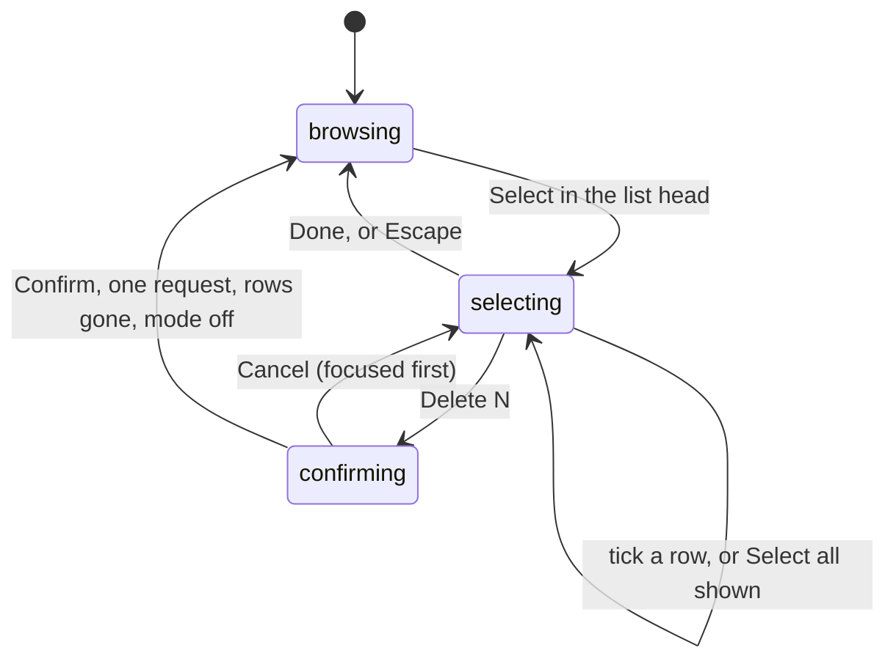

<!-- SPEC — a derived view of ../../ISA.md (feature F50). Claim IDs belong to the master.
     Sync: Skill("Spec", "sync 022-chat-turn-status-and-bulk-delete"). Never edit the master from this file.
     principal_stated_goal is the one German string in this folder: the format keeps the principal's
     words byte for byte, and they carry no value the constitution keeps out of specs/. -->

# 022 — Chat turn status, bulk delete, and the cited row in view

## Problem

After specs 020 and 021 the ring beside an answer shows one of four frames, but it never says what
happened to that turn. An answer that ended incomplete is a halted ring and a line of text; whether
the model failed, the day's budget ran out or the tool rounds were spent is said once, in the live
`error` event, and a reload loses it, because `chat_turn` stores the state and not the reason. The
empty chat's ring says nothing about the chat itself, not even which model answers or how much of
today's allowance is left. The conversation list deletes one conversation at a time, each behind a
⋯ menu and a dialog, so clearing a history of test conversations is dozens of clicks. And an offer
opened from a chat citation shows its detail on the shortlist and marks its row, but the row can sit
below the list pane's fold, so the one place that says where the offer stands in the list is
off-screen.

## Vision

The ring is the chat's status, on demand. Hovering or focusing it beside an answer turns it once and
opens a small popover: done, working, writing, incomplete because of the model, the budget or the
tool rounds, or stopped, with how many steps ran, how long the turn took and which model answered.
A reload shows the same. The empty chat's ring answers the same gesture with the chat's own state:
the model in force, today's calls against the ceiling and the round bound. The conversation list
has a select mode: tick rows or select every row shown, and delete them with one confirmation and
one request. A citation that opens an offer on the shortlist also brings its marked row into the
list pane.

## Out of Scope

- **Undo or a trash bin.** A deleted conversation is gone, as with the single delete today.
- **Loading a cited row that is not in the loaded page.** The shortlist pages by keyset; a citation
  to an offer further down opens the detail and scrolls nothing.
- **Deleting by age, exporting or archiving conversations.** Offered as the wider shape, not chosen.
- **The answer's text, the steps list, the caret and the suggestions.** Unchanged; the popover sits
  beside them and repeats nothing they already show.
- **Model-written words in a popover.** Every word is a catalog entry; the model name is a value.

## Constraints

- **Migrations are expand-only and byte-identical once applied** (BE-DB-02, BE-DB-03): `V36` adds
  one nullable column with a check and is never edited afterwards.
- **`JdbcClient`, not JPA** (BE-DB-04), for the stored reason and the bulk delete.
- **Nothing is ever deleted without being named.** The bulk request carries explicit ids; there is no
  "delete all" on the server, so a stale client cannot empty a history it did not show.
- **The single delete's promise holds for the bulk one**: a streaming turn is stopped first and waited
  for, the same `STOP_BEFORE_DELETE` bound.
- **Accessible**: the glyph and the plate mark are focusable, the popover opens on focus, Escape
  closes it, and the confirmation focuses Cancel first like the single delete (ISC-448).
- **Reduced motion is respected** as in spec 021: the turn does not play, the popover still opens.
- **The AI colour keeps its file set** (ISC-309, ISC-467); the popovers use the existing surfaces.
- **Scroll the pane, never the document** (`landCard` in `shortlist-page.ts`, not `scrollIntoView`).
- **Layering** (FE-LAYER-01..04): the popover's turn animation reuses `--lg-living-mark-turn`, set by
  the host; `shared/` names no chat concept.
- **Nothing is wired in.** The model's name reaches the popover from configuration at run time, never
  from a committed file.

## Goal

Hovering or focusing the ring beside an answer plays its turn and opens a popover with that turn's
state, the reason when it ended incomplete, its steps, duration and model, the same live and after a
reload; the empty chat's ring does the same with the chat's own status (model, today's calls against
the ceiling, the tool-round bound); the conversation list deletes the selected or all shown
conversations with one confirmation and one request; and an offer opened from a chat citation has its
marked shortlist row scrolled into the list pane.

## Not yet specified

None open. The one fog line of the shaping, whether the empty chat's ring gets a popover too, was
resolved at the goal lock: it does, with the chat's own status (ISC-476).

## Features

### F50 · Chat turn status, bulk delete, and the cited row in view

- [x] ISC-473: A turn that ends `INCOMPLETE` stores its reason — `MODEL`, `BUDGET` or `ROUNDS` — in a nullable `chat_turn.end_reason` added by an expand-only `V36`, every other ending stores null, and `TurnView` carries it as `endReason`, so a reloaded incomplete turn names the same reason its live `error` event did and a turn stored before `V36` names none.
- [x] ISC-474: Hover or keyboard focus on an answer's glyph plays the living mark's turn and opens a status popover beside it naming the turn's state — done, working, writing, incomplete with its reason (model, budget, tool rounds, or no reason stored) or stopped — with the tool steps' count, the duration from start to finish where both are known and the model where known, the same for a streaming turn and a reloaded one; moving away or Escape closes it. (after: ISC-473)
- [x] ISC-475: The glyph is a focusable control whose accessible name states the turn's state, the popover's words come only from the i18n catalogs with `i18n-parity.spec.ts` green in both languages, and under `prefers-reduced-motion` the popover still opens while the mark does not turn. (after: ISC-474)
- [x] ISC-476: Hover or keyboard focus on the empty chat's plate mark plays the same turn and opens a popover with the chat's own status — the chat model in force, today's model calls against the daily ceiling, and the tool-round bound — read from a read-only `GET /api/v1/chat/status` when the popover opens, and the endpoint answers 404 where no chat model is configured, as the rest of the chat does.
- [x] ISC-477: One request deletes an explicit list of conversation ids: every streaming turn in them is stopped first, as the single delete does, the conversations go in one transaction, the answer names the ids deleted, an unknown id is skipped rather than failing the rest, and an empty or missing list is a 400 — there is no path that deletes conversations without naming them.
- [x] ISC-478: The conversation list has a select mode: a control in the list's head turns it on, each row shows a checkbox, `Select all` selects exactly the rows shown (with a search active, the hits), a count follows the selection, and `Delete N` opens one confirmation naming N with Cancel focused first; confirming sends one request, the rows leave the list, an open conversation among them leaves the thread for a new one, and the mode ends. (after: ISC-477)
- [x] ISC-479: Opening an offer from a chat citation onto the shortlist leaves its marked row fully inside the list pane when the row is in the loaded page, by scrolling the pane alone and never the document; a row outside the loaded page scrolls nothing and the detail still opens.
- [x] ISC-480: Anti: the single delete, the ⋯ menu, rename and search behave as before; the catalogs keep parity; the bulk request's record has a hint in `LeadGenRuntimeHints` where binding reaches it by reflection; `docs/DATA-MODEL.md` names `end_reason`, `docs/decisions/chat.md` records the status popovers, the status endpoint and the bulk delete, `CHANGELOG.md` § Unreleased names all three and the row scroll, and `WorkingNotesStaySmallTest` stays green. (after: ISC-474, ISC-476, ISC-478, ISC-479)

## Test Strategy

| isc | type | check | threshold | tool | anchors_to |
|---|---|---|---|---|---|
| ISC-473 | bun-test | end a stubbed turn with each of MODEL, BUDGET and ROUNDS, one with DONE and one with STOPPED; read `chat_turn.end_reason` and `GET /conversations/{id}`; run Flyway over a copy with pre-`V36` turns | the three reasons stored and returned as `endReason`, null for DONE and STOPPED and for the old turns; `V36` only adds | JUnit, Testcontainers | `ChatConversationTest`, `V36` |
| ISC-474 | bun-test | for a stubbed DONE, a streaming turn with a running step, a streaming turn writing, INCOMPLETE with each reason and none, and STOPPED, hover then focus the glyph; read the popover; press Escape | a popover per case naming the state and the reason; steps count, duration and model shown where the stub carries them; the mark's turn animation running on open; closed after Escape and after leaving | Vitest browser mode | `chat-panel.browser.spec.ts` |
| ISC-475 | bun-test | tab to a glyph and read its accessible name; `i18n-parity.spec.ts`; emulate reduced motion and open the popover | a name stating the state; parity green; popover open and no animation on the mark | Vitest browser mode | `chat-panel.browser.spec.ts`, `i18n-parity.spec.ts` |
| ISC-476 | bun-test | open the empty chat, hover the plate; `GET /api/v1/chat/status` with and without a chat model | the popover names the model, calls used of the ceiling and the round bound from the response; 200 with the three values, 404 without a model | Vitest browser mode, JUnit | `chat-panel.browser.spec.ts`, `ChatControllerTest` |
| ISC-477 | bun-test | bulk-delete three ids of five, one of them streaming; then a list with an unknown id; then an empty list and no body | the three gone and two left, the streaming turn stopped before its rows went; the known ids deleted and named, the unknown skipped; 400 for both empty cases | JUnit, MockMvc | `ChatControllerTest` |
| ISC-478 | bun-test | turn select mode on, pick three rows, confirm; search, select all, read the dialog; delete the open conversation among them | one request with the three ids, three rows gone, mode off; select all takes only the hits and the dialog names their count, Cancel focused; the thread shows a new conversation | Vitest browser mode | `chat-history.browser.spec.ts` |
| ISC-479 | bun-test | at 2560 with the chat docked (both columns beside it) click a citation to an offer whose row sits below the pane's fold; at 1440 with the chat docked (one column) click it, then close the chat; then cite one not in the loaded page | the row's box inside the pane's box and the document's scrollTop unchanged, at 2560 at once and at 1440 once the chat is closed; for the absent one no scroll and the detail open | Vitest browser mode | `shortlist.browser.spec.ts` |
| ISC-480 | bun-test | the existing chat-history, chat-panel and ChatControllerTest delete, rename and search rows; `i18n-parity.spec.ts`; `LeadGenRuntimeHintsTest`; `rg -n end_reason docs/DATA-MODEL.md`; `rg -n -i 'bulk delete|status popover' docs/decisions/chat.md CHANGELOG.md`; `WorkingNotesStaySmallTest` | green unchanged; green; green; a hit; a hit in each; green | Vitest, JUnit, rg | `chat-history.spec.ts`, `docs/decisions/chat.md`, `CHANGELOG.md` |

## Decisions

- **2026-09-27 — the reason is stored (ISC-473, Round 0 Q1).** Showing it live only would have made
  the popover of a reloaded turn weaker than the one of a live turn, for the one case the operator
  named: incomplete answers. One nullable column, expand-only.
- **2026-09-27 — "all" means all shown, sent as ids (ISC-477, ISC-478, Round 0 Q2).** With a search
  active, select all takes the hits; the server deletes only what it is told by id, so there is no
  id-less path to guard.
- **2026-09-27 — the plate ring answers too (ISC-476, goal lock).** The empty chat's mark gets the
  chat's own status from a read-only endpoint, asked when the popover opens rather than carried on the
  capability, which is asked once per page and would be stale by the time anyone hovers.
- **2026-09-28 — refined: ISC-479's probe (spec 022, operator's answer during build).** With the chat docked the shortlist is one column below a page box of 73.8rem (ISC-472), so at 1440 the list is hidden while an offer is open and no row can be in view; the list shows beside the chat only from about 2300px. The scroll therefore waits until the list is on screen beside the detail — at once on a wide screen, otherwise when the chat closes — and the probe measures at 2560 with the chat docked and at 1440 after closing the chat. The claim's text is unchanged.

## Verification

- ISC-479: bun-test — `shortlist.browser.spec.ts` § the cited row in view 3/3 (2560 docked: row 35 inside the pane, pane scrolled, document at 0; 1440 docked then chat closed: row 35 inside the pane; offer 99 outside the loaded page: pane at 0, detail open), file 14/14 over two runs, shortlist units 106/106, `check:static` green; red first: 2/3 with row 35 outside the pane; second look: off (default) (spec 022, 2026-09-28)
- ISC-473: bun-test — `ChatConversationTest.anIncompleteTurnKeepsItsReasonAndEveryOtherEndingNamesNone` (MODEL, ROUNDS, BUDGET stored and reloaded as `endReason`, DONE and STOPPED null, a pre-V36 INCOMPLETE row null, `finishedAt` on every reload), class 14/14, `ChatTurnHardeningTest` 19/19, spotlessCheck green; red first: bad SQL grammar on `end_reason` before V36; second look: off (default) (spec 022, 2026-09-28)
- ISC-477: bun-test — `ChatConversationTest.aBulkDeleteTakesExactlyTheNamedConversationsAndStopsTheOneStreaming` (three of five over HTTP, the streaming one ends STOPPED with the stub's connection closed, two left, zero turns, the unknown id not named) and `ChatControllerTest` bulk rows (stopAll per id before deleteAll, deleted names three of four, 400 for [], {} and no body with nothing deleted), 13/13 and 15/15; red by mutation: without the stop and the 404 path 3 rows red; second look: off (default) (spec 022, 2026-09-28)
- ISC-474: bun-test — `chat-panel.browser.spec.ts` § the status popovers: six stored endings (Done, Incomplete per MODEL/BUDGET/ROUNDS and without a reason, Stopped) each with steps 2, 4.2 s and the model, beside the ring and closed after leaving; a live turn Working then Writing, the mark's turn animating while open, closed by Escape; file 7/7, chat units 107/107, chat browser + contrast 127/127; red by mutation (reason dropped, turn removed, status never asked): 3 of 4 new rows red; second look: off (default) (spec 022, 2026-09-28)
- ISC-475: bun-test — `chat-panel.browser.spec.ts` § opens on keyboard focus (aria-label 'Answer status: Incomplete', aria-describedby the popover, open on focus, closed on blur, no animation on the mark under emulated reduced motion) and `i18n-parity.spec.ts` 3/3 with `chat.status.*` in both catalogs; second look: off (default) (spec 022, 2026-09-28)
- ISC-476: bun-test — `chat-panel.browser.spec.ts` § the empty chat's plate (named 'Chat status', nothing asked before it opens, one GET /api/v1/chat/status on hover, model, '12 of 200' and 6 shown) and `ChatControllerTest` status rows (200 with model, callsUsed, callsLimit, toolRounds; 404 without a chat model); red by mutation: the plate row and the 404 row red; second look: off (default) (spec 022, 2026-09-28)
- ISC-478: bun-test — `chat-history.browser.spec.ts` § deleting several conversations 3/3 (three of five picked: one POST with {ids:[9,7,5]}, rows gone, mode off, no DELETE; select all under a 'kafka' search takes the two hits, dialog 'Delete 2 conversations?' with Cancel focused, nothing sent on cancel, {ids:[9,7]} on confirm; the open conversation among them lands on ?chat=new), file 6/6, chat units + parity 120/120, `check:static` green; red first: 3/3 with no select control; second look: off (default) (spec 022, 2026-09-28)
- ISC-480: bun-test — full `./gradlew check` green in a copy of the working tree (7 m 54 s, 135 backend result files, frontend unit and 244 browser tests, lint, stylelint, tsc, spotless) with the single-delete, rename and search rows of chat-history, chat-panel and ChatControllerTest unchanged and green, `i18n-parity.spec.ts` 3/3, `LeadGenRuntimeHintsTest` 3/3 (red first: BulkDelete has no type hint), `WorkingNotesStaySmallTest` 3/3, `rg end_reason docs/DATA-MODEL.md` and `rg -i 'bulk delete|status popover'` a hit in chat.md and CHANGELOG.md; the tree unchanged against the gated copy; second look: off (default) (spec 022, 2026-09-28)
