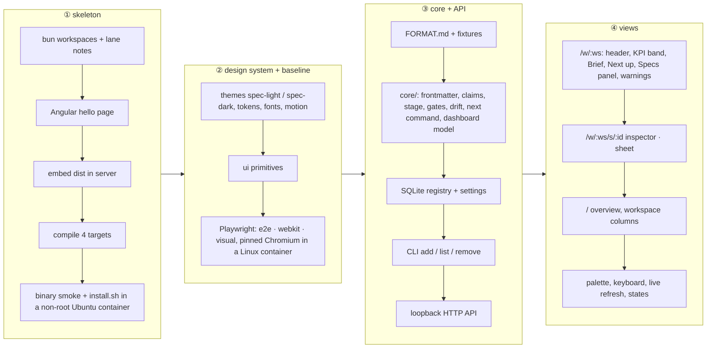
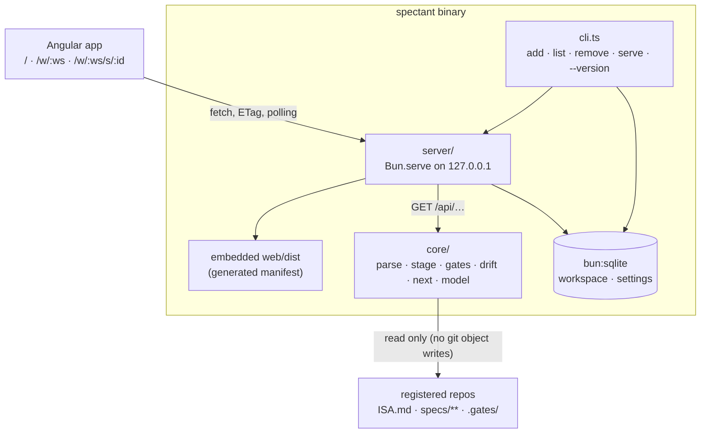

# Plan 001 — App skeleton and dashboard

**Purpose:** how the claims in `spec.md` get built. The what lives there; this file holds no acceptance criterion.

## Approach

Build a thin end-to-end skeleton first, then the design system with its own visual baseline, then the data path,
then the two views until every claim's probe is green. The obvious order would be contract first (parser, server,
UI, binary last). It layers most cleanly, but it proves the two riskiest seams last: embedding an Angular build in a
`bun build --compile` binary, and installing that binary with one line on a machine that has never seen the repo.
Walking the whole path with a hello page on day one turns both into known quantities before any real UI exists
(ISC-8.1 is the probe that keeps that seam honest from then on). The design system comes second because every later
screen is built from its primitives and measured against its own Playwright baseline; the old dashboard is the design
source, never a measurement target (Decisions 2026-09-28), so no reference render of the old skill is needed and the
harness has no dependency outside this repository.

The runtime shape the four stages add up to:

**Server and UI split.** The server stays thin: it resolves workspaces from the registry, asks `core/` for a dashboard
model per workspace, serves settings, and returns JSON. Everything visual lives in Angular. The web app can run
against a stub `/api` fed from the fixtures' golden JSON, which is how the visual baselines and most e2e specs run
without the binary.

**Embedding.** A build step writes `server/embedded.gen.ts`, which imports every file in `web/dist/browser` with
`with { type: "file" }`, so `bun build --compile` bundles them; the manifest is keyed on the imported path, and a
content-type map covers html, js, css, woff2, svg, json. The server serves them with an SPA fallback to `index.html`
for `/w/…` deep links. The version string is inlined at build time (`--define`), because a compiled binary has no
`package.json` beside it.

**Porting from the old skill.** `core/` takes over, module by module and each with golden cases: frontmatter and
claim parsing (`SpecLib`, `IsaFrontier` claim parser), the claim partition and drift classes (`SpecStatus`), the
stage and next-command rules (`SpecDashboard.stageOf` / `nextCommand`), the review and code-review marks
(`SpecGate`, re-implemented to hash the worktree **in memory** so no object is ever written into a registered
repository's `.git/`; ISC-15), the takeable set (`SpecRun.plan`), the diagram verdict, the TL;DR staleness
(`SpecTldr`), the markdown renderer for the Brief (`SpecMarkdown`), the archive listing and the local-listener probe
(`SpecServices`, loopback only). The old page's CSS is not ported; its token values become the two daisyUI themes.

**Design decisions carried in** (design.md § Viewport-übergreifend): container tiers compact < 640 / medium /
wide ≥ 1120 on the shell container; routes `/`, `/w/:ws`, `/w/:ws/s/:id` with the redirect when one workspace is
registered; filters and sort as query state; the badge chevron as the only switcher; the shared section disposition;
the live indicator replacing the refresh trio; settings server-side; the keyboard map and the single-key switch;
motion tokens with the reduced-motion override; derived contrast tokens; the WebKit fallback list.

**Determinism for the baselines.** Visual and e2e suites run inside the pinned Playwright Linux container both in CI
and locally (`bun run test:visual` starts it), so the committed baselines match CI byte for byte. Each run pins the
clock (`page.clock.setFixedTime`), disables animations, waits for `data-ready`, runs against the stub API with fixture
data (fixed dates, one fixture with a three-digit/three-digit master fraction) and never has a dev service listening.

## Stack Decisions

| Rule | Chosen | Alternatives | Why · measurement · price · probe that stays green | Recorded in |
|------|--------|--------------|-----------------------------------------------------|-------------|
| FE-I18N-01 route prefixes | language as a server-side setting, English default, Transloco unchanged | `/de` and `/en` prefixes | a local single-user tool has no URL to share and an international audience; price: a language switch re-renders in place instead of navigating; probe: `web/tests/i18n-parity.test.ts` (ISC-22) unchanged | constitution § Adaptations; `ISA.md` Decisions 2026-09-28 |
| FE-TST-01 unit runner | Angular's Vitest builder for component specs; pure TS guards (`web/tests/*.test.ts`) under root `bun test` with `web/src` excluded via `bunfig.toml` | everything under `bun test` | `bun test` cannot compile Angular TestBed specs; price: two runners in one lane, split by folder; probes: `bun run --cwd web test`, `bun test web/tests` | this plan |

## Affected Files and Modules

| Path | Change | Claim |
|------|--------|-------|
| `package.json`, `bun.lock`, `bunfig.toml` | new: bun workspaces `core`, `server`, `web`; pinned bun; scripts `build`, `check:static`, `verify:quick`, `verify`, `check:leak`, `check:single-core`, `check:version`, `test:binary`, `test:install:linux`, `test:readonly`, `test:offline:server`, `test:visual`, `test:browser`, `e2e`; `web/src` excluded from root `bun test` | ISC-3, ISC-5, ISC-5.2, ISC-8, ISC-9 |
| `CLAUDE.md`, `core/CLAUDE.md`, `server/CLAUDE.md`, `web/CLAUDE.md`, `README.md` (skeleton) | new: lane working notes (what a worker loads, the lane probe, conventions); root holds only what applies everywhere | ISC-5.1 |
| `LICENSE`, `THIRD_PARTY_NOTICES.md` | new: Apache-2.0; Lucide (ISC), daisyUI, Tailwind, Angular, Inter, JetBrains Mono (OFL), LifeOS ISA format origin (MIT) | ISC-4 |
| `eslint.config.js`, `.stylelintrc.json`, `web/tsconfig.*.json` | new: Angular rules (standalone, OnPush, signals, template a11y), `color-no-hex` with the two theme files exempt, no literal durations outside `motion.css`, `tsc --noEmit` | ISC-5.2 |
| `.github/workflows/ci.yml` | new: `bun run verify` on push inside the pinned Playwright container | constitution § Gates (ISC-59 closes it in the release spec) |
| `FORMAT.md` | new: the file contract as far as the dashboard reads it (frontmatter keys, claim lines, Test Strategy columns, `.gates/`, `rounds.jsonl`, `tldr.md`, stages, next-command rules) | ISC-6 |
| `core/src/frontmatter.ts`, `claims.ts`, `status.ts`, `stage.ts`, `gates.ts`, `takeable.ts`, `diagrams.ts`, `tldr.ts`, `markdown.ts`, `archive.ts`, `dashboard.ts` | new: the port, one module per old source, `dashboard.ts` assembles the model | ISC-5, ISC-6, ISC-14 |
| `core/fixtures/**`, `core/fixtures/*.golden.json` | new: synthetic spec trees with fixed dates (including `.gates/`, `rounds.jsonl`, `tldr.md`, an archive, warnings of every class, a three-digit/three-digit master fraction); golden snapshots double as stub-API data | ISC-6, ISC-17 |
| `core/tests/fixtures.test.ts`, `core/tests/stage-parity.test.ts` | new; parity fails when no tree was compared | ISC-6, ISC-14 |
| `server/src/cli.ts` | new: `add`, `list`, `remove`, `--version` (inlined), default command serves | ISC-9, ISC-13, ISC-20 |
| `server/src/registry.ts`, `server/src/settings.ts` | new: SQLite workspace registry (slug deduplicated with a numeric suffix) and settings | ISC-7, ISC-13, ISC-18.3 |
| `server/src/paths.ts` | new: data directory resolution | ISC-21 |
| `server/src/http.ts`, `server/src/api.ts` | new: `Bun.serve` on loopback, port 7717 with fallback, ETag; routes below; static and SPA fallback | ISC-1, ISC-8.1, ISC-15, ISC-16, ISC-20 |
| `server/src/open-browser.ts` | new: `open` / `xdg-open` unless `--no-browser` | ISC-20 |
| `server/src/services.ts` | new: local listeners for the live indicator (`lsof`, loopback probe; empty when `lsof` is missing) | ISC-2, design.md header |
| `server/src/assets.contract.ts`, `server/embedded.gen.ts`, `scripts/embed.ts` | new: the build contract and the generated import manifest of `web/dist` | ISC-8 |
| `scripts/build.ts` | new: Angular build, embed, `bun build --compile` for darwin-arm64, darwin-x64, linux-arm64, linux-x64 (`-baseline` variant for linux-x64), `codesign -s -` for darwin targets when built on macOS | ISC-8 |
| `install.sh` | new: POSIX sh; OS/arch detection, `SPECTANT_RELEASE_URL` (default GitHub releases), `INSTALL_DIR` (default `/usr/local/bin` when writable, else `~/.local/bin`), prints the PATH line when the directory is not on PATH, never edits an rc file | ISC-10, ISC-11, ISC-12 |
| `tests/install/Dockerfile`, `tests/install/run.ts`, `tests/install/run-macos.md` | new: clean Ubuntu x64 container as a **non-root** user, local release directory served from the host, one case with `/usr/local/bin` not writable; the macOS procedure uses a throwaway user account | ISC-10, ISC-11, ISC-12 |
| `tests/binary.test.ts` | new: compiled binary from an empty temp directory, `--port 0`, three routes | ISC-8.1 |
| `tests/server.test.ts`, `tests/cli.test.ts`, `tests/workspaces.test.ts`, `tests/settings.test.ts`, `tests/rebuild.test.ts`, `tests/dashboard.test.ts`, `tests/readonly.test.ts` (recursive hash incl. `.git/`), `tests/offline-server.ts` (`docker run --network none`) | new | ISC-1, ISC-2, ISC-7, ISC-13, ISC-15, ISC-16, ISC-18.3, ISC-20, ISC-21 |
| `web/` (Angular 22 workspace, Vitest builder, `test-browser` target) | new: zoneless standalone app, routes `/`, `/w/:ws`, `/w/:ws/s/:id`, Transloco | ISC-16, ISC-19 |
| `web/src/styles.css`, `web/src/styles/tokens.css`, `motion.css`, `primitives.css` | new: Tailwind 4 CSS-first, daisyUI 5 (`themes: false`, `--depth: 0`, `--noise: 0`), themes `spec-light` / `spec-dark` (OKLCH, old hex in comments, derived `--muted`, `--track`, `--*-ink`), container tier names, motion tokens | ISC-18, ISC-65, ISC-66 |
| `web/src/index.html`, `web/src/app/core/theme.service.ts`, `settings.service.ts` | new: pre-paint `data-theme` script; system / light / dark with a live `matchMedia` listener; settings from `/api/settings` | ISC-18.1, ISC-18.3 |
| `web/public/fonts/`, `web/src/styles/fonts.css` | new: Inter Variable and JetBrains Mono woff2, `@font-face` local only | ISC-67, ISC-67.1 |
| `web/src/app/shared/ui/**` | new: the primitives listed in design.md § Components, including `ui-button` with the coarse-pointer hit area, `ui-popover` with the anchor-positioning fallback, `ui-sheet`/`ui-dialog`, `ui-command-chip` with clipboard fallback, `uiRovingList` | ISC-17, ISC-64, design.md |
| `web/src/app/shared/icons/**` | new: only used icons from the pinned `lucide-static` version | ISC-18.2 |
| `web/src/app/layout/{shell,header,badge-switcher,live-indicator,command-palette,shortcut-sheet,settings-popover}/**` | new | ISC-16, ISC-18.1, ISC-60, ISC-60.1, ISC-60.2, ISC-61.2 |
| `web/src/app/features/dashboard/{kpi-band,brief,spec-table,spec-row,next-up-list,warnings-panel,context-rail,spec-inspector}/**` | new: `/w/:ws` and `/w/:ws/s/:id` | ISC-17, ISC-17.1, ISC-61, ISC-61.1, ISC-63 |
| `web/src/app/features/overview/{workspace-column,kpi-strip}/**` | new: `/`, empty and error states | ISC-16, ISC-16.1, ISC-16.2, ISC-63.1 |
| `web/src/app/core/{api.service,refresh.service,keyboard.service,live-region.service}.ts` | new: ETag polling, in-place diff, "n new" pill, keyboard map with the single-key switch | ISC-62, ISC-62.1, ISC-61 |
| `web/src/i18n/en.json`, `web/src/i18n/de.json` | new: both catalogues, German formal | ISC-22 |
| `web/tests/theme-colors.test.ts`, `icons.test.ts`, `i18n-parity.test.ts`, `fonts.test.ts` | new: pure TS guards under root `bun test` | ISC-18, ISC-18.2, ISC-22, ISC-67, ISC-67.1 |
| `web/src/**/*.browser.spec.ts` (`focus`, `contrast`, `motion`) | new: real-Chromium browser tier | ISC-64, ISC-65, ISC-66 |
| `web/e2e/playwright.config.ts`, `web/e2e/{theme,palette,keyboard,refresh,narrow,offline,smoke}.spec.ts`, `web/e2e/visual.spec.ts`, `web/e2e/__screenshots__/**`, `web/e2e/stub-api.ts` | new: Playwright projects chromium + webkit; the stub API from golden JSON; committed baselines | ISC-2, ISC-16.1, ISC-16.2, ISC-17, ISC-17.1, ISC-18.1, ISC-18.3, ISC-19.1, ISC-60…63.1 |
| `scripts/check-leak.ts`, `scripts/check-single-core.ts`, `scripts/check-version.ts` | new | ISC-3, ISC-5, ISC-9 |
| `tests/visual/cmux-check.md` | new: the recorded manual cmux check with the WebKit version | ISC-19 |

## Interfaces

**CLI** (new): `spectant [--port N] [--no-browser]` serves; `spectant add <path>`, `spectant list`,
`spectant remove <path|slug>`, `spectant --version`. Called by the user and by `install.sh`'s closing hint.

**HTTP** (new, loopback only, consumed by the Angular app; every JSON route sends an ETag):

| Route | Returns |
|-------|---------|
| `GET /api/workspaces` | `[{slug, name, pathTail, readable, error?, counts}]` in registry order |
| `GET /api/workspaces/:slug/dashboard` | the dashboard model: KPI numbers, stage counts, per-spec rows (id, title, type, stage, progress, next command, takeable claims, warnings, gates), warnings grouped, fog count, archive list, brief (markdown + stale flag), services |
| `GET /api/settings` · `PUT /api/settings` | `{theme: "system"\|"light"\|"dark", language: "en"\|"de", refreshSeconds, singleKeyShortcuts}` |
| `GET /*` | embedded web assets, SPA fallback to `index.html` |

The model never carries an absolute path; `pathTail` is the last segment. The dashboard model type lives in
`core/src/dashboard.ts` and is the seam between server and web.

## Data Model

New SQLite database `spectant.db` in the data directory:

| Table | Columns | Holds |
|-------|---------|-------|
| `workspace` | `slug TEXT PK`, `path TEXT UNIQUE`, `name TEXT`, `added_at TEXT`, `position INTEGER` | the registry, in overview order; `slug` is the path's basename, deduplicated with `-2`, `-3` |
| `setting` | `key TEXT PK`, `value TEXT` | theme, language, refresh interval, single-key shortcuts, schema version |

Nothing a repository says is stored here. Deleting the file loses the registry and the settings only.

## Risks

| Risk | Blast radius | Early warning | Mitigation |
|------|--------------|---------------|------------|
| `bun build --compile` cannot embed the Angular output cleanly (hashed names, MIME types, SPA fallback) | the distribution model | stage ① fails before any real UI exists; ISC-8.1 stays red | manifest keyed on imported paths; fallback: one tarball asset extracted to the data directory on first run |
| Cross-compiled darwin binaries are unsigned or the x64 build needs AVX2 the container cannot emulate | install tests, releases | "Illegal instruction" in the container; "killed" on macOS | `-baseline` variant for linux-x64, native x64 runner in CI later; darwin targets built on macOS or `codesign -s -`; the macOS check on a throwaway user account |
| Baselines drift between machines (fonts, antialiasing) | ISC-16.1 … ISC-17.1 | first CI run after a local baseline update is red | baselines are only taken inside the pinned Playwright Linux container, locally and in CI; fonts are bundled |
| `core/` port is larger than it looks (gates, drift, takeable, tldr, markdown) | stage ③ duration | golden cases for a module still red after its first sitting | one module per old source, each with its own golden cases; `dashboard.ts` last |
| Gate logic writes into a registered repo's `.git/` (the old `write-tree` approach) | ISC-15, user trust | `test:readonly` checksum differs | in-memory tree hashing; never shell out to git for writes |
| Stage parity needs real spec trees that carry private names | ISC-14 | — | trees come from `SPECTANT_PARITY_TREES` (a local path list); the probe fails on zero comparisons; committed fixtures are synthetic |
| cmux's WebKit lacks anchor positioning / view transitions | popover placement, transitions | ISC-19.1 red or the manual check | fallbacks listed in design.md; native `popover` (WebKit 17) is the floor |
| ⌘K captured by the terminal host | palette unreachable | manual cmux check | `/` and Ctrl+K aliases, a visible search control |
| Leak into the public repo via fixtures or baselines | public repository | `check:leak` on every verify | fixtures synthetic; baselines show fixture content only |

## Open Points

None: the spec has no fog after the review before implement.

## Conformance Impact

- **Every tier of the ladder (grandfathered):** cleared. This spec creates `check:static`, `verify:quick` and
  `verify`; the constitution's `## Gates` rows are re-pointed at them.
- **XC-10 leak check (not measured):** cleared by `check:leak`.
- **FE-FW-*, DS-APP-* (not measured):** become measurable with the Angular workspace, ESLint and Stylelint
  configuration (ISC-5.2) and the browser tier (ISC-64 … ISC-66).
