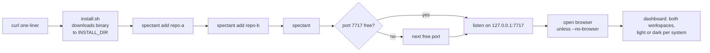

<!-- SPEC — a derived view of ../../ISA.md (feature F1, plus the F0 cross-cutting claims
     ISC-1 to ISC-7). Claim IDs belong to the master, which is untracked in this public
     repository; every claim here carries its full text so this file reads on its own.
     Sync: Skill("Spec", "sync 001-app-skeleton"). Never edit the master from this file.
     principal_stated_goal is deliberately absent: it is German and lives only in the
     untracked master (../constitution.md § What a spec may contain). -->

# 001 — App skeleton and dashboard

## Problem

Today every repository that uses the Spec skill gets its own static `dashboard.html`, rendered by the skill into
`specs/`. To see where the specs of two projects stand, the author opens two files in two places, and nothing about
the pages can be installed or started on its own. There is no binary, no install path and no place that knows more
than one repository.

## Vision

Someone on a fresh Mac or Linux box pastes one line, types `spectant add` twice and `spectant`, and a browser tab (or
the cmux side panel) shows the specs of both repositories side by side. The page carries the look they know from the
old dashboard (the same palette in light and dark, the same cards, rings and chips) but behaves like a tool built this
year: ⌘K jumps to any spec, arrow keys walk the list, numbers change in place when a file changes, and the layout
follows the width of the panel it sits in. Nothing was written into either repository and nothing left the machine.

## Out of Scope

- **No writes into a repository.** The review mark and task checkboxes are spec 002.
- **No review, report, tech, TL;DR or notes page.** Later specs port them.
- **No stage state machine and no agent board.** This spec shows the stage the old skill derives; events and activity
  come with the state-machine spec.
- **No Claude Code plugin and no skill changes.** The old skill and its pages keep working unchanged beside the app.
- **No GitHub release, no checksum verification, no Homebrew.** The install script is proven against a local release
  directory; publishing is the release spec.

## Constraints

- Everything in `../constitution.md` binds; this spec clears its `## Conformance baseline` row for the ladder by
  creating `check:static`, `verify:quick` and `verify`.
- Bun + TypeScript; the binary is built with `bun build --compile` for darwin-arm64, darwin-x64, linux-arm64 and
  linux-x64, and embeds the Angular build.
- UI: Angular 22 zoneless with daisyUI 5 on Tailwind 4; two themes `spec-light` and `spec-dark` whose tokens are the
  old pages' colour values. The old pages are the design source for tokens and component anatomy only; their layout
  and code are not ported, and no screenshot is compared against them. Visual regression runs against the app's own
  committed Playwright baseline.
- Fonts (Inter Variable, JetBrains Mono) ship as local assets; language is a persisted setting, not a route prefix
  (constitution § Adaptations).
- Loopback only; default port 7717; data directory `$XDG_DATA_HOME/spectant` or `~/.spectant/`.
- The spec parsing the dashboard needs lives in `core/`, the one module the plugin will later share.
- This spec creates the repository's `README.md`, root `CLAUDE.md`, `FORMAT.md` (the parts the dashboard reads) and
  `LICENSE`, so the constitution's rows can move off the untracked master.

## Goal

A fresh macOS or Linux user installs spectant with one line, registers two workspaces and sees their specs side by
side on a read-only dashboard that inherits the old Spec dashboard's look in its light and its dark theme and works
like a current developer tool (command palette, keyboard navigation, in-place refresh), with nothing leaving the
machine and nothing written into either repository.

## Test Strategy

| isc | type | check | threshold | tool | anchors_to | severity |
|-----|------|-------|-----------|------|------------|----------|
| ISC-1 | bun-test | server socket address | 127.0.0.1 or ::1 only | `bun test tests/server.test.ts -t "loopback"` | derived: local-only | high |
| ISC-2 | e2e | no request leaves loopback across a scripted session | 0 blocked requests | `bun run e2e -- offline` (Playwright `context.route('**')` fails every non-loopback host, every route, both themes) plus `bun run test:offline:server` (binary in `docker run --network none`) | derived: local-only | high |
| ISC-3 | bash | leak classes in tracked files | 0 hits | `bun run check:leak` | derived: public-oss | high |
| ISC-4 | bash | license and notices present | both | `test -f LICENSE && rg -q 'Apache License' LICENSE && test -f THIRD_PARTY_NOTICES.md` | derived: public-oss | |
| ISC-5 | bash | one parser implementation | 0 duplicates | `bun run check:single-core` | derived: one-contract | |
| ISC-6 | bun-test | fixture corpus against golden snapshots | all green | `bun test core/` | derived: one-contract | |
| ISC-7 | bun-test | view rebuilt after data dir loss | snapshot equal | `bun test tests/rebuild.test.ts` | derived: files-are-truth | |
| ISC-8 | bash | release build targets | exactly 4 | `bun run build && test $(ls dist/spectant-{darwin,linux}-{arm64,x64} \| wc -l) -eq 4` | literal | |
| ISC-9 | bash | host binary version | equals package.json | `bun run check:version` | literal | |
| ISC-10 | bash | install in a clean Ubuntu container | exit 0 | `bun run test:install:linux` | literal | high |
| ISC-11 | manual | install on a clean macOS arm64 user | `spectant --version` exits 0 | transcript with a fresh `HOME` | literal | high |
| ISC-12 | bash | INSTALL_DIR honoured | binary at target | `bun run test:install:linux -- INSTALL_DIR=/opt/x/bin` | literal | |
| ISC-13 | bun-test | add, list, remove a workspace | round-trip | `bun test tests/workspaces.test.ts` | literal | |
| ISC-14 | bun-test | stage per spec equals the old derivation; fails on zero comparisons | all equal, count > 0 | `bun test core/tests/stage-parity.test.ts` (reads `SPECTANT_PARITY_TREES`) | literal | |
| ISC-15 | bash | registered repo byte-identical after add + browse, `.git/` included | checksum equal | `bun run test:readonly` (recursive hash of the fixture repo before and after) | derived: files-are-truth | high |
| ISC-16 | bun-test | two workspaces on one dashboard | both listed | `bun test tests/dashboard.test.ts -t "multi-workspace"` | literal | |
| ISC-17 | bash | dashboard visual baseline, light, 390/820/1440 | green on Linux CI with pinned Chromium | `bun run test:visual -- dashboard` (Playwright `toHaveScreenshot` against `web/e2e/__screenshots__/`) | derived: no-drift | |
| ISC-17.1 | bash | dashboard visual baseline, dark | green | `bun run test:visual -- dashboard --theme dark` | derived: no-drift | |
| ISC-18 | bun-test | theme tokens round-trip to the old pages' hex within ΔE 0.5 | all within | `bun test web/tests/theme-colors.test.ts` (pure TS, parses `styles.css`) | literal | |
| ISC-18.1 | e2e | system mode follows prefers-color-scheme, live | 2 cases | `bun run e2e -- theme -g system` (`emulateMedia`) | literal | |
| ISC-18.2 | bun-test | icon names used vs the old pinned Lucide set | 0 foreign | `bun test web/tests/icons.test.ts` | literal | |
| ISC-19 | manual | dashboard in the cmux web view | renders, navigates | Interceptor / cmux screenshot | literal | high |
| ISC-20 | bun-test | start-up: port, fallback, --no-browser, URL printed | 4 cases | `bun test tests/cli.test.ts -t "start"` | literal | |
| ISC-21 | bun-test | data dir resolution | 2 cases | `bun test tests/cli.test.ts -t "data dir"` | derived: local-only | |
| ISC-22 | bun-test | EN/DE catalogue parity, formal German | 0 missing keys, 0 informal forms | `bun test web/tests/i18n-parity.test.ts` | derived: no-translation | |
| ISC-60 | e2e | palette opens, lists workspaces and specs | all listed | `bun run e2e -- palette -g open` | derived: developer-tool | |
| ISC-60.1 | e2e | palette filters | only matches | `bun run e2e -- palette -g filter` | derived: developer-tool | |
| ISC-60.2 | e2e | Enter navigates | URL changed | `bun run e2e -- palette -g enter` | derived: developer-tool | |
| ISC-61 | e2e | arrows and j/k move selection | selection follows | `bun run e2e -- keyboard -g move` | derived: developer-tool | |
| ISC-61.1 | e2e | Enter opens the selected spec | URL changed | `bun run e2e -- keyboard -g enter` | derived: developer-tool | |
| ISC-61.2 | e2e | `?` opens the shortcut sheet | dialog visible | `bun run e2e -- keyboard -g help` | derived: developer-tool | |
| ISC-62 | e2e | value updated in place, no navigation | 0 navigations | `bun run e2e -- refresh -g in-place` | derived: live-first | |
| ISC-62.1 | e2e | layout shift during refresh | CLS 0 | `bun run e2e -- refresh -g cls` | derived: live-first | |
| ISC-63 | e2e | dashboard at 600 px: no horizontal overflow | scrollWidth == clientWidth | `bun run e2e -- narrow -g dashboard` | derived: cmux-panel | |
| ISC-63.1 | e2e | workspace column at 600 px: no horizontal overflow | scrollWidth == clientWidth | `bun run e2e -- narrow -g column` | derived: cmux-panel | |
| ISC-64 | browser | focus ring on every interactive element, both themes | all | `bun run test:browser -- focus` | derived: design-standard | |
| ISC-65 | browser | contrast: text 4.5:1, marks 3:1, both themes | all | `bun run test:browser -- contrast` | derived: design-standard | |
| ISC-66 | browser | reduced motion: no animation or transition runs | 0 | `bun run test:browser -- motion` | derived: design-standard | |
| ISC-67 | bun-test | two font files present as local assets | 2 faces | `bun test web/tests/fonts.test.ts -t "local"` | derived: local-only | |
| ISC-67.1 | bun-test | external font URL in any stylesheet | 0 | `bun test web/tests/fonts.test.ts -t "external"` | derived: local-only | |
| ISC-5.1 | bash | lane working notes present | 4 files | `test -f CLAUDE.md -a -f core/CLAUDE.md -a -f server/CLAUDE.md -a -f web/CLAUDE.md` | derived: lanes | |
| ISC-5.2 | bash | static tier runs lint, stylelint and tsc at zero warnings | exit 0 | `bun run check:static` | derived: ladder | |
| ISC-8.1 | bash | compiled host binary serves the embedded app from an empty directory | 200 html · 200 js · SPA fallback | `bun run test:binary` (copies the binary to a temp dir, `--no-browser --port 0`, curls `/`, one `main-*.js`, `/w/x`) | literal | high |
| ISC-16.1 | bash | overview visual baseline, light, incl. empty and unreadable states | green | `bun run test:visual -- overview` | derived: no-drift | |
| ISC-16.2 | bash | overview visual baseline, dark | green | `bun run test:visual -- overview --theme dark` | derived: no-drift | |
| ISC-18.3 | e2e | chosen mode survives reload and port change | 2 cases | `bun run e2e -- theme -g persist` (settings from `/api/settings`) | literal | |
| ISC-19.1 | e2e | WebKit smoke: both routes render, zero console errors | 0 errors | `bun run e2e -- --project webkit smoke` | derived: cmux-panel | |

## Features

### F0 · Cross-cutting
Why: what would sink the project whichever slice slipped — data leaving the machine, a private detail going public, the app and the skill disagreeing about the format, or the database quietly becoming a second truth.

- [x] ISC-1: Anti: the app's HTTP server listens on any address other than 127.0.0.1 or ::1.
- [ ] ISC-2: Anti: with no AI feature switched on, starting the app, adding a workspace, browsing every page and performing every write makes an outbound network request.
- [ ] ISC-3: Anti: a tracked file contains a customer name, an absolute home path or personal data (generic leak classes plus a private word list kept outside the repo).
- [x] ISC-4: The repository root holds the Apache-2.0 `LICENSE` and a `THIRD_PARTY_NOTICES.md` naming the bundled assets and the LifeOS (MIT) origin of the ISA format.
- [x] ISC-5: Anti: the repository holds more than one implementation of frontmatter, claim or stage parsing; the app and the plugin both import `core/`.
- [x] ISC-6: Every fixture under `core/fixtures/` parses without error to its golden JSON snapshot.
- [x] ISC-7: Deleting the data directory loses only the workspace registry, notes and pins; after re-adding a workspace its specs view equals the view before deletion.
- [x] ISC-5.1: A `CLAUDE.md` exists at the root plus in `core/`, `server/`, `web/`, each lane file naming its probe (root: only what applies everywhere).
- [x] ISC-5.2: `bun run check:static` runs ESLint with the Angular rules, Stylelint with `color-no-hex` and `tsc --noEmit`, all at zero warnings.

### F1 · App skeleton and dashboard
Why: the first time the author types `spectant` and sees two real repositories on one page in the look they know — the smallest thing that already replaces a per-repo HTML file.

- [x] ISC-8: `bun run build` produces four binaries: darwin-arm64, darwin-x64, linux-arm64, linux-x64.
- [x] ISC-8.1: The compiled host binary, copied to an empty directory, passes the embedded-app smoke (`/` → HTML, hashed `main-*.js` → JavaScript, `/w/x` → `index.html`). (after: ISC-8)
- [x] ISC-9: The host binary's `--version` prints the version in `package.json`. (after: ISC-8)
- [x] ISC-10: In a clean Ubuntu x64 container, the install script pointed at a local release directory puts `spectant` on PATH and `spectant --version` exits 0. (after: ISC-8)
- [ ] ISC-11: For a fresh user on macOS arm64, the install one-liner puts `spectant` on PATH and `spectant --version` exits 0. (after: ISC-8)
- [x] ISC-12: The install script writes the binary to `INSTALL_DIR` when that variable is set. (after: ISC-10)
- [x] ISC-13: `spectant add <repo>`, `spectant list` and `spectant remove <repo>` round-trip a workspace through the registry.
- [x] ISC-14: For copies of the principal's real spec trees, every spec's stage on the dashboard equals the stage the old skill derives, and the probe fails when no tree was compared.
- [x] ISC-15: Anti: adding a workspace or opening any page changes a byte inside the registered repository, `.git/` included.
- [ ] ISC-16: One dashboard lists the specs of two registered workspaces side by side.
- [x] ISC-16.1: The overview's committed visual baseline (light, three widths, states: two workspaces, empty, unreadable workspace) passes on Linux CI.
- [x] ISC-16.2: The same baseline passes in the dark theme.
- [x] ISC-17: The dashboard's committed visual baseline (Playwright `toHaveScreenshot`, light theme, 390/820/1440) passes on Linux CI with pinned Chromium.
- [x] ISC-17.1: The same baseline passes in the dark theme.
- [x] ISC-18: Antecedent: the daisyUI themes `spec-light` and `spec-dark` carry the old pages' light and dark colour values as their tokens, so the look is inherited rather than re-invented.
- [ ] ISC-18.1: In the default system mode the theme follows `prefers-color-scheme`, also when it changes while the page is open.
- [ ] ISC-18.3: A chosen light or dark mode, stored server-side, is still applied after a reload on a different port.
- [x] ISC-18.2: Antecedent: every icon the app renders comes from the old pages' pinned Lucide set.
- [ ] ISC-19: The dashboard renders and navigates inside the cmux web view.
- [ ] ISC-19.1: Playwright's WebKit project renders `/` and `/w/:ws` with zero console errors.
- [x] ISC-20: `spectant` without arguments listens on 7717 or the next free port, prints the URL, and opens the browser unless `--no-browser` is given.
- [x] ISC-21: The data directory is `$XDG_DATA_HOME/spectant` when that variable is set and `~/.spectant/` otherwise.
- [x] ISC-22: Every UI string key exists in both the English and the German catalogue.
- [x] ISC-60: ⌘K / Ctrl+K opens a command palette listing every workspace plus every spec.
- [x] ISC-60.1: Typing in the palette narrows the list to matching entries. (after: ISC-60)
- [ ] ISC-60.2: Enter in the palette navigates to the highlighted entry. (after: ISC-60)
- [x] ISC-61: In a spec list, ↓/↑ (also j/k) move the selection.
- [x] ISC-61.1: Enter opens the selected spec. (after: ISC-61)
- [x] ISC-61.2: `?` opens the shortcut sheet.
- [x] ISC-62: After the auto-refresh timer fires with a changed number on disk, the DOM node holding that number shows the new value with no navigation event.
- [ ] ISC-62.1: The same refresh produces a cumulative layout shift of 0. (after: ISC-62)
- [ ] ISC-63: At a 600 px wide container (the cmux side panel) the dashboard has no horizontal overflow: `scrollWidth` equals `clientWidth`.
- [ ] ISC-63.1: At the same width a workspace column in the overview has no horizontal overflow.
- [x] ISC-64: Every interactive element shows the brand focus ring under keyboard focus, in both themes.
- [x] ISC-65: Text reaches 4.5:1 and marks (ring track, bars, legend dots) 3:1 against their surface, in both themes.
- [x] ISC-66: Anti: under `prefers-reduced-motion: reduce` any animation or transition longer than 0 ms runs.
- [x] ISC-67: Antecedent: the app ships Inter Variable plus JetBrains Mono as local assets.
- [x] ISC-67.1: Anti: a stylesheet declares a font URL outside the app's own origin.

## Decisions

- 2026-09-28: goal confirmed as install plus dashboard over two workspaces, over a locally built one-workspace cut and
  over adding a read-only review page (context.md Round 1).
- 2026-09-28 (design pass): the badge chevron is the only switcher, with two levels (workspaces, then specs of the
  current one); the all-workspaces view is one column per workspace on an auto-fit grid; parity on `/w/:ws` holds
  with four named fixes (master fraction never wraps, card labels never fade into the glow, Dev-Services pills align
  to the content edge, the workspace name never hyphen-breaks) plus the icon-rail entries left out of 001. These
  regions are masked by name in the visual test for ISC-17 and ISC-17.1; muted-text contrast stays as on the old
  pages. See design.md.
- 2026-09-28 (review before implement): **refined:** pixel parity to the old dashboard dropped; the identity (palette
  in both themes, card anatomy, icons) stays as the design source. ISC-17/17.1 now name the app's own visual baseline;
  the threshold fog line dies here. ISC-60 to ISC-67 added (command palette, keyboard navigation, in-place refresh,
  600 px container, focus, contrast, reduced motion, local fonts). The design-pass decision "muted-text contrast stays
  as on the old pages" is reversed by ISC-65; the four named fixes and the masks are moot. design.md is re-run under
  the new direction. Chosen over "001 pixel-identical, fancy from 002" and "parity first, redesign later".
- 2026-09-28 (design pass 2, merge): a spec opens on the route `/w/:ws/s/:id` (rail inspector at wide, side sheet at
  medium, full-screen sheet at compact; the later review page attaches here); "Next up" is its own surface and every
  row carries stage and next command; the TL;DR bar stays as a collapsed Brief; the overview grid is
  `minmax(min(100%, 360px), 1fr)` capped at three columns. Container tiers compact < 640 / medium / wide ≥ 1120 replace
  the old viewport breakpoints. Settings (theme mode, language, interval, single-key shortcuts) live server-side in
  SQLite (`/api/settings`, ISC-18.3). Derived contrast tokens are legitimate additions beside the inherited ones:
  `--muted` = `#939293`, a new `--track` ≈ `#7f7d80`, and `--*-ink` text variants in the light theme (ISC-65); ISC-18's
  guard covers the inherited tokens only. "Pinned Lucide set" in ISC-18.2 means the pinned `lucide-static` version,
  so icons the new surfaces need (search, x, chevron-right, folder-plus, archive, keyboard) come from that same
  version. See design.md.
- 2026-09-28: this spec projects F1 and the F0 cross-cutting claims; F0 stays open across later specs where a claim
  needs their pages (ISC-2 covers "every write" once spec 002 adds writes).

## Verification

- ISC-62: e2e — `bun run e2e -- refresh -g in-place --workers=1` 1 pass in the main tree (page.clock; the stub's session-scoped POST /api/__stub/bump raises harbor's closed claims, 31 s later the same KPI node, still connected, reads 56, 0 framenavigated events); red before (Expected "56" Received "55"); RefreshService polls on settings.refreshSeconds while visible and on visibilitychange, through the ETag cache; r and the palette's Refresh now share it (T68; 2026-09-30)

- ISC-61.2: e2e — `bun run e2e -- keyboard -g help --workers=1` 2 pass in the main tree (on /w/harbor `?` opens the sheet listing the workspace, spec and any contexts from the one SHORTCUTS table; g s/g n/g w reach #specs/#next-up/#warnings, 1–3 set ?phase=, g a goes to /, h/l move across overview columns); red before (no [data-context], #specs not focused); keyboard/palette/shell e2e 82 pass (T67; 2026-09-30)

- ISC-61.1: e2e — `bun run e2e -- keyboard -g enter --workers=1` 2 pass in the main tree (wide: Enter on the selected row sets ?spec=<id> with the rail inspector, ] [ rewrite it in list order, Esc clears it and refocuses the row, Enter again opens /w/harbor/s/<id>; medium: side sheet, Open → spec page); red before (Enter went straight to the spec page) (T69; 2026-09-30)

- ISC-60.1: e2e — `bun run e2e -- palette -g filter --workers=1` 5 pass in the main tree (describe 'palette filter': 'manifest' leaves exactly harbor/004 and 006, every option marked, unmatched groups render no heading; '004' leaves harbor/004 with its chip marked and clearing restores list and groups; 'zzqx' shows the no-match line; plus the two levels filter tests); red 3/3 against a deliberately match-all rankEntry, reverted byte-identical (T70; 2026-09-30)

- ISC-17: bash — `bun run test:visual:ci -- dashboard` green: visual.spec.ts dashboard-390/820/1440.png, light, pinned Playwright v1.63.0-noble container, recorded 2026-09-30; red before: no baseline existed (Playwright fails on a missing snapshot); full visual suite 48/48 light, stable on a second run (T79, T84–T90)

- ISC-17.1: bash — `bun run test:visual:ci -- dashboard --theme dark` green: dark dashboard-390/820/1440.png, pinned Playwright v1.63.0-noble container, recorded 2026-09-30; red before: no baseline existed (Playwright fails on a missing snapshot); full visual suite 48/48 dark (T80)

- ISC-16.1: bash — `bun run test:visual:ci -- overview` green: overview-{two-workspaces,empty,unreadable}-{390,820,1440}.png, light, pinned Playwright v1.63.0-noble container, recorded 2026-09-30; red before: no baseline existed (Playwright fails on a missing snapshot) (T81)

- ISC-16.2: bash — `bun run test:visual:ci -- overview --theme dark` green: the nine overview baselines dark, pinned Playwright v1.63.0-noble container, recorded 2026-09-30; red before: no baseline existed (Playwright fails on a missing snapshot) (T82)

- ISC-60: e2e — `bun run e2e -- palette -g open --workers=1` 3 pass (⌘K lists every workspace and every active spec, open workspace first; Ctrl+K and / open, Esc closes; the header trigger opens and focus returns), red 3/3 before (no palette); groups from PALETTE_SOURCES by order, empty groups absent; palette/keyboard/shell/offline/dashboard e2e 71 pass (T66; 2026-09-30)

- ISC-61: e2e — `bun run e2e -- keyboard -g move --workers=1` 3 pass (Specs panel on /w/harbor: ↓ ↑ j k Home End move one focused data-selected row, the list's only tabindex=0, no wrap, URL unchanged; ?sort=id reorders the walk), red before (0 rows in [data-panel="specs"]) (T27, T63; 2026-09-30)

- ISC-15: bash — bun run test:readonly → 3 pass: harbor copy under git with staged, modified, stale-stat, untracked and ignored files and a code-reviewed mark for 004; recursive hash incl. .git/ (bytes, modes, mtimes) equal after add + list + dashboard + 304 + HEAD + settings + SPA routes; .git/index bytes and mtime unchanged; 004 gate reads fresh, proving the in-memory tree id ran; controls: one byte in .git/description flips the hash, a plain git status rewrites the index; spec 001 round 18

- ISC-7: bun-test — bun test tests/rebuild.test.ts → 2 pass (add harbor + lantern, PUT theme, keep list + ETag + both dashboards; rm -rf data dir; serve again: [] workspaces, default settings, fixture hashes unchanged; re-add → list and ETag equal, dashboards byte-equal except runtime services; reverse order changes only list order; tripwire: tables are exactly setting + workspace until notes/pins land); spec 001 round 18

- ISC-4: bash — test -f LICENSE && rg -q 'Apache License' LICENSE && test -f THIRD_PARTY_NOTICES.md → exit 0; LICENSE is the canonical Apache-2.0 text with the appendix line filled in, THIRD_PARTY_NOTICES.md covers Angular, Transloco, RxJS, tslib, Tailwind, daisyUI, Lucide (incl. Feather notice), Inter and JetBrains Mono (OFL), the Bun runtime, the frozen leadgen fixture and the LifeOS (MIT) origin of the ISA format, plus a dev-dependency table; spec 001 round 17

- ISC-14: bun-test — bun test core/tests/stage-parity.test.ts with SPECTANT_PARITY_TREES = three local trees (13 spec folders: this repo, the public leadgen repo, one private customer corpus) and SPECTANT_SPEC_SKILL_DIR = the old skill → 14 pass, 0 fail (13 stages equal + count > 0); unset → 1 skip, listed but nothing compared → 1 fail; spec 001 round 17

- ISC-6: bun-test — bun test core/ → 464 pass, 0 fail; golden check lives in core/tests/fixtures.test.ts only (five trees ↔ five *.golden.json, byte-equal to buildDashboard, UPDATE_GOLDEN=1 the only rewrite path), every fixture parses with zero error diagnostics and its warning set pinned (leadgen's real master-progress-mismatch), non-vacuity proven by a spec-less folder; spec 001 round 17

- ISC-65: browser — bun run test:browser -- contrast → 4 passed (117 text and 55 mark samples per theme against /__ui; first run red with six real defects: gallery and primitive classes colliding with daisyUI .stack/.label, light primary button 3.77, light inks on tints, muted on selected chip, success dot; fixed via class renames, tint-aware light inks, --primary-fill/--done-mark tokens; focus and motion probes still green); spec 001 round 16

- ISC-66: browser — bun run test:browser -- motion → 4 passed (reduce in light and dark: 23 interactions, 0 running animations or transitions; control under no-preference shows 200+ transitions, so the emulation reaches the page; red when the reduced-motion block is disabled); spec 001 round 15

- ISC-20: bun-test — bun test tests/cli.test.ts -t "start" → 5 pass (default 7717 or the next free port, fall-forward on EADDRINUSE, URL line `spectant · http://127.0.0.1:<port>`, browser runner called unless --no-browser, /api/settings served by the CLI-started server), red before T50; spec 001 round 15

- ISC-1: bun-test — bun test tests/server.test.ts -t "loopback" → 4 pass (kernel socket address 127.0.0.1/::1 only, non-loopback connects refused on three interfaces, source guard over http.ts and cli.ts; red under 0.0.0.0 mutations of LOOPBACK_HOST and of Bun.serve hostname); spec 001 round 15

- ISC-13: bun-test — bun test tests/workspaces.test.ts → 7 pass (CLI add/list/remove round-trip through the registry, stdout never carries the absolute path, repo hash unchanged), red before T44 (unknown command), server lane 74 pass; spec 001 round 14

- ISC-64: browser — bun run test:browser -- focus → 2 passed (light, dark; 53 elements per theme against the /__ui gallery; red before the segmented checked-state halo fix, red under ring-width and ring-token mutations); spec 001 round 13

- ISC-22: bun-test — bun test web/tests/i18n-parity.test.ts → exit 0, 17 pass (174 keys in en.json and de.json, 0 missing, 0 informal German, 0 param mismatches; Transloco 8.4.0 with a bundled loader; red on a dropped key, a dropped param and 'deinen'), round 9, T23

- ISC-67.1: bun-test — bun test web/tests/fonts.test.ts -t "external" → exit 0, 13 pass (no external font/stylesheet URL under web/src or the build; red on a throwaway Google Fonts @import and on 13 synthetic offenders), round 9, T20

- ISC-18.2: bun-test — bun test web/tests/icons.test.ts → exit 0, 11 pass (lucide-static pinned 1.48.0, icons.ts byte-identical to regeneration, no foreign name or raw svg under web/src; red on a hand-edited path, a 'rocket' name and a raw svg), round 8, T22

- ISC-67: bun-test — bun test web/tests/fonts.test.ts -t "local" → exit 0 (Inter Variable 4.1 352 KB + JetBrains Mono 2.304 114 KB as woff2 under web/public/fonts, OFL texts beside them, @font-face local, copied into web/dist/browser/fonts), round 8, T19

- ISC-12: bash — bun run test:install:linux -- INSTALL_DIR=/opt/x/bin → exit 0, 19 checks on linux/amd64 (binary exactly at /opt/x/bin/spectant, nothing elsewhere, PATH hint names it; red with INSTALL_DIR ignored), round 8, T15

- ISC-9: bash — bun run check:version → exit 0, 'check:version: ok 0.1.0' (root and web package.json agree; host binary prints exactly 'spectant 0.1.0\n'; red on a 0.1.1 mismatch), round 7, T13

- ISC-10: bash — bun run test:install:linux → exit 0, 14 checks on linux/amd64 (ubuntu:24.04, non-root, file:///release, ~/.local/bin fallback, PATH hint, --version, HEAD / main-*.js /w/x all 200), round 7, T14

- ISC-8.1: bash — bun run test:binary → exit 0, 6 pass (host binary alone in a mkdtemp dir, --port 0: / html, main-*.js immutable text/javascript, /w/x = index, 404 elsewhere, lsof loopback only, SIGTERM exit 0), round 7, T12

- ISC-8: bash — bun run build && test $(ls dist/spectant-{darwin,linux}-{arm64,x64} | wc -l) -eq 4 → exit 0 (darwin-arm64 58.8 MB signed, darwin-x64 64.0 MB signed, linux-arm64 95.7 MB, linux-x64 baseline 95.3 MB; host binary serves /, main-*.js, /w/x from an empty dir), round 6, T11

- ISC-5.2: bash — bun run check:static → exit 0 (eslint 9.39.5 + angular-eslint 22.5.0 + typescript-eslint 8.70.1, stylelint 17.15.0, tsc 6.0.3; red on a throwaway @Input/*ngIf/| async/hex/literal-duration proof), round 5, T8

- ISC-18: bun-test — bun test web/tests/theme-colors.test.ts → 12 pass, 0 fail (ΔE_OK×100 ≤ 0.5 for 23 tokens per theme; red on the placeholder, red on a 0.01 chroma nudge), round 5, T17

- ISC-5: bash — bun run check:single-core → exit 0, 0 hits (red on a throwaway split("---") under server/), round 2, T45

- ISC-21: bun-test — bun test tests/cli.test.ts -t "data dir" → 3 pass, 0 fail (round 2, T46)

- ISC-5.1: bash — test -f CLAUDE.md -a -f core/CLAUDE.md -a -f server/CLAUDE.md -a -f web/CLAUDE.md → exit 0 (round 2, T2–T5)
