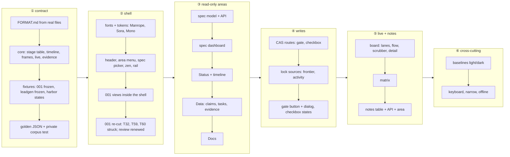

# Plan 002 — Shell and spec page

**Purpose:** how the claims in `spec.md` get built. The what lives there; this file holds no acceptance criterion.

## Approach

Contract first, then the shell, then the areas in the order a developer reads a spec, with the two writes and the
board after the read-only views: **① Stage 0** writes `FORMAT.md` from real files and extends the one parser in
`core/` (stage table, timeline, frames, live frame, evidence listing) against golden fixtures that now include
Spectant's own spec 001 frozen and public leadgen specs; **② the shell** lands the prototype's header, area menu, spec
picker, zen, collapsible rail and the font switch as tokens and layout components, and spec 001's dashboard, overview,
inspector and palette move inside it while 001 is re-cut (T32, T59, T60 struck); **③ the read-only areas** follow,
spec dashboard, Status with timeline, Data, Docs; **④ the two writes** add the compare-and-swap routes, the lock
sources and the gate and checkbox states; **⑤ Live and Notes** add the frame model's views and the notes table;
**⑥ the cross-cutting probes** close the baselines, keyboard, narrow and offline claims.

The obvious path would port the prototype page by page against a stub API and wire the parser last: fastest to
look finished, and exactly the failure the prototype's own documentation warns about, since its five JavaScript
fixtures contradict each other (18/26 tasks on one page, 9/26 on another) and none of them derives from a file.
Building the model first, from files that exist, makes every later view a rendering of golden JSON (ISC-72) and
keeps the prototype in the role the design pass gave it: a reference for surface and interaction. The shell comes
before the areas because every area renders inside it and because spec 001 is paused until it exists (Decisions,
2026-09-29): finishing 001's header twice was the alternative nobody wanted. Writes come after the read-only areas
because their guards (hash, frontier lock, activity line) reuse the parser's view of the same files, and because a
write path is easier to test once the page it reports into already renders. `design.md` § Viewport-übergreifend binds
the shell and every area: one `<header>` with seven controls on every tier, the tab bar as one `<nav>` projected into
header row 2 at compact and under the spec head above; one home per element (command chip, operator steps); Notes as
an area route; five area tiles; Live and Notes as disabled area entries until their tabs exist. The plan departs from
`design.md` nowhere.

**Model boundaries.** `core/` gains one model per area, each a pure function of the parsed files: `spec.ts`
(the spec page model: head, key numbers, idea quote, lanes, gates, warnings), `timeline.ts` (decisions from
`context.md`, rounds, gate marks, commits, derived stage transitions; `events.jsonl` wins when present), `frames.ts`
(rounds → dispatch/result frames, re-cut detection by comparing task ids and texts between rounds, worst state per
frame), `live.ts` (tasks.md + lock sources → the live frame), `evidence.ts` (artifacts/ and .evidence/ listing with
media type, path-confined), `locks.ts` (frontier lock files under the LifeOS state directory when present,
`.spectant/activity.jsonl` when present, "no source" otherwise). Commits come from `git log --format=… -- specs/NNN-slug`
executed read-only by the server, never by `core/`, so `core/` stays free of subprocesses. The server exposes each
model under `/api/workspaces/:ws/specs/:id/*` and performs the two writes through one `writes.ts` that reads the file,
compares the sha256 the client sent, consults `locks.ts`, writes atomically (temp file + rename inside the spec
folder is not allowed by the read-only rule for anything but the two target files, so the write goes straight to the
target with an fsync) and appends the event line.

**Fixtures.** `core/fixtures/` gains `spectant-001/` (this repository's spec 001 at a named commit, master claims
copied for F0 and F1 only) and `leadgen/` (three leadgen specs of two types, their `constitution.md`, a reduced
master, `LICENSE-leadgen.txt`). The lane rule "never a copy of a real repository" in `core/CLAUDE.md` is narrowed to
"never a copy of a private repository": both corpora are public, and the rule's reason (private names) does not
apply. `harbor/002-web-console/rounds.jsonl` is extended so one fixture holds every one of the eleven card states,
a retry, a question, a stop reason and a re-cut (ISC-88, ISC-91). The porzellan-shop specs stay outside the
repository behind `SPECTANT_PRIVATE_CORPUS`, reusing the harness pattern of the existing `SPECTANT_PARITY_TREES`
test: skipped, not passed, when unset.

**Spec 001 re-cut.** Done as the first `repo`-lane task of stage ②, by the parent, not a worker: T32, T59 and T60
are struck from 001's `tasks.md` with a strike note naming this spec, ISC-6 keeps its golden test in 001, and
`/spec-review 001` renews 001's mark afterwards (ISC-98). 001's remaining web tasks (T57, T58, T61–T83) stay in 001
and build inside this spec's shell after stage ② lands.

## Affected Files and Modules

| Path | Change | Claim |
|------|--------|-------|
| `FORMAT.md` | new: one section per file kind with a real example, the stage table, the drift classes, the rounds line, the gate marks | ISC-68.1, ISC-79 |
| `scripts/check-format-doc.ts`, `package.json` (`check:format-doc`) | new: section names vs `core/src/files.ts` kinds | ISC-68.1 |
| `core/src/files.ts` | new: the enumerated file kinds and their paths inside a spec folder | ISC-68.1, ISC-83 |
| `core/src/stage.ts` | extend: the stage table as data, next command with its reason | ISC-79 |
| `core/src/spec.ts` | new: the spec page model (head, key numbers, idea quote, lanes, gates, warnings, waiting on you) | ISC-78, ISC-72, ISC-71 |
| `core/src/timeline.ts`, `core/src/events.ts` | new: merged timeline; `events.jsonl` schema validation | ISC-80, ISC-36, ISC-32 |
| `core/src/frames.ts` | new: rounds → frames, worst state, re-cut detection, matrix cells | ISC-87, ISC-91, ISC-92 |
| `core/src/live.ts`, `core/src/locks.ts` | new: live frame from tasks.md + lock sources; frontier and activity readers | ISC-90, ISC-37, ISC-86 |
| `core/src/claims.ts`, `core/src/tasks.ts` | extend: claim glyph state, kind, probe row, verification line; task line grammar with flags, edges, paths, probe mapping | ISC-81, ISC-82 |
| `core/src/evidence.ts` | new: artifacts/ and .evidence/ listing, media type, path confinement | ISC-83, ISC-83.1 |
| `core/src/markdown.ts` | extend: tables, code, mermaid fences as figures, TOC extraction | ISC-84 |
| `core/tests/golden.test.ts`, `core/tests/fixtures.test.ts`, `core/tests/private-corpus.test.ts` | new/extend: golden per fixture, corpus presence, private corpus | ISC-68, ISC-69, ISC-70 |
| `core/tests/stage.test.ts`, `timeline.test.ts`, `frames.test.ts`, `live.test.ts`, `events.test.ts` | new: model tests | ISC-79, ISC-80, ISC-87, ISC-91, ISC-90, ISC-32 |
| `core/fixtures/spectant-001/`, `core/fixtures/leadgen/`, `core/fixtures/harbor/specs/002-web-console/rounds.jsonl`, `core/fixtures/*.golden.json` | new/extend: frozen corpora, all card states, snapshots | ISC-69, ISC-88, ISC-68 |
| `core/CLAUDE.md` § Fixtures | narrow the copy rule to private repositories | ISC-69 |
| `server/src/api.ts`, `server/src/spec-routes.ts` | new routes per area, 404 for unknown ids | ISC-71, ISC-78, ISC-80, ISC-87 |
| `server/src/writes.ts` | new: hash CAS, lock check, atomic write, event append; 409 / 423 | ISC-24, ISC-25, ISC-26, ISC-27, ISC-86 |
| `server/src/git.ts` | new: read-only `git log` for the timeline commits | ISC-80 |
| `server/src/evidence.ts` | new: confined file serving with media types | ISC-83, ISC-83.1 |
| `server/src/notes.ts`, `server/src/db.ts` (migration 2) | new: notes table, CRUD, import | ISC-94, ISC-52, ISC-53 |
| `server/src/lifeos.ts` | new: optional LifeOS state directory detection | ISC-37 |
| `tests/routes.test.ts`, `tests/writes.test.ts`, `tests/evidence.test.ts`, `tests/notes.test.ts`, `tests/timeline.test.ts`, `tests/lifeos-optional.test.ts` | new: route and write tests | ISC-71, ISC-24–27, ISC-86, ISC-83, ISC-94, ISC-52, ISC-53, ISC-36, ISC-37 |
| `web/src/styles/fonts.css`, `web/public/fonts/` | Manrope, Sora, JetBrains Mono local; Inter removed | ISC-74 |
| `web/src/styles/tokens.css`, `web/src/styles.css` | prototype hex → OKLCH theme slots with hex comments; `-ink` aliases; area icons; no glow | ISC-74, ISC-88 |
| `web/tests/fonts.test.ts`, `web/tests/theme-colors.test.ts` | rewrite for the three faces; contrast guard for the two narrow dark values (001's ISC-65 stays green) | ISC-74 |
| `web/src/app/layout/shell/` | new: `container: shell`, tiers, grid with 352 px rail at wide, rail collapse via settings, tab-bar slot per tier (design.md, all viewports) | ISC-73, ISC-75, ISC-93 |
| `web/src/app/layout/header/` | new: wordmark, workspace picker, spec picker, area menu, palette trigger, live indicator, zen, settings with help; collapse order; two rows at compact (Mobile) | ISC-73, ISC-76 |
| `web/src/app/layout/area-menu/`, `layout/tab-bar/` | new: popover with `aria-current`, disabled entries with reason; route-driven tabs with counts | ISC-76, ISC-97 |
| `web/src/app/layout/spec-head/`, `layout/agent-banner/`, `layout/zen-footer/` | new: head with single command home, banner variants, zen status bar | ISC-85, ISC-86, ISC-90, ISC-75 |
| `web/src/app/core/keyboard.service.ts`, `layout/shortcut-sheet/` | extend: `g` sequences, `[` `]`, `v`, `◂ ▸`, listing | ISC-97 |
| `web/src/app/features/dashboard/**`, `features/overview/**`, `layout/command-palette/**` | move into the shell; palette trigger field only ≥ 1280 header container (design.md, Desktop) | ISC-77 |
| `web/src/app/features/spec/dashboard/` | new: KPI band, idea quote, next step, lanes, five area tiles, Brief reuse | ISC-78, ISC-72 |
| `web/src/app/features/spec/status/`, `status/timeline/` | new: four blocks, gate cards and button states, timeline list with filters and derived chip | ISC-79, ISC-80, ISC-36, ISC-85 |
| `web/src/app/features/spec/data/claims/`, `data/tasks/`, `data/evidence/` | new: claim cards with six glyphs, task rows with checkbox states, evidence groups with preview dialog | ISC-81, ISC-82, ISC-83.1, ISC-25, ISC-26 |
| `web/src/app/features/spec/docs/` | new: markdown page with TOC, figures, type-aware empty state | ISC-84 |
| `web/src/app/features/spec/live/board/`, `live/flow/`, `live/matrix/`, `live/card-detail/`, `live/this-frame/` | new: lanes and flow views, scrubber, bottom bar and sheet, matrix, card detail | ISC-87, ISC-88, ISC-89, ISC-92, ISC-93 |
| `web/src/app/features/spec/notes/` | new: list and editor routes, anchor picker, import notice | ISC-95, ISC-94 |
| `web/src/app/shared/ui/` (`glyph`, `state-chip`, `sheet`, `dialog`, `popover`, `disclosure`, `toast`, `scrubber`) | new primitives on daisyUI classes | ISC-88, ISC-85, ISC-81 |
| `web/src/i18n/en.json`, `de.json` | every new UI string in both catalogues (001's parity test ISC-22 stays green) | ISC-73, ISC-76, ISC-85, ISC-88 |
| `web/e2e/shell.spec.ts`, `spec.spec.ts`, `data.spec.ts`, `docs.spec.ts`, `gate.spec.ts`, `board.spec.ts`, `notes.spec.ts`, `counts.spec.ts`, `keyboard.spec.ts`, `narrow.spec.ts`, `offline.spec.ts`, `visual.spec.ts` | new/extend: the e2e and visual probes, stub API fed by golden JSON | ISC-73, ISC-75, ISC-76, ISC-78, ISC-81, ISC-82, ISC-83.1, ISC-84, ISC-85, ISC-88, ISC-89, ISC-92, ISC-93, ISC-95, ISC-97, ISC-72, ISC-96, ISC-96.1, ISC-23, ISC-23.1, ISC-49, ISC-49.1, ISC-2 |
| `web/e2e/stub-api.ts` | extend: spec routes, writes with 409/423 scripting, lock fixtures | ISC-85, ISC-86 |
| `specs/001-app-skeleton/tasks.md` | strike T32, T59, T60 with a note naming this spec | ISC-98 |
| `web/CLAUDE.md`, `server/CLAUDE.md`, `core/CLAUDE.md` | lane notes: new modules, the write rule's two exceptions, the fixture rule | ISC-68.1 (documentation of the contract) |

## Interfaces

**HTTP** (new, loopback only, every JSON route sends an ETag; the model never carries an absolute path):

| Route | Returns / does |
|-------|----------------|
| `GET /api/workspaces/:ws/specs/:id` | the spec page model from `core/src/spec.ts`; 404 with `{error: "not_found"}` for unknown `:ws` or `:id` |
| `GET …/:id/timeline` | `[{ts, kind: decision\|round\|gate\|commit\|stage, derived, title, body?, ref}]` |
| `GET …/:id/claims` · `GET …/:id/tasks` | claim and task models with glyph state, kind, edges, probe row, verification line; flags, lane, state, paths, probe mapping |
| `GET …/:id/evidence` · `GET …/:id/evidence/file?path=` | the grouped listing; the file with its media type, 403 for a path outside the spec folder |
| `GET …/:id/docs/:name` | rendered HTML plus TOC for plan, design, decisions (context.md), constitution; 404 with the type-aware reason when the file does not exist |
| `GET …/:id/frames` · `GET …/:id/live` | frames from `rounds.jsonl`; the live frame with lock source name (`frontier`, `activity`, `none`) |
| `POST …/:id/gate/reviewed` | body `{hashes: {spec.md, plan.md, tasks.md}}`; 200 writes the mark and the event, 409 hash mismatch, 423 claim locked (`{lock: {source, session}}`) |
| `POST …/:id/tasks/:tid/check` | body `{checked, hash}`; 200 changes one line, 409, 423 as above |
| `GET /api/workspaces/:ws/notes` · `POST` · `PATCH /:noteId` · `DELETE /:noteId` | notes with `{id, workspace, anchor?: {kind: spec\|claim\|task, ref}, title, body, updated}` |
| `GET /api/lifeos` | `{present: boolean}`; nothing under the LifeOS directory is read when false |

**Settings** (`GET/PUT /api/settings`) gain `railCollapsed`, `termHints`, `importNoticeDismissed`, `boardView`,
`boardDensity`.

**CLI**: `spectant import-notes <file>` (F5's ISC-53) reads the old notes page's JSON export and inserts into the notes
table; no other CLI change.

**Client shell contract** (web): the tab bar is one `TabBarComponent` rendered through a slot the shell chooses per
tier; the `KeyboardService` owns the `g` sequences; the `LockSource` state (`frontier` | `activity` | `none`) is a
signal the banner, the gate button and the checkboxes read.

## Data Model

`spectant.db` gains one table; migration 2 in `server/src/db.ts`, tracked by the existing `setting` row
`schema_version`.

| Table | Columns | Holds |
|-------|---------|-------|
| `note` | `id TEXT PK`, `workspace TEXT NOT NULL REFERENCES workspace(slug) ON DELETE SET NULL`, `anchor_kind TEXT NULL CHECK (anchor_kind IN ('spec','claim','task'))`, `anchor_ref TEXT NULL`, `title TEXT`, `body TEXT`, `created_at TEXT`, `updated_at TEXT` | the developer's notes; at most one anchor; orphaned (workspace NULL) when a workspace is removed without deleting its notes |

Nothing a repository says is stored; a note's anchor is a reference string, resolved against the parsed spec at read
time and shown as "unresolved" when the target no longer exists.

## Migration and Rollback

Expand–contract, expand only: migration 2 creates `note` and bumps `schema_version` to 2; no existing table changes.
Rollback is `spectant db rollback 2` (new subcommand, drops `note`, sets `schema_version` to 1); running it loses every
note that was not exported first with `spectant export-notes <file>` (the inverse of the import, added with the
rollback). No repository file is touched by either direction; the two repo writes are not migrations and need no
rollback beyond `git checkout -- specs/NNN-slug/tasks.md` and deleting `.gates/reviewed.json`, both the developer's.

## Risks

| Risk | Blast radius | Early warning | Mitigation |
|------|--------------|---------------|------------|
| The frontier lock format or location changes in LifeOS | live frame and write guard read nothing; writes proceed with "no agent source" | `tests/lifeos-optional.test.ts` fixture drifts from the real directory | `locks.ts` reads one documented shape from `SpecFormat.md`; the real path is probed by a local-only test |
| A stale-hash write races an agent that holds no lock yet (between plan and lock) | one checkbox line overwritten | 409 rate in the write log | the client re-fetches the hash immediately before POST; the server re-reads the file inside the write |
| Golden JSON for the frozen spec 001 goes stale as 001 moves | golden test red for a reason unrelated to the parser | `spectant-001/COMMIT` differs from the frozen tree | the fixture is frozen at a named commit and refreshed only on `/spec-complete 001` (Open Points) |
| leadgen's specs carry a format version the parser does not accept | fixture corpus fails to parse | first golden run on `leadgen/` | freeze specs the parser already reads; a diagnostic is a finding for `FORMAT.md`, not a reason to edit the copy |
| The prototype's fixtures leak into the port as "obvious" values | counters disagree with the files | `bun run e2e -- counts` (ISC-72) | every view renders golden JSON; no literal number in a template |
| Font switch breaks 001's committed baselines | 001's visual tests red | first `test:visual -- dashboard` after stage ② | baselines are re-recorded once in stage ② together with the shell; 001's e2e suites (ISC-77) prove behaviour, baselines prove look |
| Compact header (two rows) and the medium/wide header (one row) diverge as two components | double maintenance, ISC-73 count differs per tier | the header e2e at 390 and 1440 | one `HeaderComponent` with a tier signal; the tab bar is one component in two slots |
| Notes table survives a workspace removal as orphans nobody sees | confusion, disk growth | orphan count in `GET /api/workspaces/:ws/notes?orphans=1` | the Notes list shows "From removed workspaces" (design.md); `import-notes`/`export-notes` round-trip them |
| `git log` on a large repository slows the timeline | slow Status tab | timeline route > 500 ms in the server log | limit to `-- specs/NNN-slug` and 200 commits, cache per ETag |

## Open Points

- fog (spec § Not yet specified, first line): which leadgen specs are frozen and how their claim IDs are namespaced in
  the fixture master — resolved when `core/fixtures/leadgen/` is built: one spec per type present there, the reduced
  master carries only their feature blocks, and IDs keep their original numbers because fixtures never share a master.
- fog (second line): Live and Notes as disabled area entries or hidden — resolved by `design.md` § Viewport-übergreifend
  as disabled entries with a visible reason; the fog line is closed at review.
- fog (third line): how the frozen spec 001 fixture is refreshed — resolved here as "named commit, refreshed only on
  `/spec-complete 001`", recorded in `core/fixtures/README.md`; the fog line is closed at review.

## Conformance Impact

- every tier of the ladder (grandfathered, spec 001 clears it): extend — the new e2e, visual and browser suites ride
  `verify` and `test:visual`; no new tier.
- XC-10 leak check (not measured): extend — the frozen leadgen corpus and the spec 001 copy pass `check:leak`; the
  private corpus never enters the tree.
- FE-FW-*, DS-APP-* (not measured): leave — spec 001's Angular workspace measures them; this spec adds components on
  the same primitives.
