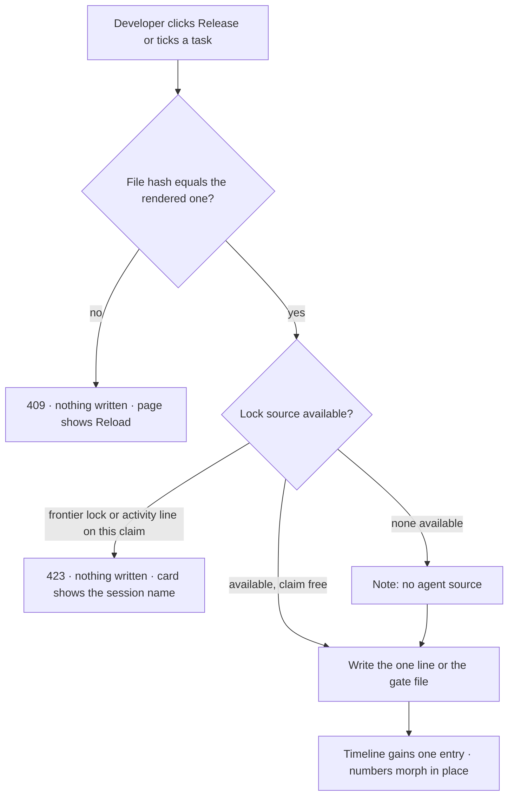
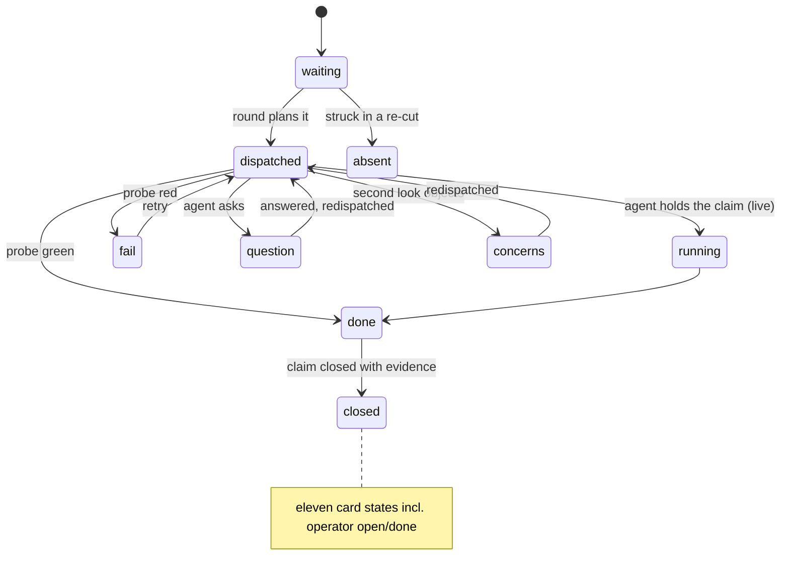

<!-- SPEC — a derived view of ../../ISA.md (feature F7, plus the claims it carries from
     F0 (ISC-2), F2 (ISC-23 to ISC-27), F3 (ISC-32, ISC-36, ISC-37) and F5 (ISC-49, ISC-49.1,
     ISC-52, ISC-53)). Claim IDs belong to the master, which is untracked in this public
     repository; every claim here carries its full text so this file reads on its own.
     Sync: Skill("Spec", "sync 002-shell-and-spec-page"). Never edit the master from this file.
     principal_stated_goal is deliberately absent: it is German, names a local path, and lives
     only in the untracked master (../constitution.md § What a spec may contain). -->

# 002 — Shell and spec page

## Problem

Spec 001 builds the dashboard against a design the prototype has since replaced: a new shell with an area menu and a
spec picker, a wordmark instead of a badge, Manrope and Sora instead of Inter, zen mode and a collapsible rail.
Everything beyond the dashboard has a finished, clickable prototype and no spec at all: the spec page with its areas,
the timeline, the round board, the two writes, notes. The prototype's own documentation ranks its demo data as "not
to be adopted" and lists the decisions that must be made before anything is built from it: the file contract, how
changes are detected, how a write stays safe next to a running agent. Until those are made, the prototype is a picture,
and the developer still reads their specs in an editor.

## Vision

The developer opens a spec of a registered workspace and lands on its dashboard: key numbers, the idea in one quoted
sentence, the next command and why it is next, one bar per lane, and five area tiles (Status, Live, Data, Docs, Notes). Status shows where the spec
stands and a timeline of everything that happened to it, from the first question round to the last commit. Data shows
every claim with its glyph, probe and evidence, every task with its lane and state, and the files the tasks produced.
Docs shows plan, design, decisions and constitution as rendered pages. Live shows the round board: the frames of every
build round behind a scrubber, in lanes or as a flow, and the tasks agents hold right now. Notes keep the developer's
own thoughts next to the spec, anchored to a claim or a task when that helps.

Two things are written, and only two: the developer releases a spec for implementation, and ticks a task. Both go
through the same guard, so the page can never overwrite what an agent or an editor just changed.

Every number on every page comes from the parser's reading of the repository's real files, the same parser the
golden fixtures pin. Nothing in the prototype's JavaScript fixtures is ported; the prototype is the reference for
surface and interaction, not for data.

Spectant ships with its Spec skill: spec work starts in the AI chat, and this app runs alongside as the surface for
control and administration (decided 2026-09-29). The two meet only in files; nothing on these pages calls the skill.

## Out of Scope

- The workspaces administration page, the help page, the per-workspace library, workspace identity images and the
  assistant "dot" from the prototype: each is its own later spec or stays Remaining Work.
- Redesigning spec 001's dashboard, overview, inspector and palette beyond fitting them into the shell.
- SSE and the two-second live update (ISC-28), content translation, the state-transition table and its enforcement
  (ISC-29 to ISC-31), the plugin hooks that write `.spectant/activity.jsonl` (ISC-33 to ISC-35).
- Any write beyond the reviewed gate and a task checkbox; the app never edits spec text.
- Porting any counter, mapping or text from the prototype's fixtures.

## Constraints

- Angular 22 zoneless with daisyUI 5 on Tailwind 4, bun and TypeScript only, one parser in `core/`, loopback only,
  nothing leaves the machine (constitution § Non-negotiables, XC-01, XC-02, XC-11).
- The files are the truth: the SQLite registry holds nothing a repository says; notes and settings are the only data
  the app owns (ISC-7).
- Registered repositories are read-only for the app except the two guarded writes; `.git/` is never touched (ISC-15).
- Fonts ship locally: Manrope, Sora and JetBrains Mono replace Inter as the shell's decision; ISC-67 stays closed as
  history and ISC-74 supersedes it. ⟨?: the token tests of 001 (`web/tests/fonts.test.ts`) are rewritten rather than
  extended — assuming 001 does not also need the Inter face for its baselines⟩
- Contrast 4.5:1 for text and 3:1 for marks in both themes, reduced motion honoured, focus visible (ISC-64 to ISC-66);
  UI chrome from the EN/DE catalogues (ISC-22).
- Everything under `specs/` is English and public-safe; the prototype and its German docs stay under the gitignored
  `.design/prototype/`; no customer material enters the repository. The porzellan-shop specs are read only through
  `SPECTANT_PRIVATE_CORPUS` on the principal's machine.
- The prototype is an interface reference, not a data model.
- Lanes as the constitution names them: core, server, web, repo; the plugin lane is not touched by this spec.

## Goal

A developer works a spec end to end in Spectant, from dashboard to live board and notes, inside the prototype's shell.

## Test Strategy

| isc | type | check | threshold | tool | anchors_to | severity |
|-----|------|-------|-----------|------|------------|----------|
| ISC-2 | e2e | no request leaves loopback across a scripted session | 0 blocked requests | `bun run e2e -- offline` (Playwright `context.route('**')` fails every non-loopback host, every route, both themes) plus `bun run test:offline:server` (binary in `docker run --network none`) | derived: local-only | high |
| ISC-23 | bash | spec page visual baseline, light | green | `bun run test:visual -- review` | derived: no-drift | |
| ISC-23.1 | bash | spec page visual baseline, dark | green | `bun run test:visual -- review --theme dark` | derived: no-drift | |
| ISC-24 | bun-test | mark reviewed | gate file + 1 event | `bun test tests/writes.test.ts -t "reviewed"` | derived: light-writes | |
| ISC-25 | bun-test | tick a task | exactly one line changed | `bun test tests/writes.test.ts -t "checkbox"` | derived: light-writes | |
| ISC-26 | bun-test | stale hash | 409 + file byte-identical | `bun test tests/writes.test.ts -t "cas"` | derived: light-writes | high |
| ISC-27 | bun-test | write under an open claim | refused | `bun test tests/writes.test.ts -t "claim lock"` | derived: light-writes | high |
| ISC-32 | bun-test | events.jsonl schema | every line valid | `bun test core/tests/events.test.ts` | derived: state-machine | |
| ISC-36 | bun-test | timeline order and derived marker | both cases | `bun test core/tests/timeline.test.ts` | derived: state-machine | |
| ISC-37 | bun-test | LifeOS present vs absent | locks shown / no LifeOS read | `bun test tests/lifeos-optional.test.ts` | derived: lifeos-optional | |
| ISC-49 | bash | board visual baseline, light | green | `bun run test:visual -- report` | derived: no-drift | |
| ISC-49.1 | bash | board visual baseline, dark | green | `bun run test:visual -- report --theme dark` | derived: no-drift | |
| ISC-52 | bun-test | notes survive a restart | persisted | `bun test tests/notes.test.ts -t "persist"` | literal | |
| ISC-53 | bun-test | import of an old notes export | count equal | `bun test tests/notes.test.ts -t "import"` | literal | |
| ISC-68 | bun-test | every fixture repository parses into its committed golden JSON | byte-equal | `bun test core/tests/golden.test.ts` | literal | high |
| ISC-68.1 | bash | every file kind the app reads has a section and a real example in FORMAT.md | 13 kinds | `bun run check:format-doc` (section names vs `core/src/files.ts` kinds) | derived: file-contract | |
| ISC-69 | bash | fixture corpus: spec 001 frozen, ≥ 3 leadgen specs of ≥ 2 types, licence note present | all present | `bun test core/tests/fixtures.test.ts -t "corpus"` | derived: file-contract | |
| ISC-70 | bun-test | private corpus parses with zero diagnostics when `SPECTANT_PRIVATE_CORPUS` is set; skipped when unset | 0 diagnostics / skipped | `bun test core/tests/private-corpus.test.ts` | derived: file-contract | |
| ISC-71 | bun-test | unknown spec id or workspace slug | 404 + not-found page, no fallback | `bun test tests/routes.test.ts -t "not found"` and `bun run e2e -- spec -g "not found"` | literal | high |
| ISC-72 | e2e | every counter on the spec dashboard and its tabs vs golden JSON | 0 mismatches | `bun run e2e -- counts` | derived: single-source | high |
| ISC-73 | e2e | exactly one shell header on every route, with the seven controls, at 390 and 1440 | 1 header, 7 controls | `bun run e2e -- shell -g header` | derived: prototype-shell | |
| ISC-74 | bun-test | Manrope, Sora and JetBrains Mono present as local assets; no external font URL | 3 faces, 0 URLs | `bun test web/tests/fonts.test.ts` | derived: local-only | |
| ISC-75 | e2e | zen hides tools and rail, keeps navigation; rail state survives reload | both | `bun run e2e -- shell -g zen` | derived: prototype-shell | |
| ISC-76 | e2e | area menu and tab bar follow the deep link `/w/:ws/s/:id/<tab>` | area + tab selected | `bun run e2e -- spec -g "deep link"` | derived: prototype-shell | |
| ISC-77 | bash | spec 001's e2e suites pass on the new shell | green | `bun run e2e -- dashboard overview palette keyboard` | derived: no-regression | high |
| ISC-78 | e2e | spec dashboard: key numbers, idea quote, next command with reason, lane bars, area tiles | all rendered from fixture | `bun run e2e -- spec -g dashboard` | derived: prototype-views | |
| ISC-79 | bun-test | stage and next command per fixture spec equal the table in FORMAT.md | all rows | `bun test core/tests/stage.test.ts` | derived: status-contract | high |
| ISC-80 | bun-test | timeline merges decisions, rounds, gate marks and commits in time order | ordered, one entry per source event | `bun test core/tests/timeline.test.ts -t "sources"` | derived: status-contract | |
| ISC-81 | e2e | claims tab: glyph state, kind, edges, probe row, verification line; filters | counts equal golden | `bun run e2e -- data -g claims` | derived: prototype-views | |
| ISC-82 | e2e | tasks tab: lane, flags, state, edges, paths, probe mapping; filters | counts equal golden | `bun run e2e -- data -g tasks` | derived: prototype-views | |
| ISC-83 | bun-test | evidence file outside the spec folder | 403, nothing served | `bun test tests/evidence.test.ts -t "traversal"` | derived: local-only | high |
| ISC-83.1 | e2e | evidence tab lists artifacts/ and .evidence/ grouped by claim with image and markdown preview | all fixture files listed | `bun run e2e -- data -g evidence` | derived: prototype-views | |
| ISC-84 | e2e | docs tabs render markdown, tables, code, mermaid figures; type-aware empty state | all four tabs | `bun run e2e -- docs` | derived: prototype-views | |
| ISC-85 | e2e | gate button states ready / stale (naming changed files) / done / paused; dialog lists three hashed files | all four states | `bun run e2e -- gate` | derived: light-writes | |
| ISC-86 | bun-test | write under a LifeOS frontier lock refused with 423; no lock source → write proceeds with "no agent source" | both | `bun test tests/writes.test.ts -t "frontier"` | derived: light-writes | high |
| ISC-87 | bun-test | rounds.jsonl → frames (dispatch, result, live); scrubbing changes no file | frames equal golden, tree unchanged | `bun test core/tests/frames.test.ts` and `git status --porcelain` empty after `bun run e2e -- board -g scrub` | literal | |
| ISC-88 | e2e | all eleven card states render with glyph, chip text and colour | 11 states | `bun run e2e -- board -g states` | derived: state-model | |
| ISC-89 | e2e | waiting tasks grouped by reason, none hidden | shown cards = frame tasks | `bun run e2e -- board -g waiting` | derived: state-model | |
| ISC-90 | bun-test | live frame from tasks.md + frontier locks (+ activity.jsonl when present); locked task in flight with session name | both sources | `bun test core/tests/live.test.ts` | derived: state-model | |
| ISC-91 | bun-test | re-cut between rounds → scrubber marker, struck tasks absent, no state carried to a renumbered id | 0 mis-attributions | `bun test core/tests/frames.test.ts -t "recut"` (fixture: spec 001's own rounds.jsonl) | literal | high |
| ISC-92 | e2e | matrix tasks × frames with glyphs; cell click jumps to frame | jump works | `bun run e2e -- board -g matrix` | derived: prototype-views | |
| ISC-93 | e2e | board at 600 px: no horizontal page overflow, no lane with its own scrollbar | scrollWidth == clientWidth, 0 lane scrollers | `bun run e2e -- narrow -g board` | derived: cmux-panel | |
| ISC-94 | bun-test | a note is stored in the data directory with workspace and at most one anchor; the repository tree is unchanged | row present, `git status` clean | `bun test tests/notes.test.ts -t "store"` | derived: local-only | |
| ISC-95 | e2e | notes area lists anchored notes with editor and preview; claim card shows note count | all fixture notes | `bun run e2e -- notes` | derived: prototype-views | |
| ISC-96 | bash | visual baseline: spec dashboard and notes area, light, 390/820/1440 | green on Linux CI | `bun run test:visual -- spec notes` | derived: no-drift | |
| ISC-96.1 | bash | the same baseline, dark | green | `bun run test:visual -- spec notes --theme dark` | derived: no-drift | |
| ISC-97 | e2e | keyboard: `g` sequences for areas and tabs, `[` `]` between specs, `v` view toggle, `z` zen, `◂ ▸` frames; all listed in the shortcut sheet | every binding works and is listed | `bun run e2e -- keyboard -g spec` | derived: prototype-shell | |
| ISC-98 | bash | spec 001's tasks.md carries no shell task and its reviewed mark is fresh after the re-cut | T59/T60 moved, `SpecGate check reviewed` exit 0 | `rg -c "shell with container tiers|header: eyebrow" specs/001-app-skeleton/tasks.md` → 0 and the Spec skill's `SpecGate check reviewed 001` exits 0 | literal | |
| ISC-99 | bun-test | takeable gated on a fresh reviewed mark | harbor 003 (no mark) 0 takeable, 002 (fresh) unchanged | `bun test core/tests/status.test.ts -t "review gate"` | derived: state-machine | high |

## Features

### F7 · Prototype port: shell, spec areas, board and notes
Why: the developer works a spec end to end in Spectant, from its dashboard through status, data, docs, the live board and notes, in the shell the Lovable prototype settled, every number read from the repository's real files and every write guarded.

**Stage 0 — the file contract**

- [x] ISC-68: Every fixture repository under `core/fixtures/` parses into the golden JSON committed beside it, byte for byte.
- [ ] ISC-68.1: `FORMAT.md` documents every file kind the app reads (spec.md frontmatter and claims, plan.md, tasks.md line grammar, context.md rounds, design.md, constitution.md, rounds.jsonl, `.gates/*.json`, artifacts/, .evidence/, the master) with one real example each. (after: ISC-68)
- [x] ISC-69: The fixture corpus holds Spectant's own spec 001 frozen at a named commit, at least three leadgen specs of at least two types with their licence note, and the synthetic harbor, lantern and empty-master trees.
- [x] ISC-70: With `SPECTANT_PRIVATE_CORPUS` pointing at a directory of spec trees, the parser reads every spec in it with zero diagnostics; when the variable is unset the test reports skipped, never passed.
- [x] ISC-71: An unknown spec id or workspace slug yields 404 from the API and a "not found" page; no fallback spec is ever rendered.
- [ ] ISC-72: Anti: a counter on the spec dashboard or on any of its tabs disagrees with the parser's golden JSON for the same fixture.

**The shell**

- [ ] ISC-73: Every route renders inside one shell whose header carries the workspace picker, the spec picker (name when a spec is open, or its id at compact; count otherwise), the area menu, the palette trigger, the live indicator, zen and settings with help; no second header exists in the DOM.
- [x] ISC-74: The app ships Manrope, Sora and JetBrains Mono as local assets and declares no font URL outside its own origin; this supersedes the Inter face of ISC-67.
- [ ] ISC-75: Zen mode hides the header tools and the context rail and keeps the sticky navigation; the collapsed state of the rail survives a reload.
- [ ] ISC-76: The area menu offers Dashboard · Status · Live · Data · Docs · Notes for an open spec, the tab bar shows only the current area's tabs, and a deep link `/w/:ws/s/:id/<tab>` selects area and tab. ⟨?: Live and Notes render as disabled entries with "comes with this spec's later tasks" while their tabs are unbuilt, rather than hidden — assuming a stable menu beats a growing one⟩
- [ ] ISC-77: Spec 001's dashboard, overview, inspector and palette render inside the new shell and 001's e2e suites stay green. (after: ISC-73)
- [ ] ISC-97: `g` sequences reach every area and tab, `[` `]` step between specs, `v` toggles Lanes and Flow, `z` toggles zen, `◂ ▸` step frames, and every binding is listed in the shortcut sheet.
- [ ] ISC-98: Spec 001's tasks.md carries no shell task after the re-cut (T59 and T60 moved to this spec) and 001's reviewed mark is fresh again.
- [ ] ISC-99: A claim is takeable only while the spec's reviewed mark is fresh; before that every open claim shows as `open` on the dashboard row, the Claims tab and the takeable set, and no task of it is dispatched.

**Spec dashboard and Status**

- [ ] ISC-78: `/w/:ws/s/:id` shows the spec's key numbers (claims, tasks, rounds, gates, waiting), its idea quote, the next command with its reason, one bar per lane and the area tiles, all from the fixture files. ⟨?: the idea quote is the first sentence of `## Goal`, falling back to `task:` — assuming no spec carries a dedicated idea field⟩
- [ ] ISC-79: The stage and the next command `core/` derives for every fixture spec equal the stage table in `FORMAT.md`, row by row. (after: ISC-68.1)
- [x] ISC-80: A spec's timeline merges the decisions of context.md, the rounds of rounds.jsonl, the gate marks and the commits touching the spec folder into one time-ordered list with one entry per source event.
- [x] ISC-36: A spec's timeline lists its events in order; a spec without `events.jsonl` shows its derived stage marked as derived.
- [x] ISC-32: Every line of `events.jsonl` validates against the schema `{ts, from, to, command, actor}`.

**Data and Docs**

- [x] ISC-81: The Claims tab renders every claim with its state glyph (open, takeable, taken, blocked, closed, dropped), kind, dependency edges, probe row and verification line, filterable by state and kind, with counts equal to the golden JSON.
- [x] ISC-82: The Tasks tab renders every task line with lane, flags, state, edges and paths, filterable by lane and state, plus the probe mapping table, with counts equal to the golden JSON.
- [x] ISC-83: Anti: the evidence endpoint serves a file outside the spec's own folder.
- [ ] ISC-83.1: The Evidence tab lists artifacts/ and .evidence/ files grouped by claim with image and markdown preview.
- [x] ISC-84: The Plan, Design, Decisions and Constitution tabs render their Markdown with headings, tables, code and mermaid fences as figures; a file the spec type does not have shows a type-aware empty state. ⟨?: mermaid is rendered client-side from the pinned package the old skill already vendors — assuming no server-side SVG step⟩

**The two writes**

- [ ] ISC-24: "Mark reviewed" writes `.gates/reviewed` in the format the old skill writes and appends exactly one `tasks → review` event (the stage table's names, decided 2026-09-29). (after: ISC-32)
- [ ] ISC-25: Ticking a task in the app changes exactly that task's checkbox line in `tasks.md` and nothing else.
- [ ] ISC-26: A write whose sha256 no longer matches the rendered file returns 409 and leaves the file byte-identical.
- [ ] ISC-27: Anti: the app writes to a spec while `.spectant/activity.jsonl` shows an open claim on it.
- [x] ISC-37: With LifeOS present the board also shows LifeOS frontier locks; without LifeOS the board works and no LifeOS path is read.
- [ ] ISC-85: The gate button shows ready, stale (naming the changed files), done or paused from `.gates/reviewed.json` and the lock sources; its dialog lists the three hashed files. (after: ISC-24)
- [ ] ISC-86: A write is refused with 423 while a LifeOS frontier lock exists for the claim; when no lock source is available the page shows "no agent source" and the write proceeds under the hash check. (after: ISC-26, ISC-37)

**Live — the round board**

- [ ] ISC-87: The board turns rounds.jsonl into frames (dispatch, result, live) behind a scrubber with a Lanes view and a Flow view over the same cards; scrubbing changes no file.
- [ ] ISC-88: All eleven task card states (waiting, dispatched, running, question, concerns, fail, done, closed, absent, operator open, operator done) render with glyph, chip text and colour from the fixture that holds every one of them.
- [ ] ISC-89: Waiting tasks are grouped by their reason and none is hidden; the number of shown cards equals the frame's tasks.
- [ ] ISC-90: The live frame is built from tasks.md, the master's frontier locks and, when present, `.spectant/activity.jsonl`; a task under a lock shows in flight with the lock's session name. (after: ISC-37)
- [ ] ISC-91: A re-cut of tasks.md between rounds shows as a marker on the scrubber and struck tasks as absent; no state is attributed to a renumbered id. (after: ISC-87)
- [ ] ISC-92: The Matrix tab shows tasks × frames with state glyphs, and clicking a cell jumps the scrubber to that frame. (after: ISC-87)
- [ ] ISC-93: At a 600 px container the board has no horizontal page overflow and no lane scrolls on its own.

**Notes**

- [ ] ISC-94: A note is stored in the data directory with its workspace and at most one anchor (spec, claim or task), and the repository tree stays unchanged.
- [ ] ISC-95: The Notes area lists the spec's anchored notes with a Markdown editor and preview, and a claim card shows its note count. (after: ISC-94)
- [ ] ISC-52: A note created, edited and pinned in the app is unchanged after the app restarts.
- [ ] ISC-53: `spectant import-notes <file>` imports a JSON export from the old notes page with the same number of notes.

**Cross-cutting**

- [ ] ISC-2: Anti: with no AI feature switched on, starting the app, adding a workspace, browsing every page and performing every write makes an outbound network request.
- [ ] ISC-23: The review page's visual baseline (light, three widths) is committed and passes on Linux CI.
- [ ] ISC-23.1: The same baseline passes in the dark theme.
- [ ] ISC-49: The report page's visual baseline (light, three widths) is committed and passes on Linux CI.
- [ ] ISC-49.1: The same baseline passes in the dark theme.
- [ ] ISC-96: The visual baseline of the spec dashboard and the Notes area (light, 390/820/1440) is committed and passes on Linux CI.
- [ ] ISC-96.1: The same baseline passes in the dark theme.

## Not yet specified

- none open. The three shaping questions (leadgen selection and ID namespacing, the disabled Live and Notes area
  entries, the refresh rule for the frozen spec 001 fixture) were resolved in plan.md and design.md; see Decisions
  2026-09-29.

## Decisions

- 2026-09-28: goal confirmed as the wide sentence (every spec area, live board and notes included) over "shell + spec
  page with the two writes" and "read only"; the shape chosen in Round 0 was "shell + spec page as spec 002" over
  "reference only into 001" and "project spec re-cutting the master". Workspaces admin, help, library, identity images
  and "dot" stay out.
- 2026-09-28: this spec owns the shell. 001's T59 and T60 move here; 001 is re-cut and re-reviewed (ISC-98). 001 keeps
  dashboard, overview, inspector and palette and builds them inside this shell (ISC-77).
- 2026-09-28: "review page" in the master's F2 means the spec page of the prototype; ISC-23/23.1 are carried here with
  that reading, ISC-49/49.1 cover the board. ISC-28 (SSE) stays in F2 for a later spec.
- 2026-09-28: the timeline is built from existing files (context.md, rounds.jsonl, gate marks, git log) with derived
  stage transitions until events.jsonl exists; events.jsonl then wins (ISC-80, ISC-36).
- 2026-09-28: writes are guarded by the hash compare-and-swap plus LifeOS frontier locks; `.spectant/activity.jsonl`
  joins as a second lock source when the plugin writes it; without any lock source the page says so and writes under
  the hash check alone (ISC-86, ISC-90). Recommended over blocking writes until F3 and over "reviewed gate only".
- 2026-09-28: fixtures are Spectant's own spec 001 frozen, public leadgen specs (Apache-2.0) and the synthetic trees;
  the porzellan-shop specs are a customer's and stay a private local corpus behind `SPECTANT_PRIVATE_CORPUS` (ISC-69,
  ISC-70). The prototype's JavaScript fixtures are never ported.
- 2026-09-28: Manrope, Sora and JetBrains Mono supersede Inter (ISC-74); the closed ISC-67 stays as the record of what
  001 shipped.
- 2026-09-28: the Lovable export moved from `specs/tmp/` to `specs/001-app-skeleton/.design/prototype/` (gitignored)
  during shaping; it is the visual reference for this spec's design pass.
- 2026-09-29 (design and plan passes, applied at review): ISC-73 accepts the spec id as the compact label ("name, or
  its id at compact"); ISC-97 gains `z` for zen; the Vision counts five area tiles, since a Dashboard tile would link
  to itself. Fog closed: the leadgen fixture freezes one spec per type present there, its reduced master carries only
  their feature blocks and IDs keep their numbers because fixtures never share a master (ISC-69); Live and Notes stay
  in the area menu as disabled entries with a visible reason while their tabs are unbuilt (ISC-76); the frozen spec
  001 fixture is pinned to a named commit and refreshed only on `/spec-complete 001` (ISC-69). 001 keeps building the
  parser, API and web infrastructure this spec extends; only its shell tasks are struck (ISC-98).

## Verification

- ISC-36: bun-test — `bun test core/tests/timeline.test.ts` 27 pass (derived marker without events.jsonl, recorded transitions replace it); `bun test tests/timeline.test.ts` 5 pass through the route: derived entries flagged, events.jsonl transitions in order, invalid lines dropped, ETag changes and 304 holds (T15, T26, T50; 2026-09-29)

- ISC-81: e2e — bun run e2e -- data -g claims → 4 passed, 1 skipped (one card per golden claim, filter chip counts equal counts, takeable narrows to counts.takeable, #claim-ISC-… deep link scrolls and focuses; the taken-card case skips until the stub overlays locks on the claims route); component spec 16 pass incl. a synthetic taken claim; harbor 002: 30 cards, open 5 · takeable 4 · blocked 1 · closed 25; spec 002 round 10

- ISC-82: e2e — bun run e2e -- data -g tasks → 7 passed (rows and probe mapping at 1440/820/390 equal the golden's counts.rows and mapping.length, lane chips carry the golden counts, the web filter narrows to byLane.web and survives a reload, status and hide-done from the URL, disabled checkboxes with the ISC-25 helper line, an after-T1 edge link focuses #task-T1); component spec 11 pass; harbor 002: 32 rows, 27/32 boxes, api 1 · web 29 · operator 2; spec 002 round 10

- ISC-83: bun-test — bun test tests/evidence.test.ts -t traversal → 3 pass (core + server): ../spec.md, double encoding, absolute path, a symlink out of the folder and plan.md inside the spec but outside artifacts/ and .evidence/ answer 403 Forbidden with nothing served and no path in the body; valid .md/.png/.har/.log/.html serve with media type, nosniff, CSP sandbox and inline/attachment; repo copy byte-identical before and after; spec 002 round 9

- ISC-71: bun-test — bun test tests/routes.test.ts -t "not found" → 3 pass: unknown workspace slug, unknown spec id, ambiguous id (duplicate number in a temp copy) and unknown doc name answer 404 {error: "not-found"} with no other spec's body; the shell's not-found page renders for an unlisted id and a served 404 (web/e2e/shell.spec.ts, 30 passed) and never a fallback spec; spec 002 round 9

- ISC-84: e2e — bun run e2e -- docs → 4 passed (plan: headings, TOC links jump and focus, a mermaid svg drawn client-side from the pinned mermaid 11.17.2 lazy chunk; decisions and constitution render with frontmatter chips and table regions; a refactor's design tab shows the type-aware empty state with the command chip; at 390 tables scroll inside their region and the page never overflows); core markdown-docs 31 tests, lazy-chunk guard 3 pass; spec 002 round 10

- ISC-80: bun-test — bun test core/tests/timeline.test.ts -t sources → 17 pass (independent per-source counts for harbor 002 / spectant-001 / leadgen 022, commit interleaving, one entry per event, rank order at equal instants); server/src/git.ts reads the folder's commits read-only with head cache (tests/git.test.ts 19 pass); Timeline tab renders the golden strand with source filters in the URL, day groups, expanding rounds, derived chip and #t/<id> deep links — e2e status -g timeline 4 passed; spec 002 round 10

- ISC-32: bun-test — bun test core/tests/events.test.ts → 39 pass: every line of the fixture events.jsonl (harbor archive/001, seven transitions in the stage table's names) validates; nine rejection codes (json, not-object, missing/extra key, type, ts, empty, stage, same-stage, null-from) each proven; the old wording (idea/specified/planned/tasked/reviewed/implementing/code-reviewed) is normalised with an event-alias warning; buildTimeline and the spec page read the validated lines, so 001's chain shows recorded transitions with actor and command; FORMAT.md quotes the file (13 of 13 kinds from fixtures); spec 002 round 9

- ISC-74: bun-test — bun test web/tests/fonts.test.ts → 27 pass: Manrope (200–800) and Sora (100–800) as local latin variable woff2 from the Google Fonts CSS endpoint with the OFL texts of the pinned upstream commits, JetBrains Mono kept, Inter removed from fonts, preloads and notices; no font URL off the app's origin in any stylesheet or the built output; Sora on the wordmark/h1 per design.md; tokens: every accent has an -ink (light --held-ink derived), --hover-t/--scrim/--page-glass added, the two narrow dark values pinned (#939293 4.57, #7f7d80 3.47), no-glow guard with ui-card's inherited corner glow pinned as the one known exception; ISC-18's round-trip guard untouched and green; browser tier 10 passed; spec 002 round 8

- ISC-37: bun-test — bun test tests/lifeos-optional.test.ts → 13 pass (server) + core/tests/lifeos-optional.test.ts 15 pass: LifeOS present only via SPECTANT_LIFEOS_STATE_DIR naming an existing absolute dir (one stat at start); present → frontier locks from the hashed isa-locks dir join the dashboard (synthetic lock on ISC-75 leaves takeable, session kept in DashboardInput.locks), GET /api/lifeos {present:true}; absent or missing dir → {present:false}, activity.jsonl locks still read, a node:fs spy proves no path outside the repo is touched; the variable's value never appears in a response; repo copy and state dir byte-identical before and after; spec 002 round 8

- ISC-70: bun-test — bun test core/tests/private-corpus.test.ts with SPECTANT_PRIVATE_CORPUS = one local customer corpus (4 spec folders) → 10 pass, 0 fail (tree + every spec: zero error diagnostics, timeline builds newest first); unset → 1 skip, never passed; set to an empty dir → 1 fail naming how many entries were seen; output shows spec numbers and basenames only; spec 002 round 6

- ISC-68: bun-test — bun test core/tests/golden.test.ts → 16 pass: two new golden families for all five trees (<tree>.specs.golden.json = listSpecs/resolve listing, <tree>.timeline.golden.json = buildTimeline per spec folder with commits pinned to []), byte-equal via the shared helper core/tests/helpers/golden.ts that fixtures.test.ts now uses too; inventory tree↔golden both ways, two-space + trailing newline, no path-shaped strings, non-vacuity by in-memory mutation; core lane 480 pass; spec 002 round 4

- ISC-69: bun-test — core/tests/fixtures.test.ts -t corpus → 4 pass (spectant-001 frozen at ab49485; leadgen 012 feature, archive/013 refactor, 022 feature with LICENSE-leadgen.txt; harbor/lantern/empty-master; leak grep empty), red before T4/T5 landed; probe row names core/fixtures.test.ts, path corrected at the next review; spec 002 round 2
