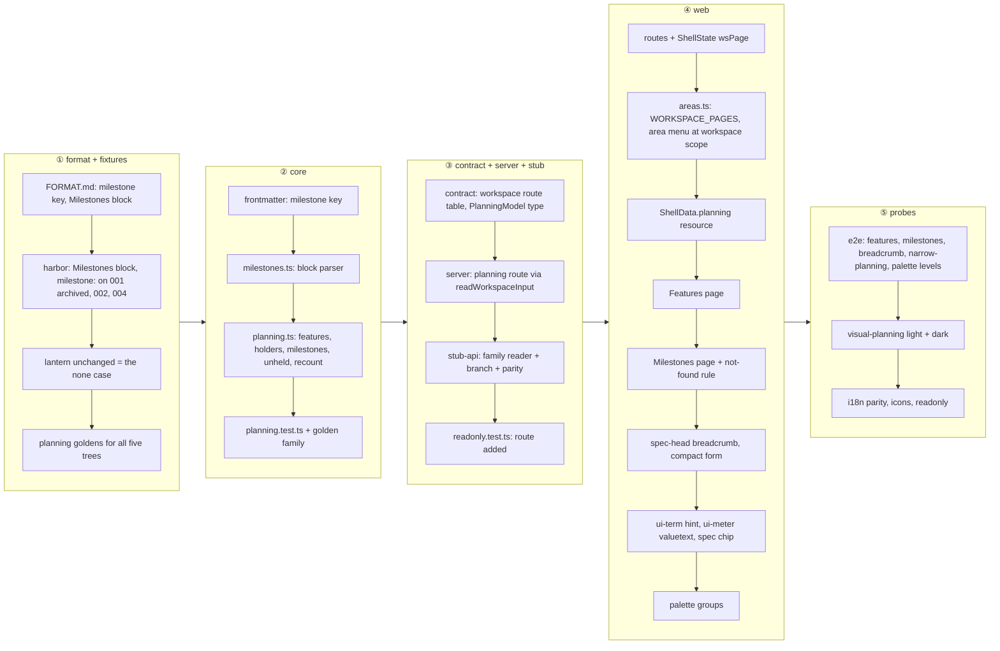

# Plan 003 — Planning hierarchy

**Purpose:** how the claims in `spec.md` get built. The what lives there; this file holds no acceptance criterion.

## Approach

Contract first, in the order spec 002 proved: **① the format** — `FORMAT.md` gains `milestone:` in the spec
frontmatter and the master's `## Milestones` block, the harbor fixture gets a milestones block and three specs naming
one (the archived `001-manifest-sync` among them), lantern stays without, and every tree gets a `planning` golden;
**② the parser** — a new `core/src/planning.ts` derives the tree from what `parseClaims`, `listSpecs` and the archive
listing already give (feature blocks with their claim ids, each folder's held ids, the master recount) and adds the
milestone grouping, with diagnostics for an unknown milestone name; **③ the contract and the server** — one
workspace-level route `/api/workspaces/:ws/planning` beside `/dashboard`, typed in the shared contract, answered by the
server and the e2e stub from the same golden family, and added to the read-only guard; **④ the web** — the two routes,
the scope-aware area menu, the Features and Milestones pages, the breadcrumb on the spec head (also at compact), the
`ui-term` glossary hint and the two palette groups; **⑤ the cross-cutting probes** — visual baselines in both themes,
the 600 px run, read-only, catalogue parity.

The obvious path would build the two pages first against hand-written stub JSON and wire the parser last. It is not
taken for the reason 002 gave: the stub's goldens *are* the parser's output (ISC-72), so a page built before the
family exists renders numbers nobody derived, and the counts the pages promise (ISC-100.2, ISC-103) are exactly the
ones that drift. Format before parser because `check:format-doc` demands a verbatim fixture example for every kind
section, so the fixture lines are written once and quoted, never invented twice. The endpoint is a workspace route of
its own rather than a field on `/dashboard`: the dashboard model is read by every page on every refresh and the
planning tree is only needed by three views, and the spec-page breadcrumb reads the same resource once per workspace
instead of growing the spec payload. It is computed on request and cached by ETag like every other family, nothing in
SQLite (ISC-7). `design.md` § Viewport-übergreifend binds every web step: own routes, absence instead of a disabled
menu entry, the breadcrumb grammar (`/` · `›`), the `<dfn>` hint, the archived and main-feature chip markers, master
order for features and target-date order for milestones. The plan departs from `design.md` nowhere. The spec's
assumed path `/api/w/:ws/planning` is corrected here to the API's real root `/api/workspaces/:ws/planning`.



## Affected Files and Modules

| Path | Change | Claim |
|---|---|---|
| `FORMAT.md` | `milestone:` row in the `spec` frontmatter table; `## Milestones` grammar in the `master` section with a verbatim `From core/fixtures/harbor/ISA.md` example; the planning tree named under the derived views | ISC-101, ISC-101.2 |
| `core/fixtures/harbor/generate.ts`, `core/fixtures/harbor/ISA.md`, `.../specs/002-web-console/spec.md`, `.../004-retention-policies/spec.md`, `.../archive/001-manifest-sync/spec.md` | generator emits a `## Milestones` block (two entries, one target date passed, one ahead) and `milestone:` on 002, 004 and the archived 001; regenerate the tree | ISC-110, ISC-100.3, ISC-102 |
| `core/fixtures/README.md` | harbor's tables gain the milestone column; regeneration note | ISC-110 |
| `core/fixtures/*.planning.golden.json` (five trees) | new golden family, `UPDATE_GOLDEN=1 bun test core/tests/golden.test.ts` | ISC-100, ISC-102 |
| `core/src/frontmatter.ts` | `milestone: ['milestone', 'string']` in `KEYS`, field on `SpecFrontmatter`, `emptyData()` default | ISC-101 |
| `core/src/milestones.ts` | parses the master's `## Milestones` section into `{name, slug, target, description, line}[]`; a malformed line is a `master-milestone-line` warning | ISC-101, ISC-101.1 |
| `core/src/planning.ts` | `buildPlanning(input: DashboardInput): PlanningModel` — features in master order with per-claim holder (folder, archived) and closed/total, spec entries with main feature (first word of `isa_feature`, the `status.ts` split) and the other blocks held, unheld ids, milestones by target date with cross-feature progress and derived state; pure, no Bun API, types browser-safe | ISC-100, ISC-100.1, ISC-100.2, ISC-100.3, ISC-102 |
| `core/src/diagnostics.ts` (codes only), `core/src/index.ts` | export `planning.ts` and `milestones.ts`; `spec-milestone-unknown` warning code | ISC-101.1 |
| `core/tests/planning.test.ts` | tree, main feature, recount, archived, milestone format, unknown milestone, no-milestone (diagnostics before vs after on every tree), milestones order | ISC-100 to ISC-102 |
| `core/tests/golden.test.ts`, `core/tests/fixtures.test.ts` | `planning` added to `FAMILIES`; corpus test `milestones` (one tree with a block and an archived spec naming one, one without) | ISC-100, ISC-110 |
| `server/src/spec-routes.contract.ts` | workspace-level route `planning` (`/api/workspaces/:ws/planning`), `WORKSPACE_ROUTE_TABLE`, `matchWorkspacePath`, `GOLDEN_FAMILY.planning`, typed 200 body `PlanningModel` | ISC-103, ISC-104 |
| `server/src/api.ts` or `server/src/spec-routes.ts` | GET/HEAD handler: loopback guard, `readWorkspaceInput`, `buildPlanning`, `json()` with ETag; 404 unknown slug, 409 unreadable | ISC-103, ISC-109 |
| `tests/readonly.test.ts` | the planning route joins the read routes hashed before and after | ISC-109 |
| `web/e2e/stub-api.ts`, `web/e2e/stub-api.test.ts` | `planning` family reader, a branch before the spec catch-all, parity case against the real handler | ISC-103, ISC-104 |
| `web/src/app/core/api.service.ts` | `planning(ws)` typed method and URL helper | ISC-103 |
| `web/src/app/layout/shell/shell-data.service.ts` | `planning` resource keyed by `state.ws()`; exposes `hasMilestones` | ISC-104, ISC-105 |
| `web/src/app/layout/shell/shell-state.service.ts` | route signal gains `wsPage: 'specs' \| 'features' \| 'milestones' \| null` | ISC-103, ISC-104 |
| `web/src/app/layout/shell/areas.ts` | `WORKSPACE_PAGES` registry (`specs`, `features`, `milestones` with icon, goKey candidate, summary key); `workspaceLink(ws, page)` | ISC-104 |
| `web/src/app/layout/area-menu/*`, `web/src/app/layout/shell/shell-nav.html`, `shell-nav.ts` | at workspace scope the trigger names the current page and the menu lists `WORKSPACE_PAGES`, Milestones only while `hasMilestones`; at spec scope unchanged (design § Where the pages sit) | ISC-104 |
| `web/src/app/app.routes.ts` | `w/:ws/features` and `w/:ws/milestones` (lazy pages) beside `w/:ws` | ISC-103, ISC-104 |
| `web/src/app/features/planning/features-page.*` | H1 with `ui-term`, meta line, one `ui-card` per feature with anchor id, meter + fraction, Why line, holder chips, unheld `<details>` (Desktop and Tablet § Features page; compact rules § Mobile) | ISC-103, ISC-103.1, ISC-100.3, ISC-107 |
| `web/src/app/features/planning/milestones-page.*` | rows by target date, state chip (upcoming / late / complete), cross-feature meter, feature and spec chip rows; renders `app-not-found` when the tree has no milestone (design § Milestones absent) | ISC-104, ISC-103.1, ISC-102 |
| `web/src/app/features/planning/spec-chip.*` | the holding-spec chip: main (primary tint + dot), other (outline), archived (glyph, word, dashed) as a router link; used by both pages | ISC-100.1, ISC-100.3 |
| `web/src/app/shared/ui/term/*` | `ui-term`: `<dfn>` with dotted underline, `popover="hint"` on hover, focus-visible and tap, `aria-describedby`; consumers: page heads and breadcrumb | ISC-107 |
| `web/src/app/shared/ui/meter/meter.ts` | `valueText` input (`aria-valuetext`) and a `size` input for the 8 px bar | ISC-103 |
| `web/src/app/layout/spec-head/spec-head.ts`, `spec-head.css`, `spec-head-model.ts` | breadcrumb levels milestone · feature (+n popover) › spec › area › claim/task from the planning resource and the open tab; rendered at compact in the short form; separators via `data-sep`; archived glyph; truncation order | ISC-105, ISC-107 |
| `web/src/app/features/palette/*` (spec 001's palette, once present) | groups Features and Milestones after Workspaces and Specs; Milestones absent under the page's rule | ISC-106 |
| `web/src/app/shared/icons/icon-names.ts`, `icons.ts` | `flag`, `circle-dashed`, `clock-alert`; `bun run --cwd web icons:generate` | ISC-103, ISC-104 |
| `web/src/i18n/en.json`, `de.json` | `planning.*`, `shell.pages.*`, `terms.*`, `palette.groups.features/milestones` | ISC-107, ISC-22 |
| `web/e2e/features.spec.ts`, `milestones.spec.ts`, `breadcrumb.spec.ts`, `narrow-planning.spec.ts`, `visual-planning.spec.ts`, `palette.spec.ts -g levels` | the e2e groups the Test Strategy names, on harbor (with milestones) and lantern (without), at 390/600/820/1440 | ISC-103 to ISC-108.1 |
| `web/e2e/__screenshots__/chromium/{light,dark}/visual-planning.spec.ts/*` | committed baselines, produced in the Linux container | ISC-108, ISC-108.1 |
| `specs/002-shell-and-spec-page/design.md`, `web/src/app/layout/spec-head/spec-head.css` | the note "breadcrumb dropped at compact" is amended to point at ISC-105 — done by 002's owner, named here so it is not forgotten | ISC-105 |

## Interfaces

**Contract, new workspace route** (`server/src/spec-routes.contract.ts`):

| Route | Method | Path | 200 body | Errors |
|---|---|---|---|---|
| `planning` | GET, HEAD | `/api/workspaces/:ws/planning` | `PlanningModel` | 304 ETag, 403 non-loopback, 404 unknown slug, 405 other methods, 409 unreadable |

Callers: `ApiClient.planning(ws)` in the web, the e2e stub (same golden family), `tests/readonly.test.ts`.

**`PlanningModel`** (`core/src/planning.ts`, browser-safe types):

```
PlanningModel {
  features: PlanningFeature[]        // master order
  milestones: PlanningMilestone[]    // target date ascending, undated last; [] when none
  recount: Progress                  // the master's own count, for ISC-100.2
  diagnostics: FileDiagnostic[]
}
PlanningFeature { id, name, why, closed, total, claims: PlanningClaim[], holders: PlanningHolder[], unheld: string[] }
PlanningClaim   { id, closed, holder: string | null, dropped }
PlanningHolder  { id, slug, title, archived, main: boolean, held: number, stage: string | null }
PlanningMilestone { name, slug, target: string | null, description, closed, total, state: 'upcoming'|'late'|'complete',
                    features: {id, name, closed, total}[], specs: PlanningHolder[] }
```

**Master block grammar** (owned by `FORMAT.md`, quoted from the harbor fixture):

```
## Milestones

- Harbor 0.9 · 2026-03-15 · Config through one loader, before the console ships.
- Harbor 1.0 · 2026-05-14 · First release a teammate can install.
```

Name up to the first ` · `, then an ISO date, then an optional description; the slug is the kebab-cased name; a line
without the date part is a `master-milestone-line` warning and is skipped. Spec side: `milestone: Harbor 1.0` in the
frontmatter, matched by name; a name without an entry yields `spec-milestone-unknown` (warning) and the spec still
parses.

**Shell route state:** `ShellState.route()` gains `wsPage`; `WORKSPACE_PAGES` sits beside `SPEC_AREAS` in
`areas.ts`; `areaLink()` at workspace scope resolves to `workspaceLink(ws, page)`.

## Data Model

No persisted form changes. The registry and settings in SQLite are untouched; the planning tree is derived per request
from `ISA.md`, `specs/*/spec.md` and `specs/archive/*/spec.md`.

## Risks

| Risk | Blast radius | Early warning | Mitigation |
|---|---|---|---|
| ISC-106 depends on spec 001's command palette, which is not built yet (`data-control="palette"` is still `aria-disabled`) | one claim of 003 blocked | `palette.spec.ts` absent when stage ④ starts | schedule the palette groups last; if 001's palette has not landed, the task waits with reason "after 001 palette" rather than building a second palette |
| `/w/:ws` is being replaced by 001's dashboard page (round 20, T63) while 003 adds sibling routes and a workspace-scope menu | merge conflicts in the shell lane | both specs touching one file in one round | agreed with 001's session on 2026-09-29: 001 touches `app.routes.ts` (T63), `layout/shell/shell.ts` (`showRail()` on `/w/:ws`) and the rail label key in `en/de.json`; 003 touches `areas.ts`, `shell-state`, `shell-nav`, `area-menu`, `shell-data`, `spec-head` and adds its two routes to `app.routes.ts` only after T63 has landed; 001's palette (T66/T70/T71) comes in a later 001 round and its group API is announced for ISC-106 |
| Harbor's regenerated tree shifts other goldens (dashboard, specs) because the milestone lines change file hashes and line numbers | every harbor golden | `bun test core/` red on families other than `planning` | regenerate all harbor goldens in the same task and diff them: only line numbers, hashes and the new fields may change |
| A new golden family must exist for all five trees, including the frozen `spectant-001` and `leadgen` | inventory test red | golden inventory test | goldens for trees without milestones carry `milestones: []`; the frozen trees are not edited |
| The breadcrumb at compact reintroduces a row spec 002 removed for space | spec head height at 390 | `narrow-board` / `narrow-planning` overflow checks | the compact form drops workspace and area and never wraps; truncation order fixed in design |
| `ui-term`'s hover popover on touch | ISC-107 on coarse pointers | e2e on the phone width with tap | popover opens on tap and focus, not hover alone; tested at 390 |
| The `check:format-doc` verbatim rule: the `From core/fixtures/harbor/ISA.md` block must match the generated file byte for byte | static tier red | `bun run check:format-doc` | write the FORMAT.md example after regenerating harbor, in the same task |

## Open Points

- fog (spec, routes): resolved by design pass 003 — own routes `/w/:ws/features` and `/w/:ws/milestones`, reached
  through the scope-aware area menu; this plan builds exactly that. The fog line closes in `spec.md` with this plan.
- fog (spec, late milestone): resolved — derived state `late` when the target date has passed with open claims,
  shown as a warning chip; `upcoming` and `complete` otherwise.
- fog (spec, `done` mark): resolved — no `done` mark in the master block; completeness is always derived from the
  claims, as `FORMAT.md` states in the block's grammar.
- fog (spec, all specs archived): resolved — the milestone shows `complete` when every claim is closed; the archive
  is a property of the specs, not of the milestone.
- Not fog, a dependency: the palette groups (ISC-106) wait for spec 001's palette; named in Risks.
- Not fog, a proposal for `/spec-review 003`: `g f` and `g m` at workspace scope in the one `SHORTCUTS` table.

## Conformance Impact

The constitution's `## Conformance baseline` rows (the ladder tiers and the leak check, owed by spec 001) are
neither touched nor cleared by this spec: leave. Every new probe here runs inside the existing tiers.
