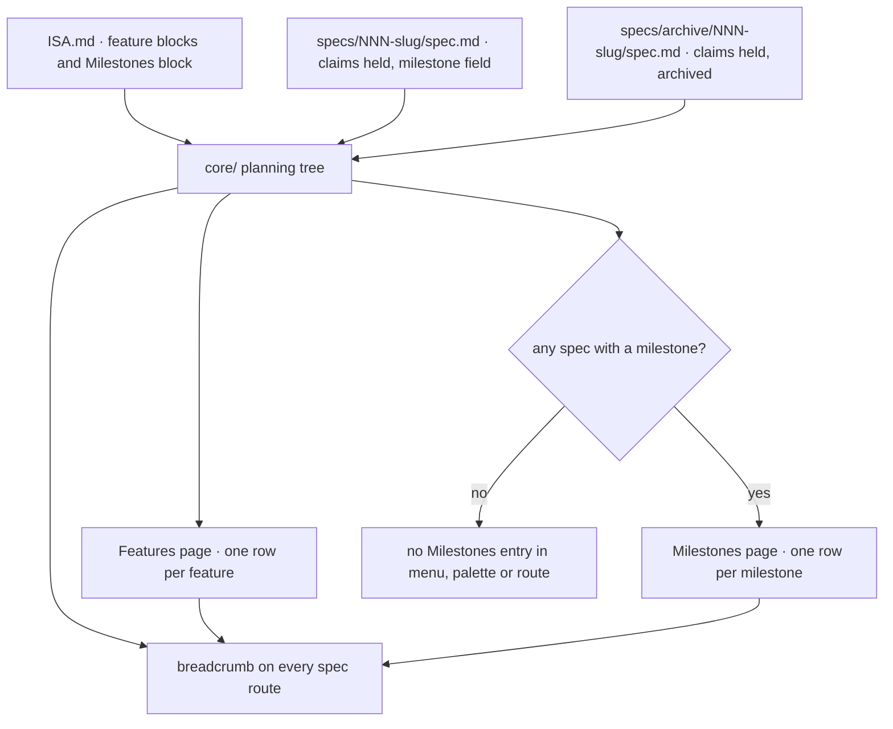

<!-- SPEC — a derived view of ../../ISA.md (feature F8). Claim IDs belong to the master, which is
     untracked in this public repository; every claim here carries its full text so this file reads
     on its own. Sync: Skill("Spec", "sync 003-planning-hierarchy"). Never edit the master from this
     file. principal_stated_goal is deliberately absent: it is German and lives only in the untracked
     master (../constitution.md § What a spec may contain). -->

# 003 — Planning hierarchy

## Problem

The format already carries a hierarchy: the master's feature blocks own the claims, a spec holds a set of them, and
tasks anchor to claims. The app shows none of it as a hierarchy. It renders spec by spec, so where a feature stands
across all the specs that hold its claims is worked out by hand from the master, and a claim no spec has picked up is
invisible until a drift check names it. There is no milestone level at all: nothing says what a release still needs,
and nothing ties specs of different features to one target date. Archived specs, which still hold closed claims,
disappear from every view except the archive listing, so a feature's real progress is understated as soon as one of
its specs is done.

## Vision

A workspace gains a Features page: one row per feature block of the master, with a progress bar of closed against
total claims, the specs that hold its claims (an archived one marked as such, without a next step) and the number of
claims no spec holds yet. When at least one spec of the workspace names a milestone, a Milestones page appears beside
it, one row per milestone ordered by target date, with progress across every feature it touches. Every spec page shows
its path, milestone · feature › spec › claim or task, and each level is a link, so the developer always knows where in
the plan they are standing and can move one level up in one click. The vocabulary on screen stays the one the files
use; the common names are a hint on the level headers for someone arriving from a ticket tracker.

## Out of Scope

- Export to JIRA or GitHub Issues: this spec builds the levels; a later export only maps them.
- Milestone ordering, target date or description on the spec side; the master block owns them.
- Any new write path: no milestone is set or changed from the app, the files stay the truth.
- A hard "one spec = one feature" rule; specs holding claims from several blocks stay valid, without a warning.
- The Ideas stage and vocabulary switching per repository.
- Cross-workspace roll-ups: features and milestones are shown per workspace, never summed over workspaces.

## Constraints

- One parser: the planning tree is derived in `core/` and imported by server and web; no counting in the web lane
  (ISC-5, constitution § Non-negotiables).
- `FORMAT.md` is extended before the parser is: format first, golden fixtures second, pages third (ISC-68.1 owns the
  document; ISC-101 adds to it).
- Old specs without `milestone:` and masters without `## Milestones` parse with zero new diagnostics (ISC-101.2).
- The archive rule of `FORMAT.md` holds: an archived spec is counted and listed, never offered a next step or a
  warning (ISC-100.3).
- Registered repositories stay read-only for the app; the new pages and links change no byte (ISC-15, ISC-109).
- Both pages render in the cmux web view at 600 px without horizontal overflow, like the dashboard (ISC-63,
  ISC-103.1), in both themes with the contrast, focus and motion rules of ISC-64 to ISC-66.
- Every new UI string exists in the English and the German catalogue (ISC-22); the visible vocabulary is
  Feature · Spec · Claim · Task · Milestone.
- Everything under `specs/` is English and public-safe; the fixtures for milestones are synthetic (harbor, lantern) or
  Spectant's own frozen specs.
- The Features and Milestones pages are routes of their own, `/w/:ws/features` and `/w/:ws/milestones`, reached
  through the area menu, which gains a workspace scope (design pass 2026-09-29, § Viewport-übergreifend).
- The planning tree is served as one workspace route, `/api/workspaces/:ws/planning`, computed on request from the
  parsed files and cached by ETag only, nothing in SQLite (ISC-7; plan.md § Interfaces).

## Goal

A developer sees where every feature and every milestone of a workspace stands across all its specs, active and
archived, and every spec page shows its place in that hierarchy.

## Test Strategy

| isc | type | check | threshold | tool | anchors_to | severity |
|-----|------|-------|-----------|------|------------|----------|
| ISC-100 | bun-test | planning tree per fixture equals its golden JSON, claim by claim | byte-equal | `bun test core/tests/planning.test.ts -t "tree"` | derived: one-contract | high |
| ISC-100.1 | bun-test | a spec holding claims of several blocks appears under each, main feature marked | both features, one main | `bun test core/tests/planning.test.ts -t "main feature"` (fixture shaped like spec 002: F7 plus F0/F2/F3/F5 claims) | derived: files-are-truth | |
| ISC-100.2 | bun-test | sum over features equals the master recount | closed and total equal | `bun test core/tests/planning.test.ts -t "recount"` | derived: single-source | high |
| ISC-100.3 | bun-test | archived spec counted under its feature, listed as archived, no next step | counts equal the archive listing | `bun test core/tests/planning.test.ts -t "archived"` (harbor `archive/001-manifest-sync`) | derived: files-are-truth | |
| ISC-101 | bash | FORMAT.md documents `milestone:` and `## Milestones` with a real example; parser reads both | 2 sections, both parsed | `bun run check:format-doc` plus `bun test core/tests/planning.test.ts -t "milestone format"` | derived: file-contract | |
| ISC-101.1 | bun-test | milestone naming no master entry | 1 warning, spec parsed | `bun test core/tests/planning.test.ts -t "unknown milestone"` | derived: file-contract | |
| ISC-101.2 | bun-test | trees without milestones produce no new diagnostic | 0 new diagnostics on every existing fixture | `bun test core/tests/planning.test.ts -t "no milestone"` (diagnostics before vs after, all fixtures) | derived: file-contract | high |
| ISC-102 | bun-test | milestone groups with cross-feature progress, ordered by target date, archived included | equals golden JSON | `bun test core/tests/planning.test.ts -t "milestones"` | derived: one-contract | |
| ISC-103 | e2e | Features page: one row per block, progress, holding specs (archived marked), unheld count | counts equal golden JSON | `bun run e2e -- features` | derived: single-source | high |
| ISC-103.1 | e2e | Features and Milestones pages at 600 px: no horizontal overflow | scrollWidth == clientWidth | `bun run e2e -- narrow -g "features\|milestones"` | derived: cmux-panel | |
| ISC-104 | e2e | Milestones page absent without milestones, present with one row each when a spec carries one, archived included | absent on one fixture, N rows on the other | `bun run e2e -- milestones` | derived: files-are-truth | high |
| ISC-105 | e2e | breadcrumb on every spec route incl. an archived spec; levels link | present, links resolve | `bun run e2e -- breadcrumb` | derived: developer-tool | |
| ISC-106 | e2e | palette lists features and milestones; ISC-60's entries still complete | all listed | `bun run e2e -- palette -g levels` and `bun run e2e -- palette -g open` | derived: developer-tool | |
| ISC-107 | e2e | level headers and breadcrumb carry the common terms as hint in EN and DE | hint present, both catalogues | `bun run e2e -- features -g vocabulary` plus `bun test web/tests/i18n-parity.test.ts` | derived: no-translation | |
| ISC-108 | bash | Features and Milestones visual baseline, light, 390/820/1440 | green on Linux CI | `bun run test:visual -- features milestones` | derived: no-drift | |
| ISC-108.1 | bash | the same baseline, dark | green | `bun run test:visual -- features milestones --theme dark` | derived: no-drift | |
| ISC-109 | bash | registered repo byte-identical after the new pages and breadcrumb links | checksum equal | `bun run test:readonly` (routes extended by features, milestones and breadcrumb) | derived: files-are-truth | high |
| ISC-110 | bun-test | corpus: one tree with `## Milestones` and an archived spec naming one, one tree without; planning goldens present | both present | `bun test core/tests/fixtures.test.ts -t "milestones"` | derived: file-contract | |

## Features

### F8 · Planning hierarchy: features, milestones and the path
Why: the format already carries master → feature → spec → claim → task, but the app shows it spec by spec; the developer wants to see where every feature and every milestone of a workspace stands across all its specs, active and archived, and where any page sits in that plan.

**The tree in `core/`**

- [x] ISC-100: `core/` derives a planning tree per workspace from the files: every feature block of the master with its claims, each claim's holding spec (active or archived) or none, and progress closed/total per feature; for every fixture the tree equals a committed golden JSON, claim by claim.
- [x] ISC-100.1: A spec holding claims from several feature blocks appears under every one of them, with the first word of its `isa_feature` marked as its main feature. (after: ISC-100)
- [x] ISC-100.2: The sum of closed and of total claims over all features equals the master's own recount. (after: ISC-100)
- [x] ISC-100.3: An archived spec's claims count toward its feature's progress, and the spec is listed under that feature marked as archived, with no next step and no warning. (after: ISC-100)

**Milestones in the format**

- [x] ISC-101: `FORMAT.md` documents `milestone: <name>` in the spec frontmatter and the master's `## Milestones` block (one entry per milestone: name, target date, optional description), each with a real example, and `core/` reads both. (after: ISC-110)
- [x] ISC-101.1: A `milestone:` value that names no entry of the master's block yields one diagnostic of level warning, and the spec still parses and renders. (after: ISC-101)
- [x] ISC-101.2: Anti: a spec without `milestone:` or a master without `## Milestones` produces a diagnostic that it did not produce before this feature. (after: ISC-101)
- [x] ISC-102: The tree groups specs per milestone, archived ones included, with progress closed/total across features and the milestones ordered by target date; for every fixture it equals the golden JSON. (after: ISC-100, ISC-101)
- [x] ISC-110: `core/fixtures/` holds at least one tree whose master carries `## Milestones` with an archived spec naming one, and at least one tree with no milestone at all; both carry their planning golden JSON.

**The pages**

- [x] ISC-103: `/w/:ws/features` shows one row per feature block of the master with its progress, the specs holding its claims (archived ones marked) and the count of claims no spec holds; every count equals the golden JSON. (after: ISC-100)
- [x] ISC-104: The Milestones page is absent from the area menu, the palette and the route while no spec of the workspace carries a milestone, and present with one row per milestone as soon as one does, an archived spec's milestone included. (after: ISC-102)
- [x] ISC-103.1: At a 600 px wide container the Features page and the Milestones page have no horizontal overflow: `scrollWidth` equals `clientWidth`. (after: ISC-103, ISC-104)
- [x] ISC-105: Every spec route, archived specs included, renders a breadcrumb milestone (when the spec has one) · feature › spec › claim or task where the open tab has one, and every level links to its page. (after: ISC-100)
- [x] ISC-106: The command palette lists every feature and every milestone of the current workspace next to the workspaces and specs, and the list ISC-60 requires stays complete. (after: ISC-103, ISC-104)
- [x] ISC-107: The level headers of the Features and Milestones pages and the breadcrumb carry the common terms (Epic, Story, Acceptance criterion, Sub-task) as a hint in both catalogues while the visible vocabulary stays Feature · Spec · Claim · Task · Milestone.

**Cross-cutting probes**

- [x] ISC-108: The committed visual baseline of the Features and Milestones pages (light, 390/820/1440) passes on Linux CI. (after: ISC-103, ISC-104)
- [x] ISC-108.1: The same baseline passes in the dark theme. (after: ISC-108)
- [x] ISC-109: Anti: opening the Features page, the Milestones page or any breadcrumb link changes a byte inside the registered repository, `.git/` included. (after: ISC-103, ISC-104, ISC-105)

## Not yet specified

- none open. The four shaping fog lines (route placement, the late state, a `done` mark, a fully archived milestone)
  were resolved by the design pass and the plan; see Decisions 2026-09-29 (design pass, plan).

## Decisions

- 2026-09-29 (shaping): the full A4 hierarchy was chosen over "features + milestones" (recommended) and "features
  only". Q6: a spec's features are derived from the claims it holds and `isa_feature`'s first word is its main feature;
  no "one spec = one feature" rule, because 001 already holds F0 and F1 and 002 holds F0, F2, F3, F5 and F7. Q9:
  `milestone:` on the spec plus a `## Milestones` block in the master with name and target date; an unknown name
  warns. Q10: the UI keeps its own vocabulary and shows the common terms as a hint; the export translates later.
- 2026-09-29 (principal, mid-shaping): archived specs are part of the tree — counted, listed as archived, never offered
  a next step (ISC-100.3, ISC-102, ISC-104, ISC-105, ISC-110).
- 2026-09-29 (goal lock): the full sentence, overviews plus the breadcrumb path, over "overviews only" and "release
  focus". Out: JIRA/GitHub export, any new write path, the Ideas stage, cross-workspace roll-ups.
- 2026-09-29 (design pass): own routes `/w/:ws/features` and `/w/:ws/milestones` through a scope-aware area menu,
  Milestones absent (not disabled) while no spec carries one; breadcrumb in row 1 of the spec head at every tier,
  grammar `/` after the workspace, `·` between milestone and feature, `›` per level; common-term hints as design
  002's glossary `<dfn>` popover; milestone states derived (`upcoming`, `late` with open claims past the date,
  `complete` when every claim is closed, also when every spec is archived), no `done` mark in the master; archived
  chip with glyph, word and dashed border, never a next step; main-feature chip with primary tint and dot.
- 2026-09-29 (implement, round 4): edge refined — `ISC-101 (after: ISC-110)` instead of `ISC-110 (after: ISC-101)`: the
  fixture is what the format example and the "milestone format" test read, so it closes first (master Decisions,
  same date).
- 2026-09-29 (plan): build order format → parser → API → pages → probes, over vertical slices per page and UI-first
  against the stub. One workspace route `/api/workspaces/:ws/planning` (the earlier `/api/w/…` assumption corrected
  to the API's root), a `planning` golden family for every tree, harbor gains the `## Milestones` block and
  `milestone:` on 002, 004 and the archived 001, lantern stays the none case. The palette groups (ISC-106) wait for
  spec 001's palette; `g f` / `g m` are a proposal for the review, not a task.

## Verification

- ISC-106: e2e `web/e2e/palette.spec.ts` -g levels (T44) · 6 passed — Features and Milestones groups after Workspaces and Specs on harbor, entries equal the golden, Milestones absent on lantern and without a workspace, Enter lands on `#F2` / `#m-harbor-1-0`, compact sheet lists the same · `-g open` 3 passed, ISC-60 complete · 2026-09-30

- ISC-108.1: `bun run test:visual:ci -- planning --theme dark` (T46) · 12 passed in the pinned container against `__screenshots__/chromium/dark/visual-planning.spec.ts/` · 2026-09-30

- ISC-108: `bun run test:visual:ci -- planning` (T45) · 12 passed in the pinned Playwright container (linux/amd64) — Features and Milestones on harbor and lantern at 390/820/1440, light, `maxDiffPixelRatio: 0` against `web/e2e/__screenshots__/chromium/light/visual-planning.spec.ts/` · 2026-09-30

- ISC-107: e2e `web/e2e/features.spec.ts` -g vocabulary (T42) · 16 passed — hint opens on hover, focus and tap in EN and DE on the Features H1, its meta and the Milestones label; breadcrumb crumbs carry `aria-description`; visible vocabulary never the tracker word · `bun test web/tests/i18n-parity.test.ts` 17 pass · 2026-09-30

- ISC-103.1: e2e `web/e2e/narrow-planning.spec.ts` (T38) · 8 passed — Features and Milestones on harbor and lantern at 600 and 390: `scrollWidth === clientWidth`, no element past the viewport, no horizontal scroll container · 2026-09-30

- ISC-109: `bun run test:readonly` (T23) · 4 pass, 62 expects — the planning route (GET, 304 on ETag, HEAD) and the Features and Milestones pages join the hashed read pass; the registered repository, `.git/` and every mtime unchanged · 2026-09-30

- ISC-105: e2e `web/e2e/breadcrumb.spec.ts` (T41, cases turned live by T33/T37) · 49 passed, 2 width-conditional skips, 0 fixme — every spec route incl. archived 001 at 390 and 1440, every level lands (workspace, milestone, feature, +n, spec, area, claim/task) · 2026-09-30

- ISC-104: e2e `web/e2e/milestones.spec.ts` (T37) · 28 passed at 390 and 1440 — absent on lantern (no menu entry, not-found route, no crumb), present on harbor with 2 rows incl. the archived 001 under Harbor 1.0; palette group deferred to T43/T44 · 2026-09-30

- ISC-103: e2e `web/e2e/features.spec.ts` (T33) · 16 passed at 390 and 1440 against `core/fixtures/harbor.planning.golden.json` — rows, fractions, valuetext, unheld, holder chips (archived marked), meta recount, anchors · 2026-09-30

- ISC-102: bun-test — `bun test core/tests/planning.test.ts -t "milestones"` 16 pass, red first (10 failed on the empty rows): harbor golden gains Harbor 0.9 `late` with 003 (0/13, F3) and Harbor 1.0 `upcoming` with 002, 004 and the archived 001 (101/106; F1 46/46, F2 25/30, F4 30/30), date order, states derived at `now` 2026-03-20; lantern `[]`; 0/0 rows never `complete`, target day not yet late (FORMAT.md refined with both); `bun test core/` 927 pass (T16; 2026-09-30)

- ISC-101.2: bun-test — `bun test core/tests/planning.test.ts -t "no milestone"` 9 pass (every fixture tree: dashboard diagnostics equal `EXPECTED_WARNINGS` from one shared helper, no `spec-milestone-`/`master-milestone-` code in planning diagnostics; inline: no key under no block and no key under a block both silent); green on first run because T2/T3/T8 introduced no diagnostic, pinned as the regression guard; `bun test core/` 912 pass (T2, T3, T15; 2026-09-30)

- ISC-101.1: bun-test — `bun test core/tests/planning.test.ts -t "unknown milestone"` 9 pass, red first (3 failed on the missing warning): one `spec-milestone-unknown` warning per folder naming a milestone the master block lacks or when the master has no block, file `specs/<folder>/spec.md` (active folders only since the 2026-09-30 code review: an archived spec naming a removed entry stays silent, as `PlanningHolder.archived` promises), holders and claims untouched; every fixture tree yields zero; `bun test core/` 904 pass, planning goldens unchanged (T14; 2026-09-30)

- ISC-101: bash + bun-test — `bun run check:format-doc` exit 0 (13 kinds, 27 verbatim examples incl. the `## Milestones` block from `core/fixtures/harbor/ISA.md`) plus `bun test core/tests/planning.test.ts -t "milestone format"` 5 pass (two harbor milestones with name, slug, date, description; `milestone:` on 001, 002, 003, 004; lantern none; FORMAT.md row and grammar present); `bun test core/` 895 pass (T1, T2, T3, T6, T17; 2026-09-30)

- ISC-100.3: bun-test — `bun test core/tests/planning.test.ts -t "archived"` 5 pass (harbor F1: sole holder 001 `archived: true`, `main: true`, held 46, 46/46 equal to `listArchive`; holder has no next-step field and `stage` null; no diagnostic under `specs/archive/`, no warning group for 001; inline archived-only feature); green on first run, T8 built the behaviour; `bun test core/` 890 pass (T8, T13; 2026-09-30)

- ISC-100.2: bun-test — `bun test core/tests/planning.test.ts -t "recount"` 15 pass (five trees: sum of feature closed/total equals the master recount and an independent live count — harbor 101/124, leadgen 31/32 with its dropped claim excluded on both sides; inline: no master → null, flat `## Claims` → master.counted, no claim section → 0/0; documented boundary: a claim inside `## Features` before the first block counts in the recount but under no feature, no fixture has it); `bun test core/` 886 pass (T8, T12; 2026-09-30)

- ISC-110: bun-test — `bun test core/tests/fixtures.test.ts -t "milestones"` 1 pass (harbor: `## Milestones` with two entries, the archived `001-manifest-sync` names Harbor 1.0; lantern: no block, no key) and `core/fixtures/<tree>.planning.golden.json` present for all five trees (golden inventory test green) (T4, T5, T8; 2026-09-29)

- ISC-100.1: bun-test — `bun test core/tests/planning.test.ts -t "main feature"` 5 pass (inline spec-002-shaped input: 002 holds F7 plus one F0 and one F2 claim and is a holder under all three with `main` only under F7 for `F7`, `F7 · plus F0`, `F7, F0`; two-folder winner rule active-then-lower-id); green on first run because T8 built the behaviour, its own probe ran red-then-green; `bun test core/` 871 pass (T8, T11; 2026-09-29)

- ISC-100: bun-test — `bun test core/tests/planning.test.ts -t "tree"` 7 pass (all five fixture trees equal their `<tree>.planning.golden.json` claim by claim; harbor: F0 0/4 with 006, F1 46/46 with the archived 001, F2 25/30, F3 0/14 with 003+005, F4 30/30; recount 101/124); `bun test core/` 866 pass, check:static and check:single-core green (T7, T8; 2026-09-29)

## Remaining Work

- [ ] Render the master's planning diagnostics (`master-milestone-line`, `master-milestone-duplicate`) somewhere a user sees them — today they sit in `PlanningModel.diagnostics` only, so a milestone on a malformed or duplicate line vanishes without an explanation — a surface decision (Status warnings or a workspace-level notice), not a claim of this spec.
- [ ] Canonical spec reference in `ShellData`: `currentRow`, `specMissing`, `archiveRows` and `notesLink` still compare the raw `:id` route param with `row.id`, so a folder or bare-slug URL resolves the breadcrumb levels but not the header's spec row until the body answers — resolve once through `specRefMatches` and let every consumer read the canonical id.
- [ ] One workspace reading per navigation: the dashboard, planning and spec routes each re-read and re-parse the whole tree, and the planning route reads git and lock sources it does not use — measure first, then share the parsed folders or build planning inside the dashboard handler.
- [ ] An active and an archived folder sharing `NNN`: the id-keyed maps of the planning pages and the spec head cannot tell them apart (`track` is by slug already; the server answers `ambiguous`) — decide whether such trees are rejected or the maps key on the slug.
- [ ] Head height at compact: design 002's 240 px budget (T79) was set for a head without a breadcrumb, design 003 adds the crumb row (20 px, 44 px under a coarse pointer); the gate e2e now measures the head without that row — decide whether the budget grows or the compact head loses something else.
- [ ] A harbor fixture where one spec holds claims in two feature blocks and one holder is `other`: the `+n` chip and the chip variant order are proven through route interception and unit tests only.
- [ ] Catalogue follow-ups: plural forms of the area-menu summaries ("1 milestones"), an all-complete summary line, the compact Features H1 ("Features" alone per design § Mobile), the unused keys `planning.features.meta` and `specHead.breadcrumb`; palette ranking has no non-id keyword tier, so typing a milestone state word does not find milestones.
- [ ] `holder.stage` is null from core (the stage needs the gate states, T8); the pages fill it from the dashboard rows — move it into core once gates are browser-safe.
- [ ] `ng build` budget warnings: `spec-head.css` 4.86 kB over the 4 kB `anyComponentStyle` warning after T40, the initial bundle over 500 kB (with 001's dashboard) — warnings, not errors; raise the budgets deliberately or trim.
- [ ] 001 deferred moving the dashboard body types into the browser-safe `core/src/files.ts`; the palette index, overview column, KPI band and Brief keep hand-typed readers until then.
